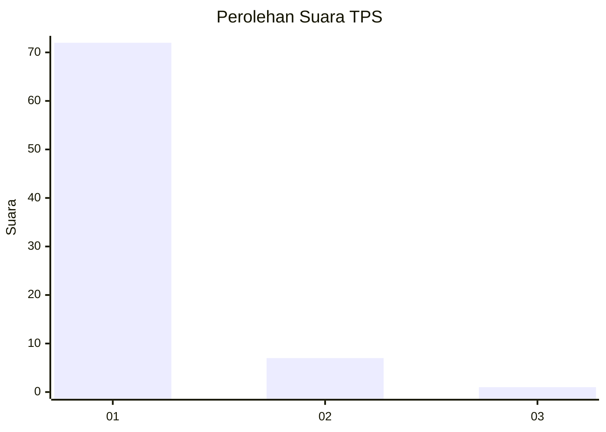
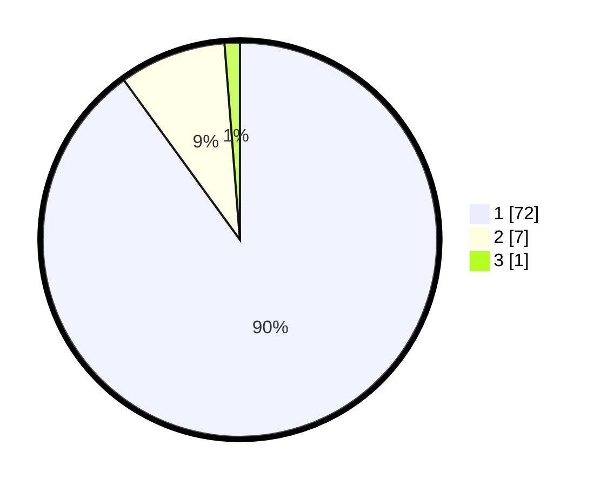

# Hasil

## Grafik

## Tabel

| No. | Nama Paslon    | Suara | Suara (raw) | Persentase |
|:--- |:-------------- | -----:| -----------:| ----------:|
| 1   | ANIES MUHAIMIN | 72    | [72][p-1]   | 90,00      |
| 2   | PRABOWO GIBRAN | 7     | [7][p-2]    | 8,75       |
| 3   | GANJAR MAHFUD  | 1     | [1][p-3]    | 1,25       |

[p-1]: https://github.com/gigit-pemilu/pemilu-2024-11-aceh/blob/main/pilpres/hitung-suara/sub/11-aceh/sub/03-aceh-timur/sub/08-rantau-selamat/sub/2002-rantau-panjang/sub/007-tps/sub/paslon-1.txt
[p-2]: https://github.com/gigit-pemilu/pemilu-2024-11-aceh/blob/main/pilpres/hitung-suara/sub/11-aceh/sub/03-aceh-timur/sub/08-rantau-selamat/sub/2002-rantau-panjang/sub/007-tps/sub/paslon-2.txt
[p-3]: https://github.com/gigit-pemilu/pemilu-2024-11-aceh/blob/main/pilpres/hitung-suara/sub/11-aceh/sub/03-aceh-timur/sub/08-rantau-selamat/sub/2002-rantau-panjang/sub/007-tps/sub/paslon-3.txt

## Foto C Plano

https://sirekap-obj-formc.kpu.go.id/b775/pemilu/ppwp/11/03/08/20/02/1103082002007-20240214-201416--2e3d65c3-1bda-447c-bb4d-96648c7f8442.jpg

https://sirekap-obj-formc.kpu.go.id/b775/pemilu/ppwp/11/03/08/20/02/1103082002007-20240216-144225--865eb886-7cbe-48d6-b016-3605818b6f9b.jpg

https://sirekap-obj-formc.kpu.go.id/b775/pemilu/ppwp/11/03/08/20/02/1103082002007-20240214-205850--f8a758ba-375b-45a4-bfee-69faffb49d84.jpg

## Metadata

| Key        | Value               |
| ---------- | ------------------- |
| Time Stamp | 2024-02-19 06:16:00 |

## DATA PEMILIH TETAP

Jumlah pemilih dalam DPT: **139**.
 * L: **79**.
 * P: **60**.

## DATA PENGGUNA HAK PILIH

Jumlah pengguna hak pilih dalam DPT: **71**.
 * L: **35**.
 * P: **36**.

Jumlah pengguna hak pilih dalam DPTb: **0**.
 * L: **0**.
 * P: **0**.

Jumlah pengguna hak pilih dalam DPK: **13**.
 * L: **9**.
 * P: **4**.

Jumlah pengguna hak pilih: **84**.
 * L: **44**.
 * P: **40**.

## JUMLAH SUARA SAH DAN TIDAK SAH

JUMLAH SELURUH SUARA SAH: **80**.

JUMLAH SUARA TIDAK SAH: **4**.

JUMLAH SELURUH SUARA SAH DAN SUARA TIDAK SAH: **84**.

