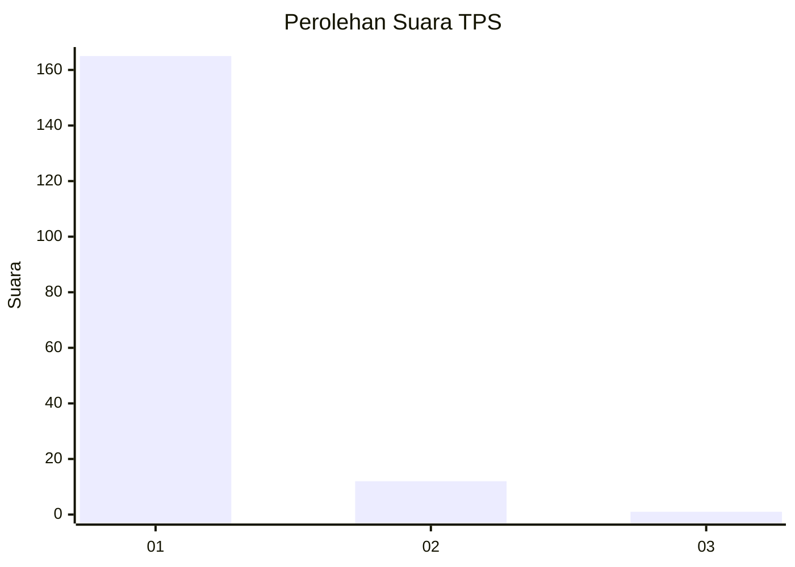
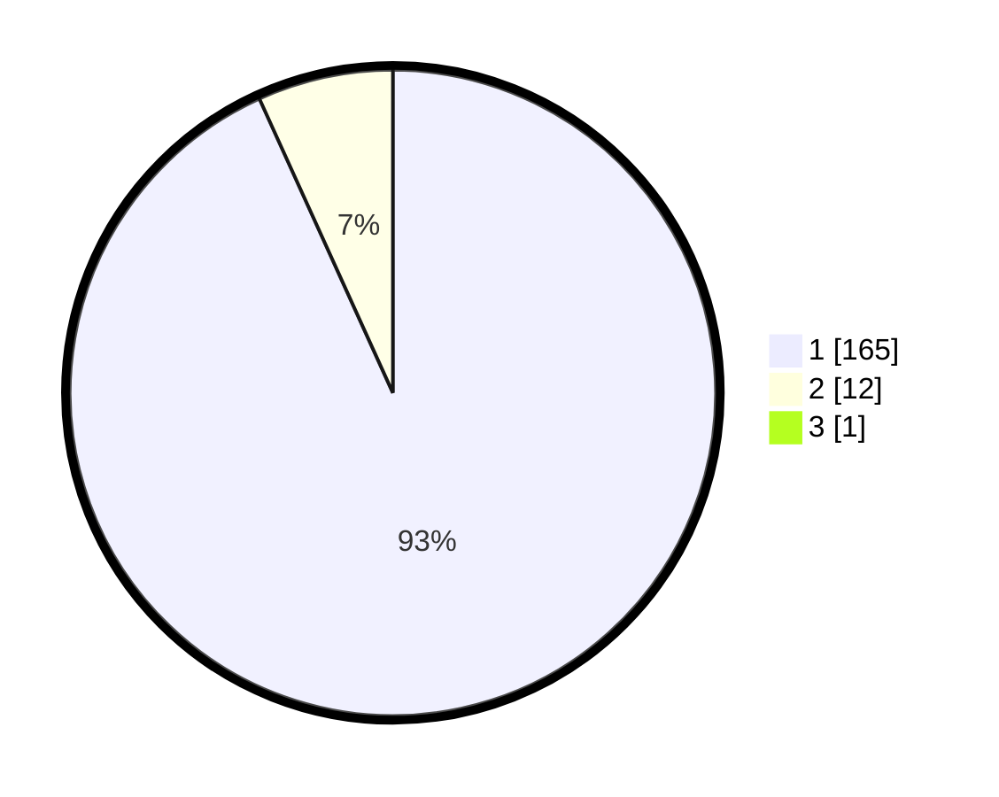

# Hasil

## Grafik

## Tabel

| No. | Nama Paslon    | Suara | Suara (raw) | Persentase |
|:--- |:-------------- | -----:| -----------:| ----------:|
| 1   | ANIES MUHAIMIN | 165   | [165][p-1]  | 92,70      |
| 2   | PRABOWO GIBRAN | 12    | [12][p-2]   | 6,74       |
| 3   | GANJAR MAHFUD  | 1     | [1][p-3]    | 0,56       |

[p-1]: https://github.com/gigit-pemilu/pemilu-2024-11-aceh/blob/main/pilpres/hitung-suara/sub/11-aceh/sub/03-aceh-timur/sub/08-rantau-selamat/sub/2003-alue-raya/sub/002-tps/sub/paslon-1.txt
[p-2]: https://github.com/gigit-pemilu/pemilu-2024-11-aceh/blob/main/pilpres/hitung-suara/sub/11-aceh/sub/03-aceh-timur/sub/08-rantau-selamat/sub/2003-alue-raya/sub/002-tps/sub/paslon-2.txt
[p-3]: https://github.com/gigit-pemilu/pemilu-2024-11-aceh/blob/main/pilpres/hitung-suara/sub/11-aceh/sub/03-aceh-timur/sub/08-rantau-selamat/sub/2003-alue-raya/sub/002-tps/sub/paslon-3.txt

## Foto C Plano

https://sirekap-obj-formc.kpu.go.id/b9b5/pemilu/ppwp/11/03/08/20/03/1103082003002-20240215-123539--ad8b4fbf-834e-4440-a1c1-fad9b4532fc9.jpg

https://sirekap-obj-formc.kpu.go.id/b9b5/pemilu/ppwp/11/03/08/20/03/1103082003002-20240215-123854--4e2b57b5-5576-4dcd-bd75-8f1577ac3a24.jpg

https://sirekap-obj-formc.kpu.go.id/b9b5/pemilu/ppwp/11/03/08/20/03/1103082003002-20240215-124053--79d17e89-7fdd-45b4-9bae-e28b8f479288.jpg

## Metadata

| Key        | Value               |
| ---------- | ------------------- |
| Time Stamp | 2024-02-19 06:16:00 |

