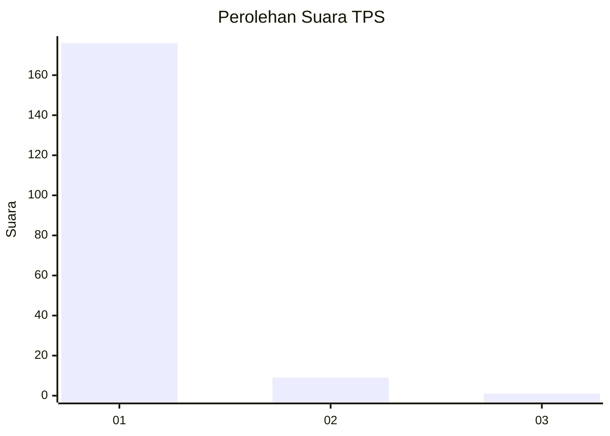
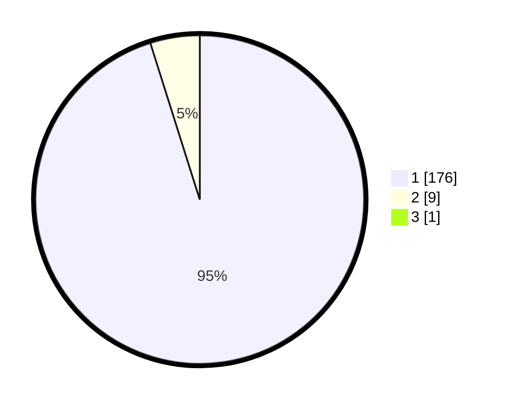

# Hasil

## Grafik

## Tabel

| No. | Nama Paslon    | Suara | Suara (raw) | Persentase |
|:--- |:-------------- | -----:| -----------:| ----------:|
| 1   | ANIES MUHAIMIN | 176   | [176][p-1]  | 94,62      |
| 2   | PRABOWO GIBRAN | 9     | [9][p-2]    | 4,84       |
| 3   | GANJAR MAHFUD  | 1     | [1][p-3]    | 0,54       |

[p-1]: https://github.com/gigit-pemilu/pemilu-2024-11-aceh/blob/main/pilpres/hitung-suara/sub/11-aceh/sub/03-aceh-timur/sub/08-rantau-selamat/sub/2004-alue-kumba/sub/001-tps/sub/paslon-1.txt
[p-2]: https://github.com/gigit-pemilu/pemilu-2024-11-aceh/blob/main/pilpres/hitung-suara/sub/11-aceh/sub/03-aceh-timur/sub/08-rantau-selamat/sub/2004-alue-kumba/sub/001-tps/sub/paslon-2.txt
[p-3]: https://github.com/gigit-pemilu/pemilu-2024-11-aceh/blob/main/pilpres/hitung-suara/sub/11-aceh/sub/03-aceh-timur/sub/08-rantau-selamat/sub/2004-alue-kumba/sub/001-tps/sub/paslon-3.txt

## Foto C Plano

https://sirekap-obj-formc.kpu.go.id/5498/pemilu/ppwp/11/03/08/20/04/1103082004001-20240215-041429--af173954-1b30-4cc3-a3fd-971589e12344.jpg

https://sirekap-obj-formc.kpu.go.id/5498/pemilu/ppwp/11/03/08/20/04/1103082004001-20240215-041621--1b391a2a-6afc-46fa-b6d9-9eb09b0e3591.jpg

https://sirekap-obj-formc.kpu.go.id/5498/pemilu/ppwp/11/03/08/20/04/1103082004001-20240215-041734--64642ed7-d450-459d-a412-131e7a0114f7.jpg

## Metadata

| Key        | Value               |
| ---------- | ------------------- |
| Time Stamp | 2024-02-16 09:00:28 |

## DATA PEMILIH TETAP

Jumlah pemilih dalam DPT: **238**.
 * L: **128**.
 * P: **110**.

## DATA PENGGUNA HAK PILIH

Jumlah pengguna hak pilih dalam DPT: **174**.
 * L: **87**.
 * P: **87**.

Jumlah pengguna hak pilih dalam DPTb: **2**.
 * L: **1**.
 * P: **1**.

Jumlah pengguna hak pilih dalam DPK: **13**.
 * L: **6**.
 * P: **7**.

Jumlah pengguna hak pilih: **189**.
 * L: **94**.
 * P: **95**.

## JUMLAH SUARA SAH DAN TIDAK SAH

JUMLAH SELURUH SUARA SAH: **186**.

JUMLAH SUARA TIDAK SAH: **3**.

JUMLAH SELURUH SUARA SAH DAN SUARA TIDAK SAH: **189**.

