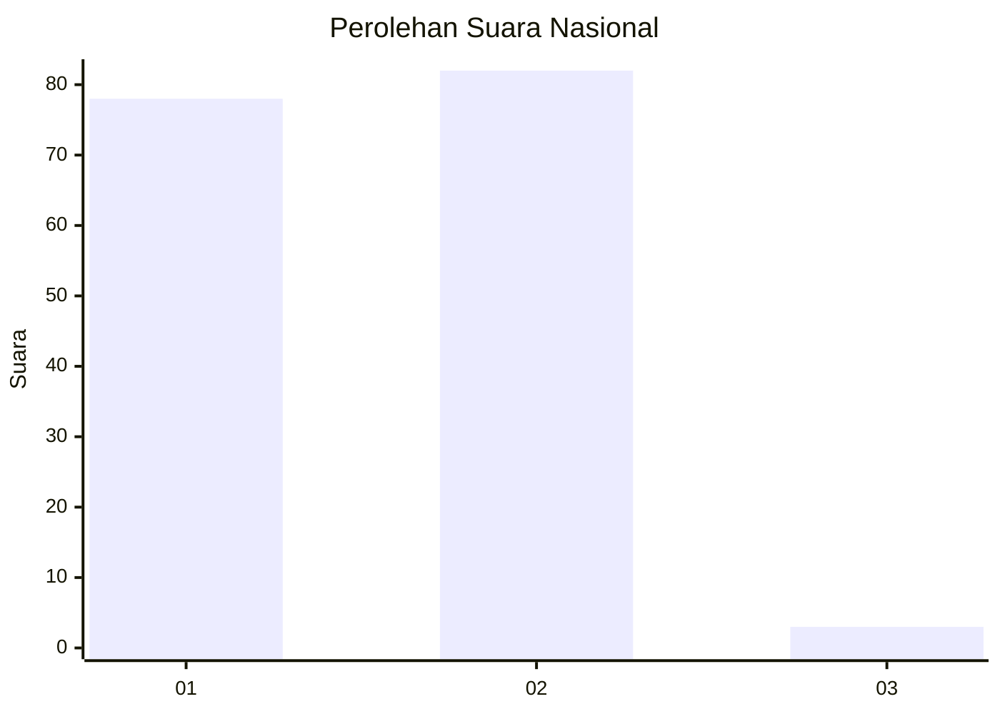
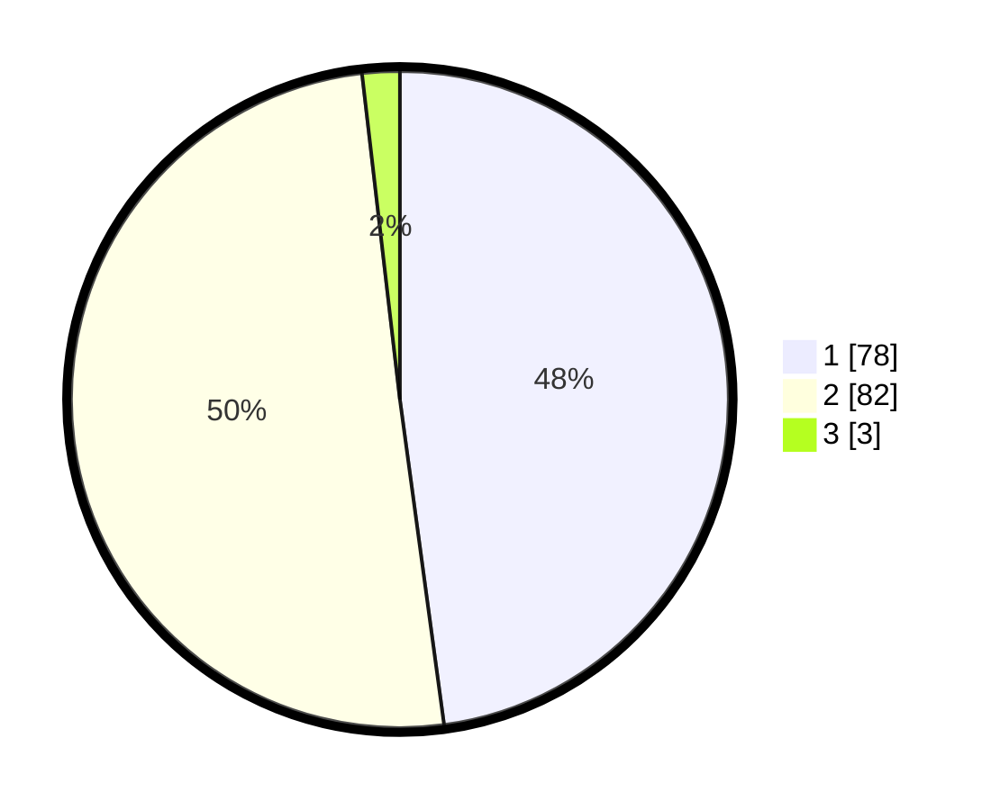

# Hasil

## Grafik

## Tabel

| No. | Nama Paslon    | Suara | Suara (raw) | Persentase |
|:--- |:-------------- | -----:| -----------:| ----------:|
| 1   | ANIES MUHAIMIN | 78    | [78][p-1]   | 47,85      |
| 2   | PRABOWO GIBRAN | 82    | [82][p-2]   | 50,31      |
| 3   | GANJAR MAHFUD  | 3     | [3][p-3]    | 1,84       |

[p-1]: https://github.com/gigit-pemilu/pemilu-2024/blob/main/pilpres/hitung-suara/sub/11-aceh/sub/03-aceh-timur/sub/08-rantau-selamat/sub/2011-alue-punti/sub/003-tps/sub/paslon-1.txt
[p-2]: https://github.com/gigit-pemilu/pemilu-2024/blob/main/pilpres/hitung-suara/sub/11-aceh/sub/03-aceh-timur/sub/08-rantau-selamat/sub/2011-alue-punti/sub/003-tps/sub/paslon-2.txt
[p-3]: https://github.com/gigit-pemilu/pemilu-2024/blob/main/pilpres/hitung-suara/sub/11-aceh/sub/03-aceh-timur/sub/08-rantau-selamat/sub/2011-alue-punti/sub/003-tps/sub/paslon-3.txt

## Foto C Plano

https://sirekap-obj-formc.kpu.go.id/f6b4/pemilu/ppwp/11/03/08/20/11/1103082011003-20240216-133057--bc5a0ee4-2987-46e6-9abf-ce0ed4a68707.jpg

https://sirekap-obj-formc.kpu.go.id/f6b4/pemilu/ppwp/11/03/08/20/11/1103082011003-20240216-133058--13be3861-bffd-4053-a7e7-266e889bcd0b.jpg

https://sirekap-obj-formc.kpu.go.id/f6b4/pemilu/ppwp/11/03/08/20/11/1103082011003-20240216-133057--bbb2eec7-506e-44f5-9d35-2fb3cd2c6253.jpg

## Metadata

| Key        | Value               |
| ---------- | ------------------- |
| Time Stamp | 2024-02-16 17:30:00 |

## DATA PEMILIH TETAP

Jumlah pemilih dalam DPT: **173**.
 * L: **88**.
 * P: **85**.

## DATA PENGGUNA HAK PILIH

Jumlah pengguna hak pilih dalam DPT: **135**.
 * L: **76**.
 * P: **59**.

Jumlah pengguna hak pilih dalam DPTb: **7**.
 * L: **3**.
 * P: **4**.

Jumlah pengguna hak pilih dalam DPK: **22**.
 * L: **7**.
 * P: **15**.

Jumlah pengguna hak pilih: **164**.
 * L: **86**.
 * P: **78**.

## JUMLAH SUARA SAH DAN TIDAK SAH

JUMLAH SELURUH SUARA SAH: **163**.

JUMLAH SUARA TIDAK SAH: **1**.

JUMLAH SELURUH SUARA SAH DAN SUARA TIDAK SAH: **164**.

