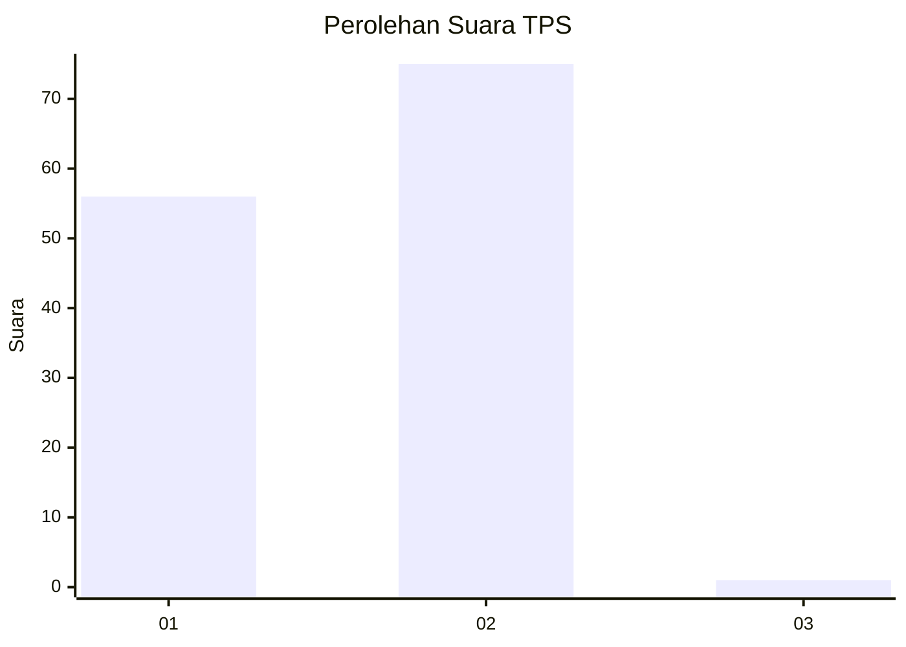
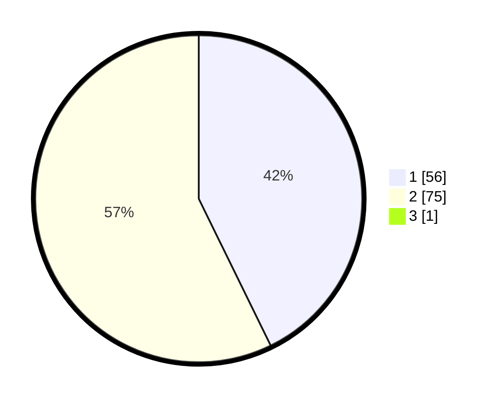

# Hasil

## Grafik

## Tabel

| No. | Nama Paslon    | Suara | Suara (raw) | Persentase |
|:--- |:-------------- | -----:| -----------:| ----------:|
| 1   | ANIES MUHAIMIN | 56    | [56][p-1]   | 42,42      |
| 2   | PRABOWO GIBRAN | 75    | [75][p-2]   | 56,82      |
| 3   | GANJAR MAHFUD  | 1     | [1][p-3]    | 0,76       |

[p-1]: https://github.com/gigit-pemilu/pemilu-2024-11-aceh/blob/main/pilpres/hitung-suara/sub/11-aceh/sub/03-aceh-timur/sub/08-rantau-selamat/sub/2014-alue-tuwi/sub/002-tps/sub/paslon-1.txt
[p-2]: https://github.com/gigit-pemilu/pemilu-2024-11-aceh/blob/main/pilpres/hitung-suara/sub/11-aceh/sub/03-aceh-timur/sub/08-rantau-selamat/sub/2014-alue-tuwi/sub/002-tps/sub/paslon-2.txt
[p-3]: https://github.com/gigit-pemilu/pemilu-2024-11-aceh/blob/main/pilpres/hitung-suara/sub/11-aceh/sub/03-aceh-timur/sub/08-rantau-selamat/sub/2014-alue-tuwi/sub/002-tps/sub/paslon-3.txt

## Foto C Plano

https://sirekap-obj-formc.kpu.go.id/391f/pemilu/ppwp/11/03/08/20/14/1103082014002-20240216-131706--854dc844-5ab4-4f08-9a55-7ddbab45701f.jpg

https://sirekap-obj-formc.kpu.go.id/391f/pemilu/ppwp/11/03/08/20/14/1103082014002-20240215-153524--731f634e-c905-46c5-900b-5dedb14c08fd.jpg

https://sirekap-obj-formc.kpu.go.id/391f/pemilu/ppwp/11/03/08/20/14/1103082014002-20240215-153800--dad99f2d-8f97-4139-a263-ac4b83bcb9cb.jpg

## Metadata

| Key        | Value               |
| ---------- | ------------------- |
| Time Stamp | 2024-02-16 17:30:00 |

## DATA PEMILIH TETAP

Jumlah pemilih dalam DPT: **160**.
 * L: **101**.
 * P: **59**.

## DATA PENGGUNA HAK PILIH

Jumlah pengguna hak pilih dalam DPT: **160**.
 * L: **101**.
 * P: **59**.

Jumlah pengguna hak pilih dalam DPTb: **0**.
 * L: **0**.
 * P: **0**.

Jumlah pengguna hak pilih dalam DPK: **0**.
 * L: **0**.
 * P: **0**.

Jumlah pengguna hak pilih: **160**.
 * L: **101**.
 * P: **59**.

## JUMLAH SUARA SAH DAN TIDAK SAH

JUMLAH SELURUH SUARA SAH: **132**.

JUMLAH SUARA TIDAK SAH: **28**.

JUMLAH SELURUH SUARA SAH DAN SUARA TIDAK SAH: **160**.

