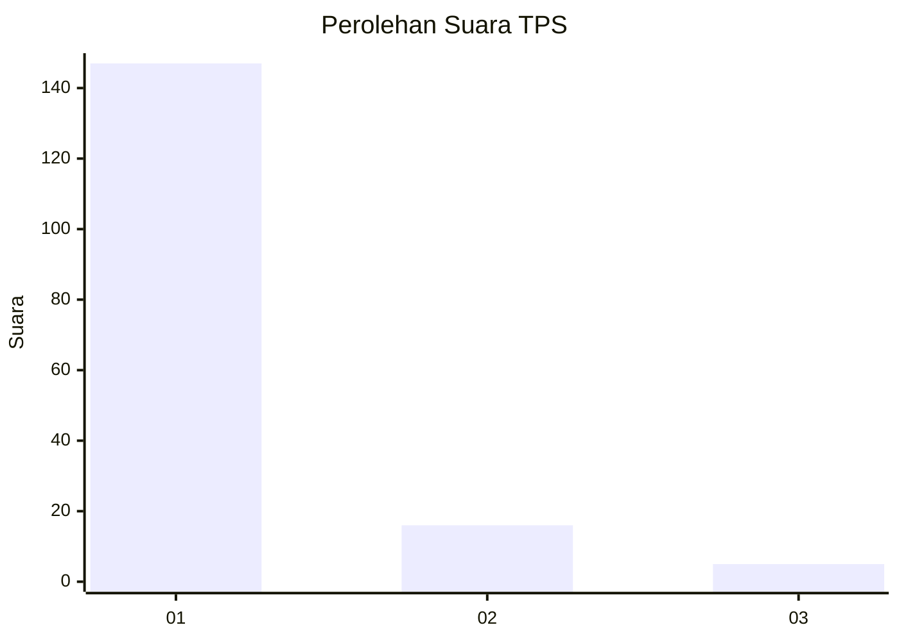
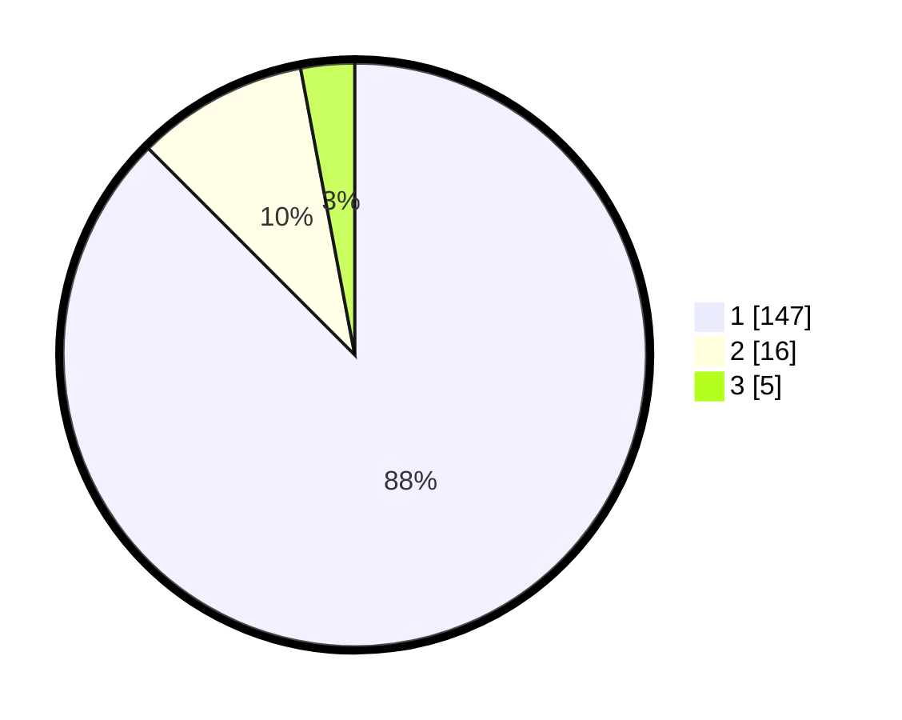

# Hasil

## Grafik

## Tabel

| No. | Nama Paslon    | Suara | Suara (raw) | Persentase |
|:--- |:-------------- | -----:| -----------:| ----------:|
| 1   | ANIES MUHAIMIN | 147   | [147][p-1]  | 87,50      |
| 2   | PRABOWO GIBRAN | 16    | [16][p-2]   | 9,52       |
| 3   | GANJAR MAHFUD  | 5     | [5][p-3]    | 2,98       |

[p-1]: https://github.com/gigit-pemilu/pemilu-2024-11-aceh/blob/main/pilpres/hitung-suara/sub/11-aceh/sub/03-aceh-timur/sub/09-simpang-ulim/sub/2001-peulalu/sub/001-tps/sub/paslon-1.txt
[p-2]: https://github.com/gigit-pemilu/pemilu-2024-11-aceh/blob/main/pilpres/hitung-suara/sub/11-aceh/sub/03-aceh-timur/sub/09-simpang-ulim/sub/2001-peulalu/sub/001-tps/sub/paslon-2.txt
[p-3]: https://github.com/gigit-pemilu/pemilu-2024-11-aceh/blob/main/pilpres/hitung-suara/sub/11-aceh/sub/03-aceh-timur/sub/09-simpang-ulim/sub/2001-peulalu/sub/001-tps/sub/paslon-3.txt

## Foto C Plano

https://sirekap-obj-formc.kpu.go.id/1222/pemilu/ppwp/11/03/09/20/01/1103092001001-20240214-185918--f5927f8a-89a3-41b1-bac5-7362cb650c24.jpg

https://sirekap-obj-formc.kpu.go.id/1222/pemilu/ppwp/11/03/09/20/01/1103092001001-20240214-191027--0b048c49-fa94-44e8-947b-aae0f759414e.jpg

https://sirekap-obj-formc.kpu.go.id/1222/pemilu/ppwp/11/03/09/20/01/1103092001001-20240214-190406--5f2b7cdb-60ee-4614-9832-7e316102e2f7.jpg

## Metadata

| Key        | Value               |
| ---------- | ------------------- |
| Time Stamp | 2024-02-14 21:46:01 |

## DATA PEMILIH TETAP

Jumlah pemilih dalam DPT: **238**.
 * L: **115**.
 * P: **123**.

## DATA PENGGUNA HAK PILIH

Jumlah pengguna hak pilih dalam DPT: **171**.
 * L: **76**.
 * P: **95**.

Jumlah pengguna hak pilih dalam DPTb: **0**.
 * L: **0**.
 * P: **0**.

Jumlah pengguna hak pilih dalam DPK: **1**.
 * L: **1**.
 * P: **0**.

Jumlah pengguna hak pilih: **172**.
 * L: **77**.
 * P: **95**.

## JUMLAH SUARA SAH DAN TIDAK SAH

JUMLAH SELURUH SUARA SAH: **168**.

JUMLAH SUARA TIDAK SAH: **4**.

JUMLAH SELURUH SUARA SAH DAN SUARA TIDAK SAH: **172**.

