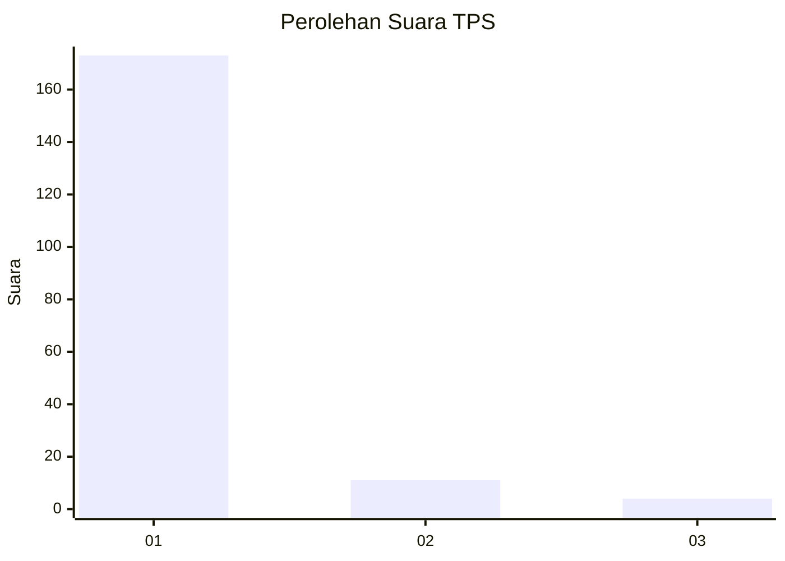
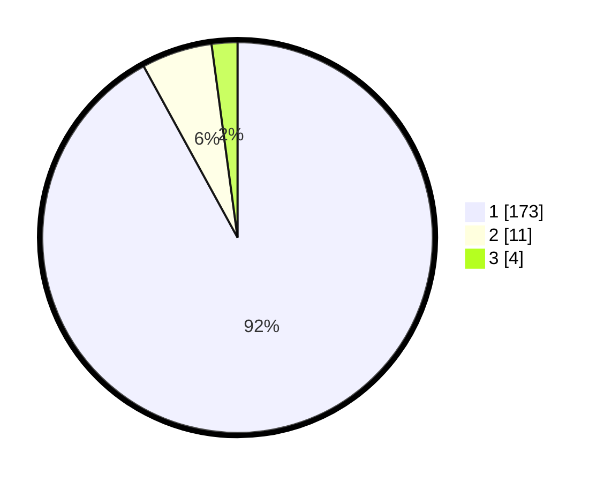

# Hasil

## Grafik

## Tabel

| No. | Nama Paslon    | Suara | Suara (raw) | Persentase |
|:--- |:-------------- | -----:| -----------:| ----------:|
| 1   | ANIES MUHAIMIN | 173   | [173][p-1]  | 92,02      |
| 2   | PRABOWO GIBRAN | 11    | [11][p-2]   | 5,85       |
| 3   | GANJAR MAHFUD  | 4     | [4][p-3]    | 2,13       |

[p-1]: https://github.com/gigit-pemilu/pemilu-2024-11-aceh/blob/main/pilpres/hitung-suara/sub/11-aceh/sub/03-aceh-timur/sub/09-simpang-ulim/sub/2001-peulalu/sub/002-tps/sub/paslon-1.txt
[p-2]: https://github.com/gigit-pemilu/pemilu-2024-11-aceh/blob/main/pilpres/hitung-suara/sub/11-aceh/sub/03-aceh-timur/sub/09-simpang-ulim/sub/2001-peulalu/sub/002-tps/sub/paslon-2.txt
[p-3]: https://github.com/gigit-pemilu/pemilu-2024-11-aceh/blob/main/pilpres/hitung-suara/sub/11-aceh/sub/03-aceh-timur/sub/09-simpang-ulim/sub/2001-peulalu/sub/002-tps/sub/paslon-3.txt

## Foto C Plano

https://sirekap-obj-formc.kpu.go.id/1808/pemilu/ppwp/11/03/09/20/01/1103092001002-20240217-003229--27360c95-22a1-47d0-9b48-d47b79093bd8.jpg

https://sirekap-obj-formc.kpu.go.id/1808/pemilu/ppwp/11/03/09/20/01/1103092001002-20240217-003310--45a46801-b22d-4dfa-a1bf-e059e4c19252.jpg

https://sirekap-obj-formc.kpu.go.id/1808/pemilu/ppwp/11/03/09/20/01/1103092001002-20240217-003348--74d5c277-e2b0-4a51-b4bf-daa2df70d3f0.jpg

## Metadata

| Key        | Value               |
| ---------- | ------------------- |
| Time Stamp | 2024-02-24 22:31:28 |

