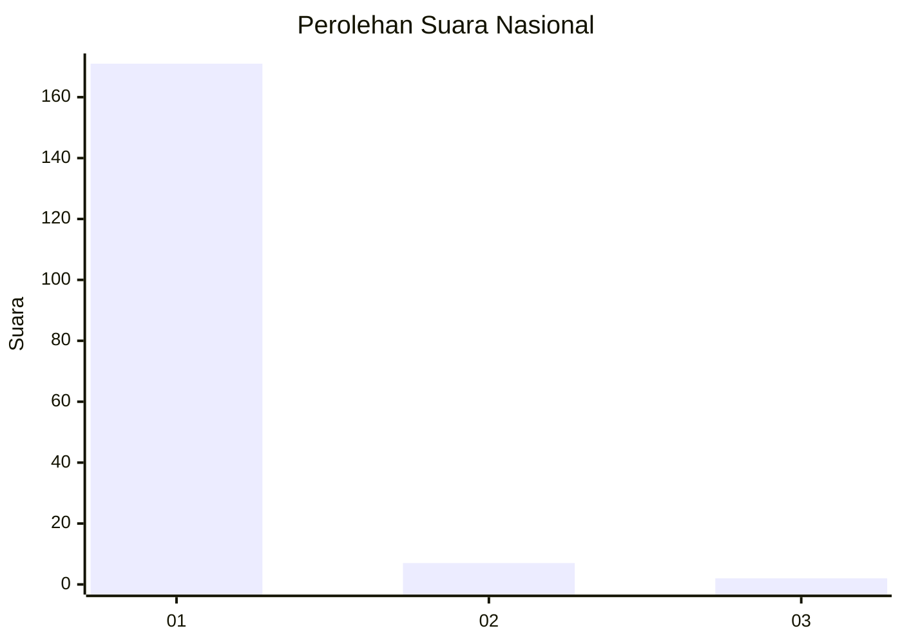
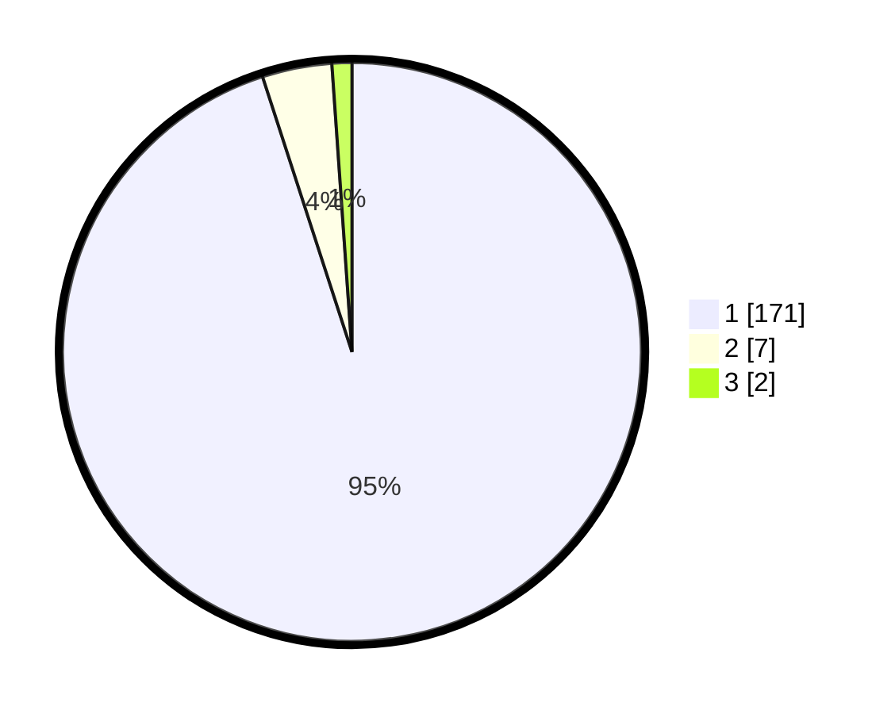

# Hasil

## Grafik

## Tabel

| No. | Nama Paslon    | Suara | Suara (raw) | Persentase |
|:--- |:-------------- | -----:| -----------:| ----------:|
| 1   | ANIES MUHAIMIN | 171   | [171][p-1]  | 95,00      |
| 2   | PRABOWO GIBRAN | 7     | [7][p-2]    | 3,89       |
| 3   | GANJAR MAHFUD  | 2     | [2][p-3]    | 1,11       |

[p-1]: https://github.com/gigit-pemilu/pemilu-2024/blob/main/pilpres/hitung-suara/sub/11-aceh/sub/03-aceh-timur/sub/09-simpang-ulim/sub/2001-peulalu/sub/003-tps/sub/paslon-1.txt
[p-2]: https://github.com/gigit-pemilu/pemilu-2024/blob/main/pilpres/hitung-suara/sub/11-aceh/sub/03-aceh-timur/sub/09-simpang-ulim/sub/2001-peulalu/sub/003-tps/sub/paslon-2.txt
[p-3]: https://github.com/gigit-pemilu/pemilu-2024/blob/main/pilpres/hitung-suara/sub/11-aceh/sub/03-aceh-timur/sub/09-simpang-ulim/sub/2001-peulalu/sub/003-tps/sub/paslon-3.txt

## Foto C Plano

https://sirekap-obj-formc.kpu.go.id/f5f9/pemilu/ppwp/11/03/09/20/01/1103092001003-20240220-122806--84730723-bb61-43b8-867e-cae042f514ae.jpg

https://sirekap-obj-formc.kpu.go.id/f5f9/pemilu/ppwp/11/03/09/20/01/1103092001003-20240220-122808--2a275199-aaad-4fa1-bb95-f8700726f37b.jpg

https://sirekap-obj-formc.kpu.go.id/f5f9/pemilu/ppwp/11/03/09/20/01/1103092001003-20240220-122807--b780aba7-bc41-4055-ac1d-5d9606260c1d.jpg

## Metadata

| Key        | Value               |
| ---------- | ------------------- |
| Time Stamp | 2024-02-21 20:00:00 |

## DATA PEMILIH TETAP

Jumlah pemilih dalam DPT: **249**.
 * L: **128**.
 * P: **121**.

## DATA PENGGUNA HAK PILIH

Jumlah pengguna hak pilih dalam DPT: **181**.
 * L: **104**.
 * P: **77**.

Jumlah pengguna hak pilih dalam DPTb: **0**.
 * L: **0**.
 * P: **0**.

Jumlah pengguna hak pilih dalam DPK: **0**.
 * L: **0**.
 * P: **0**.

Jumlah pengguna hak pilih: **181**.
 * L: **104**.
 * P: **77**.

## JUMLAH SUARA SAH DAN TIDAK SAH

JUMLAH SELURUH SUARA SAH: **180**.

JUMLAH SUARA TIDAK SAH: **1**.

JUMLAH SELURUH SUARA SAH DAN SUARA TIDAK SAH: **181**.

