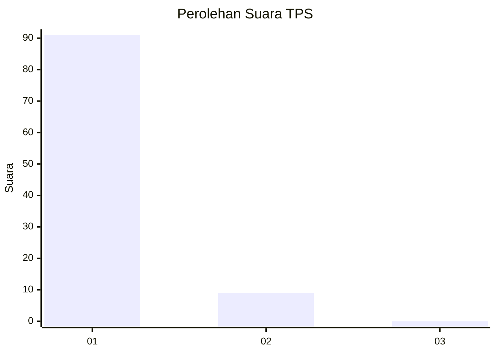
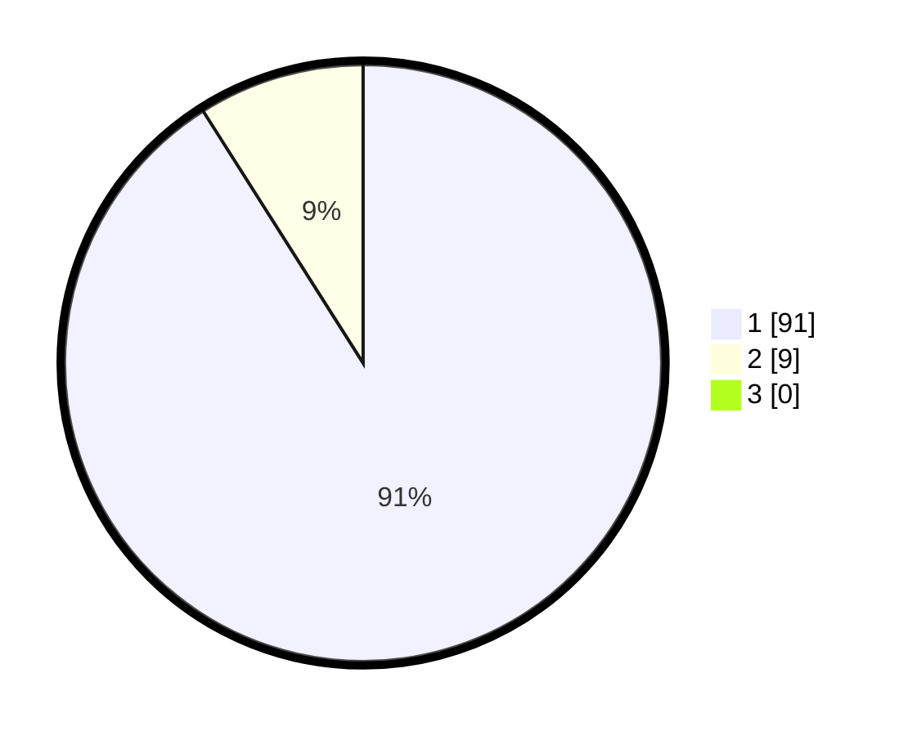

# Hasil

## Grafik

## Tabel

| No. | Nama Paslon    | Suara | Suara (raw) | Persentase |
|:--- |:-------------- | -----:| -----------:| ----------:|
| 1   | ANIES MUHAIMIN | 91    | [91][p-1]   | 91,00      |
| 2   | PRABOWO GIBRAN | 9     | [9][p-2]    | 9,00       |
| 3   | GANJAR MAHFUD  | 0     | [0][p-3]    | 0,00       |

[p-1]: https://github.com/gigit-pemilu/pemilu-2024-11-aceh/blob/main/pilpres/hitung-suara/sub/11-aceh/sub/03-aceh-timur/sub/09-simpang-ulim/sub/2003-alue-buloh-sa/sub/004-tps/sub/paslon-1.txt
[p-2]: https://github.com/gigit-pemilu/pemilu-2024-11-aceh/blob/main/pilpres/hitung-suara/sub/11-aceh/sub/03-aceh-timur/sub/09-simpang-ulim/sub/2003-alue-buloh-sa/sub/004-tps/sub/paslon-2.txt
[p-3]: https://github.com/gigit-pemilu/pemilu-2024-11-aceh/blob/main/pilpres/hitung-suara/sub/11-aceh/sub/03-aceh-timur/sub/09-simpang-ulim/sub/2003-alue-buloh-sa/sub/004-tps/sub/paslon-3.txt

## Foto C Plano

https://sirekap-obj-formc.kpu.go.id/b42b/pemilu/ppwp/11/03/09/20/03/1103092003004-20240216-142910--f0e7550e-67a3-4000-bc09-ef5b8ec8a658.jpg

https://sirekap-obj-formc.kpu.go.id/b42b/pemilu/ppwp/11/03/09/20/03/1103092003004-20240216-142911--2a80e54e-1ef1-4453-a839-d2aa916b45ec.jpg

https://sirekap-obj-formc.kpu.go.id/b42b/pemilu/ppwp/11/03/09/20/03/1103092003004-20240216-142911--54a71445-a84f-4006-b9ab-fcc3fa383150.jpg

## Metadata

| Key        | Value               |
| ---------- | ------------------- |
| Time Stamp | 2024-02-19 08:00:00 |

## DATA PEMILIH TETAP

Jumlah pemilih dalam DPT: **120**.
 * L: **58**.
 * P: **62**.

## DATA PENGGUNA HAK PILIH

Jumlah pengguna hak pilih dalam DPT: **80**.
 * L: **32**.
 * P: **48**.

Jumlah pengguna hak pilih dalam DPTb: **0**.
 * L: **0**.
 * P: **0**.

Jumlah pengguna hak pilih dalam DPK: **23**.
 * L: **9**.
 * P: **14**.

Jumlah pengguna hak pilih: **103**.
 * L: **41**.
 * P: **62**.

## JUMLAH SUARA SAH DAN TIDAK SAH

JUMLAH SELURUH SUARA SAH: **100**.

JUMLAH SUARA TIDAK SAH: **3**.

JUMLAH SELURUH SUARA SAH DAN SUARA TIDAK SAH: **103**.

