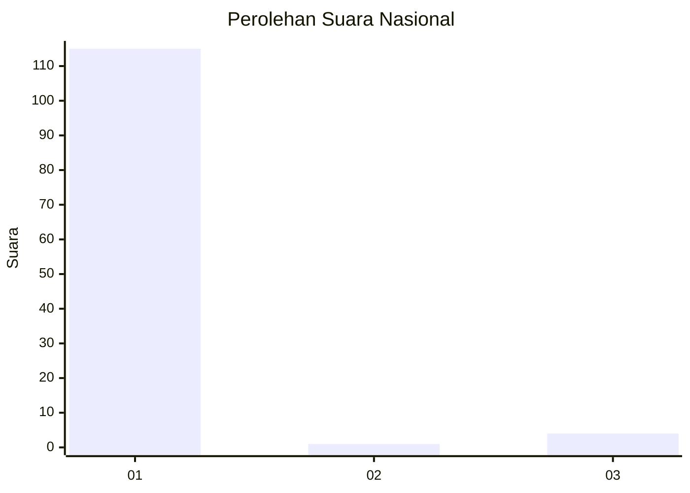
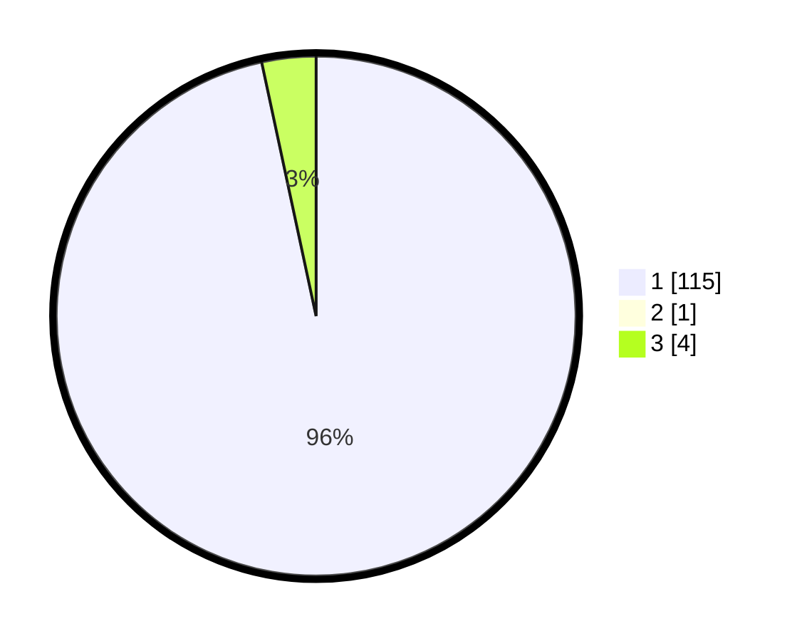

# Hasil

## Grafik

## Tabel

| No. | Nama Paslon    | Suara | Suara (raw) | Persentase |
|:--- |:-------------- | -----:| -----------:| ----------:|
| 1   | ANIES MUHAIMIN | 115   | [115][p-1]  | 95,83      |
| 2   | PRABOWO GIBRAN | 1     | [1][p-2]    | 0,83       |
| 3   | GANJAR MAHFUD  | 4     | [4][p-3]    | 3,33       |

[p-1]: https://github.com/gigit-pemilu/pemilu-2024/blob/main/pilpres/hitung-suara/sub/11-aceh/sub/03-aceh-timur/sub/09-simpang-ulim/sub/2005-teupin-breuh/sub/001-tps/sub/paslon-1.txt
[p-2]: https://github.com/gigit-pemilu/pemilu-2024/blob/main/pilpres/hitung-suara/sub/11-aceh/sub/03-aceh-timur/sub/09-simpang-ulim/sub/2005-teupin-breuh/sub/001-tps/sub/paslon-2.txt
[p-3]: https://github.com/gigit-pemilu/pemilu-2024/blob/main/pilpres/hitung-suara/sub/11-aceh/sub/03-aceh-timur/sub/09-simpang-ulim/sub/2005-teupin-breuh/sub/001-tps/sub/paslon-3.txt

## Foto C Plano

https://sirekap-obj-formc.kpu.go.id/b8b8/pemilu/ppwp/11/03/09/20/05/1103092005001-20240216-135507--a5fa1eb5-4b44-43e8-a4f9-556f609d7e6d.jpg

https://sirekap-obj-formc.kpu.go.id/b8b8/pemilu/ppwp/11/03/09/20/05/1103092005001-20240216-135509--050bce1e-e8f5-4168-a132-e97e274dfc9d.jpg

https://sirekap-obj-formc.kpu.go.id/b8b8/pemilu/ppwp/11/03/09/20/05/1103092005001-20240216-135508--77d69d69-a6c5-4f2c-8e94-0c0d5f543b7c.jpg

## Metadata

| Key        | Value               |
| ---------- | ------------------- |
| Time Stamp | 2024-02-19 08:00:00 |

## DATA PEMILIH TETAP

Jumlah pemilih dalam DPT: **149**.
 * L: **72**.
 * P: **77**.

## DATA PENGGUNA HAK PILIH

Jumlah pengguna hak pilih dalam DPT: **108**.
 * L: **49**.
 * P: **59**.

Jumlah pengguna hak pilih dalam DPTb: **0**.
 * L: **0**.
 * P: **0**.

Jumlah pengguna hak pilih dalam DPK: **19**.
 * L: **9**.
 * P: **10**.

Jumlah pengguna hak pilih: **127**.
 * L: **58**.
 * P: **69**.

## JUMLAH SUARA SAH DAN TIDAK SAH

JUMLAH SELURUH SUARA SAH: **120**.

JUMLAH SUARA TIDAK SAH: **7**.

JUMLAH SELURUH SUARA SAH DAN SUARA TIDAK SAH: **127**.

