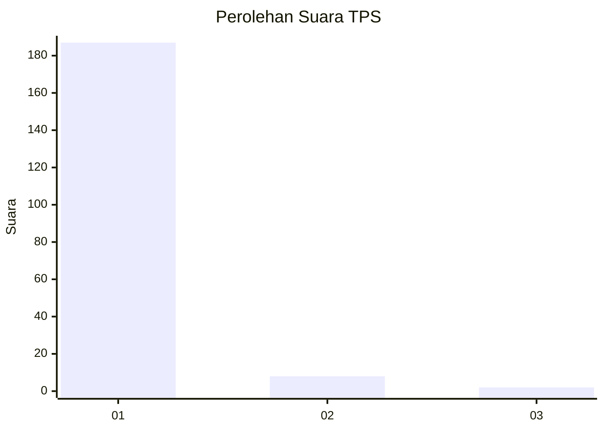
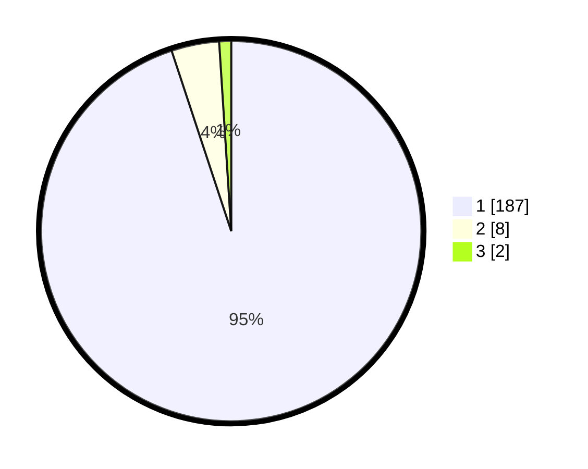

# Hasil

## Grafik

## Tabel

| No. | Nama Paslon    | Suara | Suara (raw) | Persentase |
|:--- |:-------------- | -----:| -----------:| ----------:|
| 1   | ANIES MUHAIMIN | 187   | [187][p-1]  | 94,92      |
| 2   | PRABOWO GIBRAN | 8     | [8][p-2]    | 4,06       |
| 3   | GANJAR MAHFUD  | 2     | [2][p-3]    | 1,02       |

[p-1]: https://github.com/gigit-pemilu/pemilu-2024-11-aceh/blob/main/pilpres/hitung-suara/sub/11-aceh/sub/03-aceh-timur/sub/09-simpang-ulim/sub/2007-matang-kumbang/sub/001-tps/sub/paslon-1.txt
[p-2]: https://github.com/gigit-pemilu/pemilu-2024-11-aceh/blob/main/pilpres/hitung-suara/sub/11-aceh/sub/03-aceh-timur/sub/09-simpang-ulim/sub/2007-matang-kumbang/sub/001-tps/sub/paslon-2.txt
[p-3]: https://github.com/gigit-pemilu/pemilu-2024-11-aceh/blob/main/pilpres/hitung-suara/sub/11-aceh/sub/03-aceh-timur/sub/09-simpang-ulim/sub/2007-matang-kumbang/sub/001-tps/sub/paslon-3.txt

## Foto C Plano

https://sirekap-obj-formc.kpu.go.id/548f/pemilu/ppwp/11/03/09/20/07/1103092007001-20240223-180544--3bb280fc-91ea-413e-bc1e-6e40ba290792.jpg

https://sirekap-obj-formc.kpu.go.id/548f/pemilu/ppwp/11/03/09/20/07/1103092007001-20240223-180725--f62e5130-523f-4428-b226-0128e81c3252.jpg

https://sirekap-obj-formc.kpu.go.id/548f/pemilu/ppwp/11/03/09/20/07/1103092007001-20240223-180014--cd1bcd63-50c4-4233-9b71-f9e0dbfd626c.jpg

## Metadata

| Key        | Value               |
| ---------- | ------------------- |
| Time Stamp | 2024-02-24 22:31:28 |

