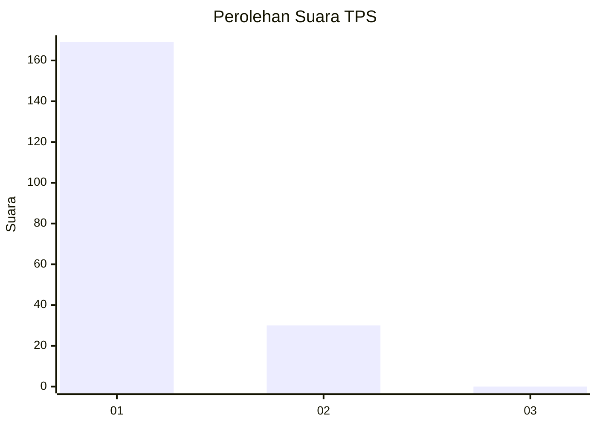
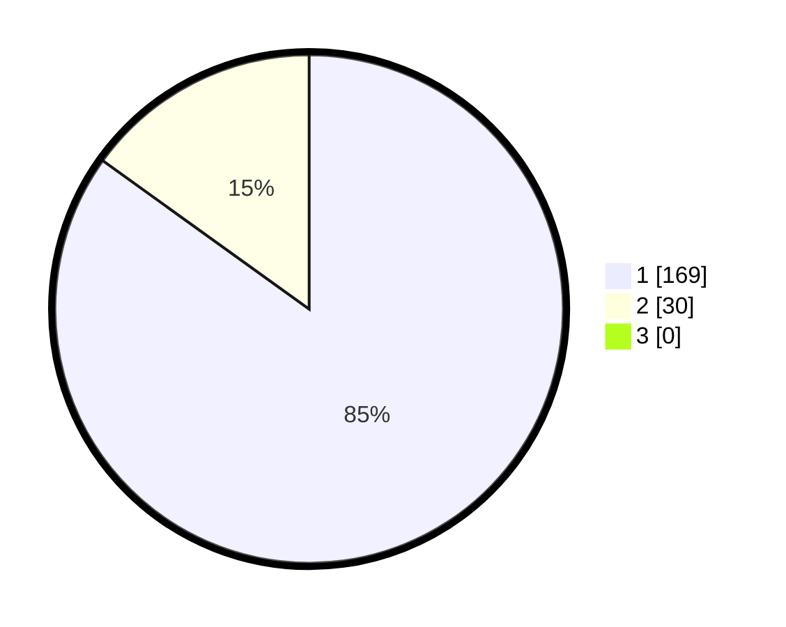

# Hasil

## Grafik

## Tabel

| No. | Nama Paslon    | Suara | Suara (raw) | Persentase |
|:--- |:-------------- | -----:| -----------:| ----------:|
| 1   | ANIES MUHAIMIN | 169   | [169][p-1]  | 84,92      |
| 2   | PRABOWO GIBRAN | 30    | [30][p-2]   | 15,08      |
| 3   | GANJAR MAHFUD  | 0     | [0][p-3]    | 0,00       |

[p-1]: https://github.com/gigit-pemilu/pemilu-2024-11-aceh/blob/main/pilpres/hitung-suara/sub/11-aceh/sub/03-aceh-timur/sub/09-simpang-ulim/sub/2017-lampoh-rayeuk/sub/001-tps/sub/paslon-1.txt
[p-2]: https://github.com/gigit-pemilu/pemilu-2024-11-aceh/blob/main/pilpres/hitung-suara/sub/11-aceh/sub/03-aceh-timur/sub/09-simpang-ulim/sub/2017-lampoh-rayeuk/sub/001-tps/sub/paslon-2.txt
[p-3]: https://github.com/gigit-pemilu/pemilu-2024-11-aceh/blob/main/pilpres/hitung-suara/sub/11-aceh/sub/03-aceh-timur/sub/09-simpang-ulim/sub/2017-lampoh-rayeuk/sub/001-tps/sub/paslon-3.txt

## Foto C Plano

https://sirekap-obj-formc.kpu.go.id/5f59/pemilu/ppwp/11/03/09/20/17/1103092017001-20240215-103855--a64f71cf-18f8-4b93-89c9-b8d47a39ec86.jpg

https://sirekap-obj-formc.kpu.go.id/5f59/pemilu/ppwp/11/03/09/20/17/1103092017001-20240215-212631--b0ccc95d-9df2-4950-af12-b6bf1727e49b.jpg

https://sirekap-obj-formc.kpu.go.id/5f59/pemilu/ppwp/11/03/09/20/17/1103092017001-20240215-212846--809f373f-0a9d-41d5-9a21-4f87e0abfa84.jpg

## Metadata

| Key        | Value               |
| ---------- | ------------------- |
| Time Stamp | 2024-02-24 22:31:28 |

