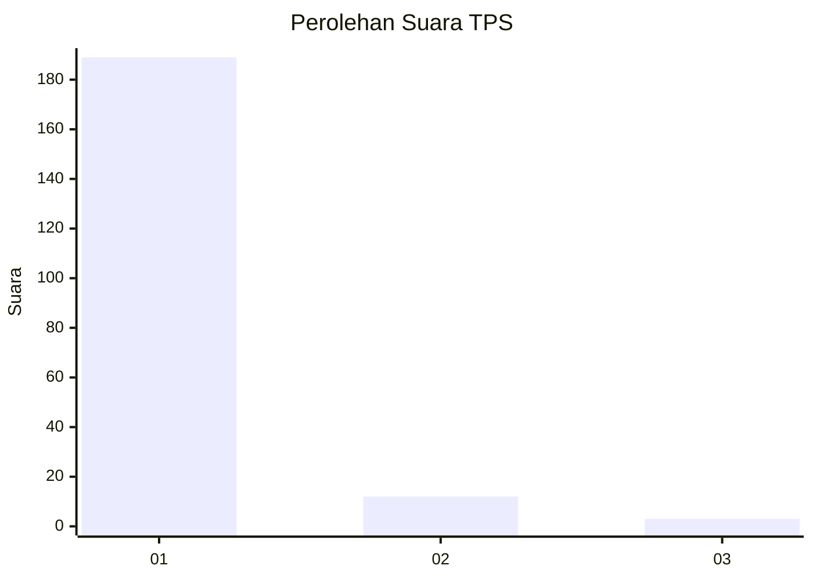
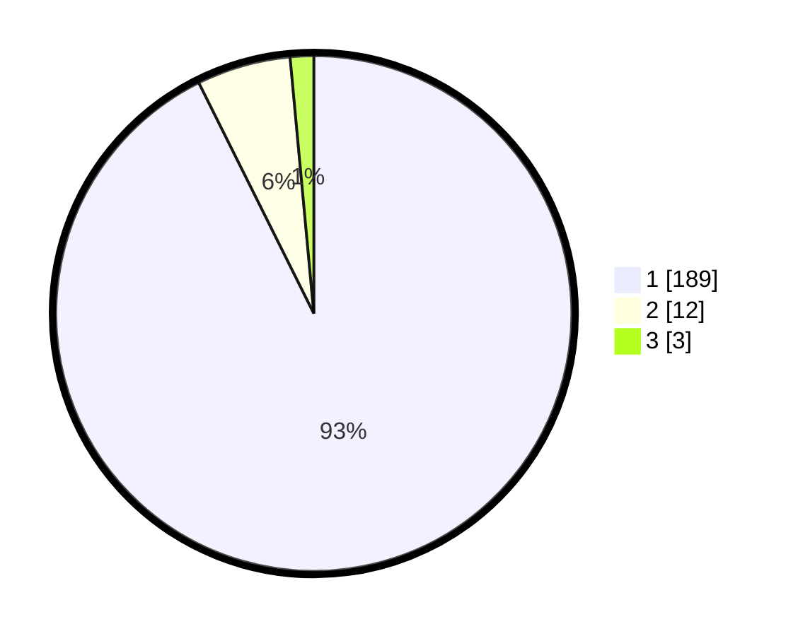

# Hasil

## Grafik

## Tabel

| No. | Nama Paslon    | Suara | Suara (raw) | Persentase |
|:--- |:-------------- | -----:| -----------:| ----------:|
| 1   | ANIES MUHAIMIN | 189   | [189][p-1]  | 92,65      |
| 2   | PRABOWO GIBRAN | 12    | [12][p-2]   | 5,88       |
| 3   | GANJAR MAHFUD  | 3     | [3][p-3]    | 1,47       |

[p-1]: https://github.com/gigit-pemilu/pemilu-2024-11-aceh/blob/main/pilpres/hitung-suara/sub/11-aceh/sub/03-aceh-timur/sub/09-simpang-ulim/sub/2020-pucok-alue-sa/sub/002-tps/sub/paslon-1.txt
[p-2]: https://github.com/gigit-pemilu/pemilu-2024-11-aceh/blob/main/pilpres/hitung-suara/sub/11-aceh/sub/03-aceh-timur/sub/09-simpang-ulim/sub/2020-pucok-alue-sa/sub/002-tps/sub/paslon-2.txt
[p-3]: https://github.com/gigit-pemilu/pemilu-2024-11-aceh/blob/main/pilpres/hitung-suara/sub/11-aceh/sub/03-aceh-timur/sub/09-simpang-ulim/sub/2020-pucok-alue-sa/sub/002-tps/sub/paslon-3.txt

## Foto C Plano

https://sirekap-obj-formc.kpu.go.id/36ce/pemilu/ppwp/11/03/09/20/20/1103092020002-20240214-201235--896bfd7f-d9b9-4ea5-a7d1-1349c74034a4.jpg

https://sirekap-obj-formc.kpu.go.id/36ce/pemilu/ppwp/11/03/09/20/20/1103092020002-20240214-201306--2e2af6cf-9e91-4823-8a0e-ee3218b8198e.jpg

https://sirekap-obj-formc.kpu.go.id/36ce/pemilu/ppwp/11/03/09/20/20/1103092020002-20240214-201333--6501c995-e189-47de-b4ad-253355c6b850.jpg

## Metadata

| Key        | Value               |
| ---------- | ------------------- |
| Time Stamp | 2024-02-24 22:31:28 |

