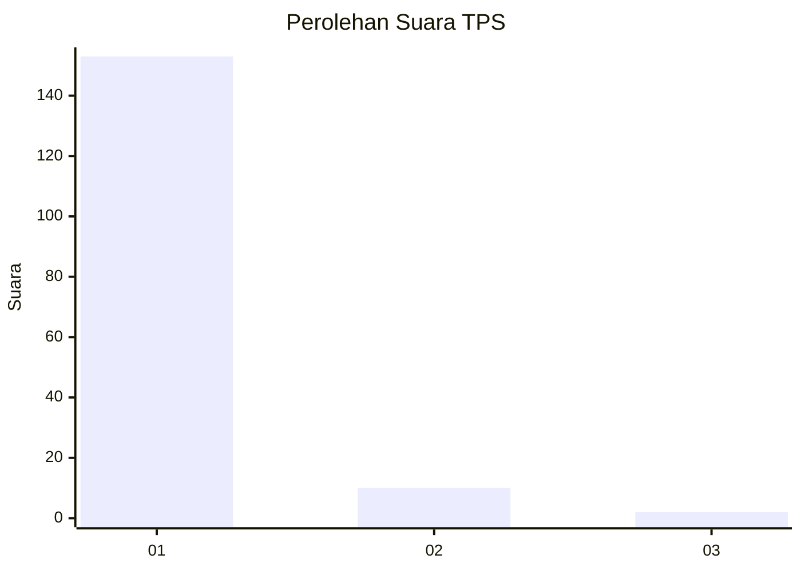
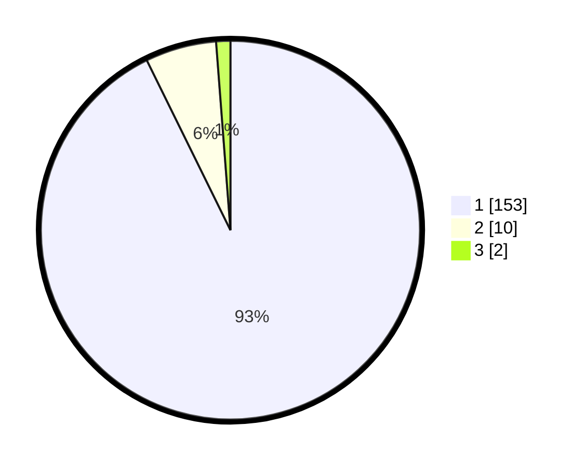

# Hasil

## Grafik

## Tabel

| No. | Nama Paslon    | Suara | Suara (raw) | Persentase |
|:--- |:-------------- | -----:| -----------:| ----------:|
| 1   | ANIES MUHAIMIN | 153   | [153][p-1]  | 92,73      |
| 2   | PRABOWO GIBRAN | 10    | [10][p-2]   | 6,06       |
| 3   | GANJAR MAHFUD  | 2     | [2][p-3]    | 1,21       |

[p-1]: https://github.com/gigit-pemilu/pemilu-2024-11-aceh/blob/main/pilpres/hitung-suara/sub/11-aceh/sub/03-aceh-timur/sub/09-simpang-ulim/sub/2022-arakundo/sub/002-tps/sub/paslon-1.txt
[p-2]: https://github.com/gigit-pemilu/pemilu-2024-11-aceh/blob/main/pilpres/hitung-suara/sub/11-aceh/sub/03-aceh-timur/sub/09-simpang-ulim/sub/2022-arakundo/sub/002-tps/sub/paslon-2.txt
[p-3]: https://github.com/gigit-pemilu/pemilu-2024-11-aceh/blob/main/pilpres/hitung-suara/sub/11-aceh/sub/03-aceh-timur/sub/09-simpang-ulim/sub/2022-arakundo/sub/002-tps/sub/paslon-3.txt

## Foto C Plano

https://sirekap-obj-formc.kpu.go.id/7dd9/pemilu/ppwp/11/03/09/20/22/1103092022002-20240216-211309--5de8d393-f2cf-49be-9540-8a65667d1869.jpg

https://sirekap-obj-formc.kpu.go.id/7dd9/pemilu/ppwp/11/03/09/20/22/1103092022002-20240216-211310--d7454e2c-a9b1-43b9-97cc-348af436a6c4.jpg

https://sirekap-obj-formc.kpu.go.id/7dd9/pemilu/ppwp/11/03/09/20/22/1103092022002-20240216-211309--95a6d15a-0ff7-4a54-9012-13271e2bb1bc.jpg

## Metadata

| Key        | Value               |
| ---------- | ------------------- |
| Time Stamp | 2024-02-19 08:00:00 |

## DATA PEMILIH TETAP

Jumlah pemilih dalam DPT: **191**.
 * L: **83**.
 * P: **108**.

## DATA PENGGUNA HAK PILIH

Jumlah pengguna hak pilih dalam DPT: **168**.
 * L: **64**.
 * P: **101**.

Jumlah pengguna hak pilih dalam DPTb: **165**.
 * L: **64**.
 * P: **101**.

Jumlah pengguna hak pilih dalam DPK: **0**.
 * L: **0**.
 * P: **0**.

Jumlah pengguna hak pilih: **165**.
 * L: **64**.
 * P: **101**.

## JUMLAH SUARA SAH DAN TIDAK SAH

JUMLAH SELURUH SUARA SAH: **165**.

JUMLAH SUARA TIDAK SAH: **0**.

JUMLAH SELURUH SUARA SAH DAN SUARA TIDAK SAH: **165**.

