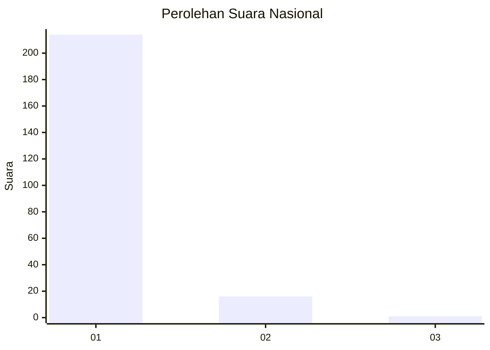
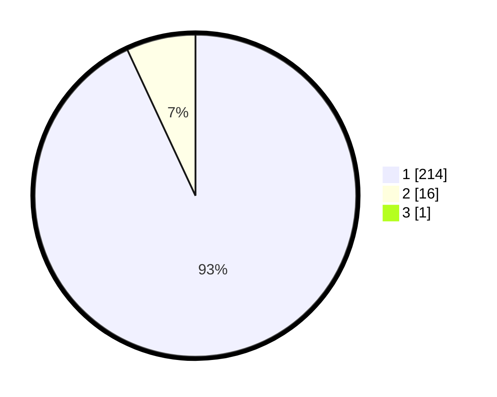

# Hasil

## Grafik

## Tabel

| No. | Nama Paslon    | Suara | Suara (raw) | Persentase |
|:--- |:-------------- | -----:| -----------:| ----------:|
| 1   | ANIES MUHAIMIN | 214   | [214][p-1]  | 92,64      |
| 2   | PRABOWO GIBRAN | 16    | [16][p-2]   | 6,93       |
| 3   | GANJAR MAHFUD  | 1     | [1][p-3]    | 0,43       |

[p-1]: https://github.com/gigit-pemilu/pemilu-2024/blob/main/pilpres/hitung-suara/sub/11-aceh/sub/03-aceh-timur/sub/10-ranto-peureulak/sub/2001-paya-unou/sub/001-tps/sub/paslon-1.txt
[p-2]: https://github.com/gigit-pemilu/pemilu-2024/blob/main/pilpres/hitung-suara/sub/11-aceh/sub/03-aceh-timur/sub/10-ranto-peureulak/sub/2001-paya-unou/sub/001-tps/sub/paslon-2.txt
[p-3]: https://github.com/gigit-pemilu/pemilu-2024/blob/main/pilpres/hitung-suara/sub/11-aceh/sub/03-aceh-timur/sub/10-ranto-peureulak/sub/2001-paya-unou/sub/001-tps/sub/paslon-3.txt

## Foto C Plano

https://sirekap-obj-formc.kpu.go.id/1331/pemilu/ppwp/11/03/10/20/01/1103102001001-20240215-093904--f95264d7-7518-4a47-847e-750069caa9c0.jpg

https://sirekap-obj-formc.kpu.go.id/1331/pemilu/ppwp/11/03/10/20/01/1103102001001-20240215-094025--29fcb297-6d74-404f-b62d-3e38ed8c0d26.jpg

https://sirekap-obj-formc.kpu.go.id/1331/pemilu/ppwp/11/03/10/20/01/1103102001001-20240215-094136--92a97c52-46be-40f5-9915-dabf01c9a151.jpg

## Metadata

| Key        | Value               |
| ---------- | ------------------- |
| Time Stamp | 2024-02-24 22:31:28 |

