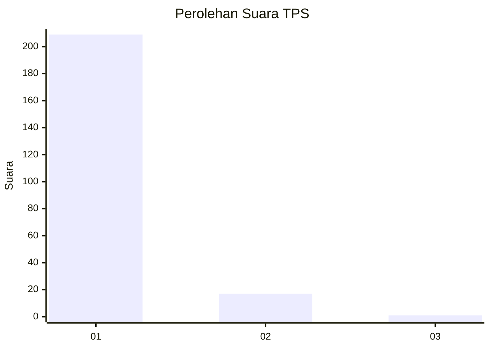
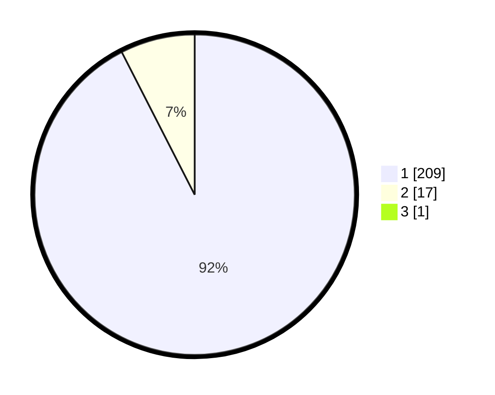

# Hasil

## Grafik

## Tabel

| No. | Nama Paslon    | Suara | Suara (raw) | Persentase |
|:--- |:-------------- | -----:| -----------:| ----------:|
| 1   | ANIES MUHAIMIN | 209   | [209][p-1]  | 92,07      |
| 2   | PRABOWO GIBRAN | 17    | [17][p-2]   | 7,49       |
| 3   | GANJAR MAHFUD  | 1     | [1][p-3]    | 0,44       |

[p-1]: https://github.com/gigit-pemilu/pemilu-2024-11-aceh/blob/main/pilpres/hitung-suara/sub/11-aceh/sub/03-aceh-timur/sub/10-ranto-peureulak/sub/2001-paya-unou/sub/002-tps/sub/paslon-1.txt
[p-2]: https://github.com/gigit-pemilu/pemilu-2024-11-aceh/blob/main/pilpres/hitung-suara/sub/11-aceh/sub/03-aceh-timur/sub/10-ranto-peureulak/sub/2001-paya-unou/sub/002-tps/sub/paslon-2.txt
[p-3]: https://github.com/gigit-pemilu/pemilu-2024-11-aceh/blob/main/pilpres/hitung-suara/sub/11-aceh/sub/03-aceh-timur/sub/10-ranto-peureulak/sub/2001-paya-unou/sub/002-tps/sub/paslon-3.txt

## Foto C Plano

https://sirekap-obj-formc.kpu.go.id/b977/pemilu/ppwp/11/03/10/20/01/1103102001002-20240215-093442--81206f43-bbdb-4325-be1a-4d0e161aebd8.jpg

https://sirekap-obj-formc.kpu.go.id/b977/pemilu/ppwp/11/03/10/20/01/1103102001002-20240214-235447--e1ce1a3b-7f7d-483e-a27d-f7517f0dfd7d.jpg

https://sirekap-obj-formc.kpu.go.id/b977/pemilu/ppwp/11/03/10/20/01/1103102001002-20240215-042611--3ae76873-b0e1-4740-9707-b593b872b8c7.jpg

## Metadata

| Key        | Value               |
| ---------- | ------------------- |
| Time Stamp | 2024-02-24 22:31:28 |

