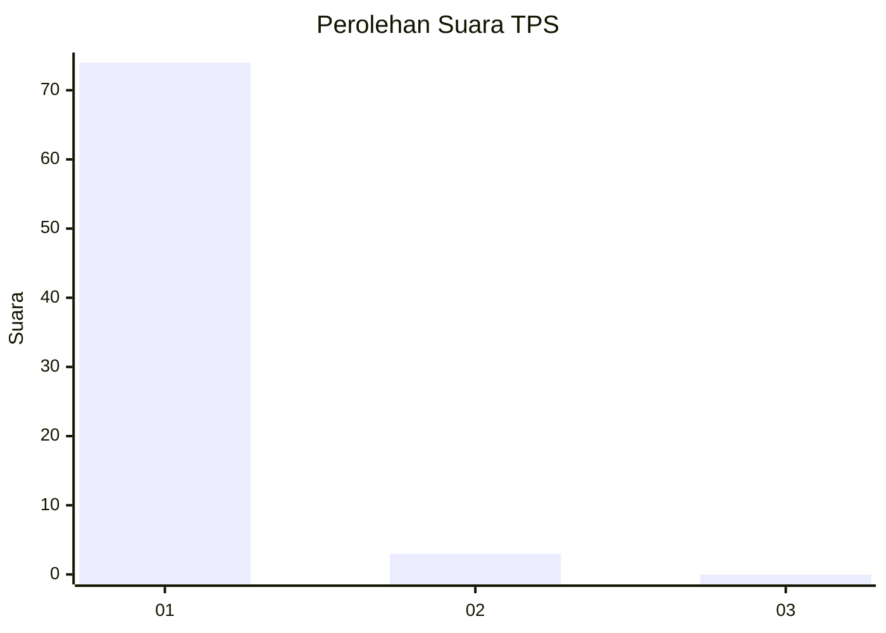
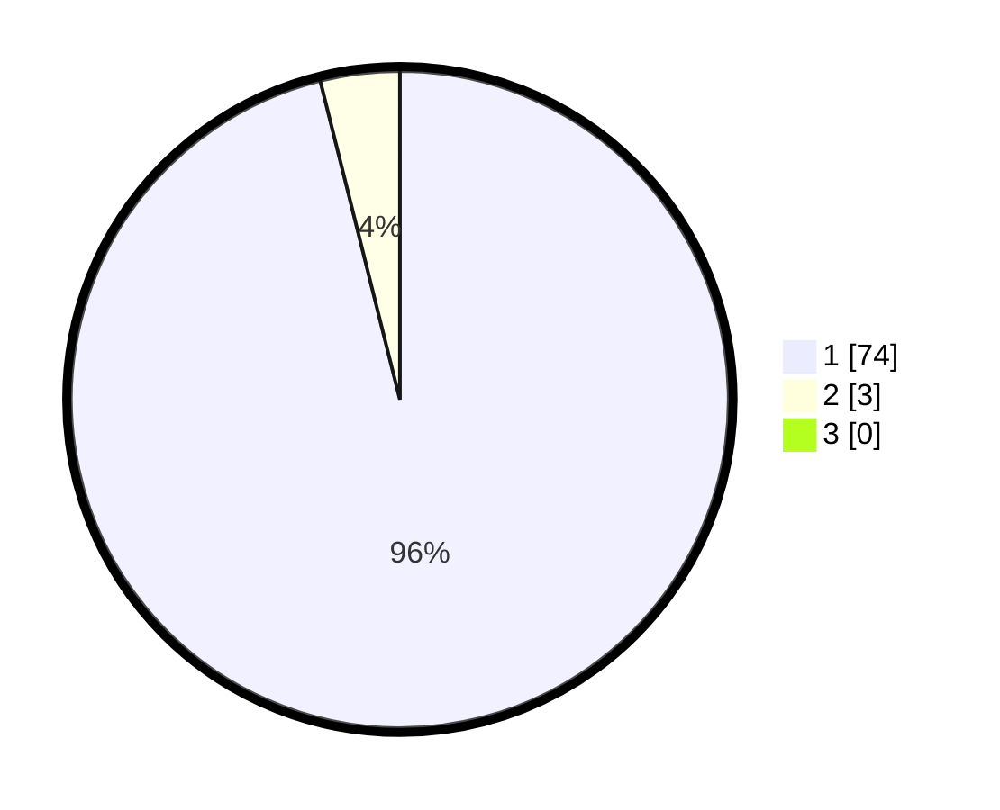

# Hasil

## Grafik

## Tabel

| No. | Nama Paslon    | Suara | Suara (raw) | Persentase |
|:--- |:-------------- | -----:| -----------:| ----------:|
| 1   | ANIES MUHAIMIN | 74    | [74][p-1]   | 96,10      |
| 2   | PRABOWO GIBRAN | 3     | [3][p-2]    | 3,90       |
| 3   | GANJAR MAHFUD  | 0     | [0][p-3]    | 0,00       |

[p-1]: https://github.com/gigit-pemilu/pemilu-2024-11-aceh/blob/main/pilpres/hitung-suara/sub/11-aceh/sub/03-aceh-timur/sub/10-ranto-peureulak/sub/2002-seuneubok-johan/sub/002-tps/sub/paslon-1.txt
[p-2]: https://github.com/gigit-pemilu/pemilu-2024-11-aceh/blob/main/pilpres/hitung-suara/sub/11-aceh/sub/03-aceh-timur/sub/10-ranto-peureulak/sub/2002-seuneubok-johan/sub/002-tps/sub/paslon-2.txt
[p-3]: https://github.com/gigit-pemilu/pemilu-2024-11-aceh/blob/main/pilpres/hitung-suara/sub/11-aceh/sub/03-aceh-timur/sub/10-ranto-peureulak/sub/2002-seuneubok-johan/sub/002-tps/sub/paslon-3.txt

## Foto C Plano

https://sirekap-obj-formc.kpu.go.id/b034/pemilu/ppwp/11/03/10/20/02/1103102002002-20240216-142355--a6b026b9-e7a1-46da-a3aa-c63034056841.jpg

https://sirekap-obj-formc.kpu.go.id/b034/pemilu/ppwp/11/03/10/20/02/1103102002002-20240216-142356--74924138-8624-4368-bf37-6262a996e49a.jpg

https://sirekap-obj-formc.kpu.go.id/b034/pemilu/ppwp/11/03/10/20/02/1103102002002-20240215-030642--887671c3-87ca-4663-8db4-17ac84b90bc9.jpg

## Metadata

| Key        | Value               |
| ---------- | ------------------- |
| Time Stamp | 2024-02-19 08:00:00 |

## DATA PEMILIH TETAP

Jumlah pemilih dalam DPT: **85**.
 * L: **40**.
 * P: **45**.

## DATA PENGGUNA HAK PILIH

Jumlah pengguna hak pilih dalam DPT: **77**.
 * L: **35**.
 * P: **42**.

Jumlah pengguna hak pilih dalam DPTb: **0**.
 * L: **0**.
 * P: **0**.

Jumlah pengguna hak pilih dalam DPK: **0**.
 * L: **0**.
 * P: **0**.

Jumlah pengguna hak pilih: **77**.
 * L: **35**.
 * P: **42**.

## JUMLAH SUARA SAH DAN TIDAK SAH

JUMLAH SELURUH SUARA SAH: **77**.

JUMLAH SUARA TIDAK SAH: **0**.

JUMLAH SELURUH SUARA SAH DAN SUARA TIDAK SAH: **77**.

