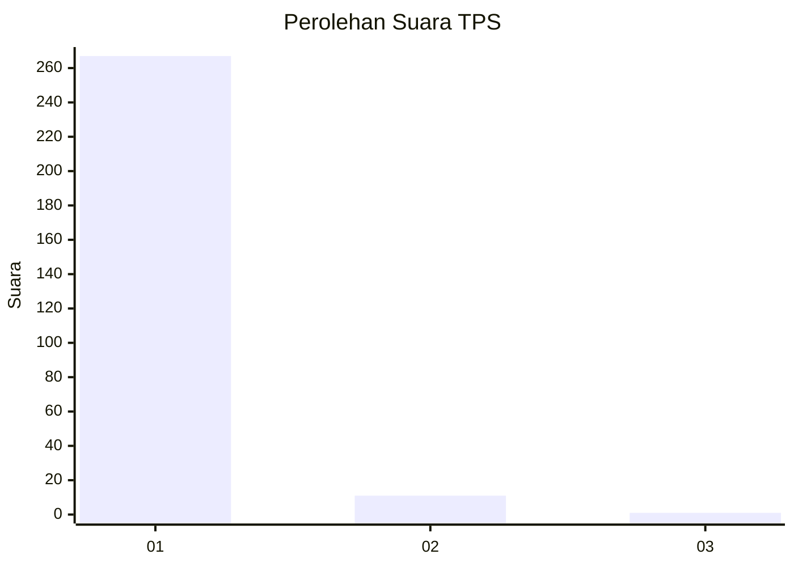
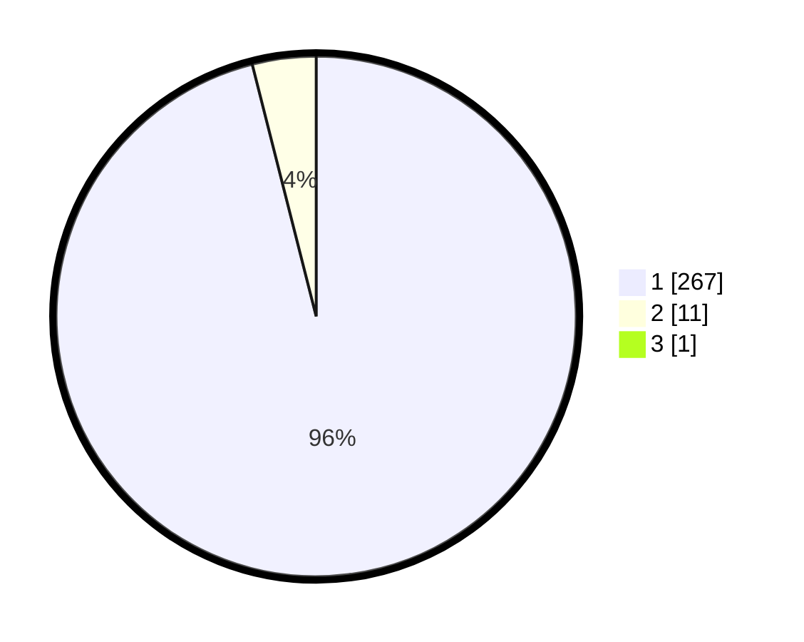

# Hasil

## Grafik

## Tabel

| No. | Nama Paslon    | Suara | Suara (raw) | Persentase |
|:--- |:-------------- | -----:| -----------:| ----------:|
| 1   | ANIES MUHAIMIN | 267   | [267][p-1]  | 95,70      |
| 2   | PRABOWO GIBRAN | 11    | [11][p-2]   | 3,94       |
| 3   | GANJAR MAHFUD  | 1     | [1][p-3]    | 0,36       |

[p-1]: https://github.com/gigit-pemilu/pemilu-2024-11-aceh/blob/main/pilpres/hitung-suara/sub/11-aceh/sub/03-aceh-timur/sub/10-ranto-peureulak/sub/2004-pulo-blang/sub/001-tps/sub/paslon-1.txt
[p-2]: https://github.com/gigit-pemilu/pemilu-2024-11-aceh/blob/main/pilpres/hitung-suara/sub/11-aceh/sub/03-aceh-timur/sub/10-ranto-peureulak/sub/2004-pulo-blang/sub/001-tps/sub/paslon-2.txt
[p-3]: https://github.com/gigit-pemilu/pemilu-2024-11-aceh/blob/main/pilpres/hitung-suara/sub/11-aceh/sub/03-aceh-timur/sub/10-ranto-peureulak/sub/2004-pulo-blang/sub/001-tps/sub/paslon-3.txt

## Foto C Plano

https://sirekap-obj-formc.kpu.go.id/9aea/pemilu/ppwp/11/03/10/20/04/1103102004001-20240214-192143--2b1b905e-2189-4dad-9a11-0a82d8dd748e.jpg

https://sirekap-obj-formc.kpu.go.id/9aea/pemilu/ppwp/11/03/10/20/04/1103102004001-20240214-192202--44802149-dbc4-4379-a1b1-e4813c215bc6.jpg

https://sirekap-obj-formc.kpu.go.id/9aea/pemilu/ppwp/11/03/10/20/04/1103102004001-20240214-192219--0072da34-15e4-4854-881f-97f41eec37c2.jpg

## Metadata

| Key        | Value               |
| ---------- | ------------------- |
| Time Stamp | 2024-02-19 08:00:00 |

## DATA PEMILIH TETAP

Jumlah pemilih dalam DPT: **293**.
 * L: **148**.
 * P: **145**.

## DATA PENGGUNA HAK PILIH

Jumlah pengguna hak pilih dalam DPT: **293**.
 * L: **148**.
 * P: **145**.

Jumlah pengguna hak pilih dalam DPTb: **0**.
 * L: **0**.
 * P: **0**.

Jumlah pengguna hak pilih dalam DPK: **0**.
 * L: **0**.
 * P: **0**.

Jumlah pengguna hak pilih: **293**.
 * L: **148**.
 * P: **145**.

## JUMLAH SUARA SAH DAN TIDAK SAH

JUMLAH SELURUH SUARA SAH: **279**.

JUMLAH SUARA TIDAK SAH: **3**.

JUMLAH SELURUH SUARA SAH DAN SUARA TIDAK SAH: **282**.

