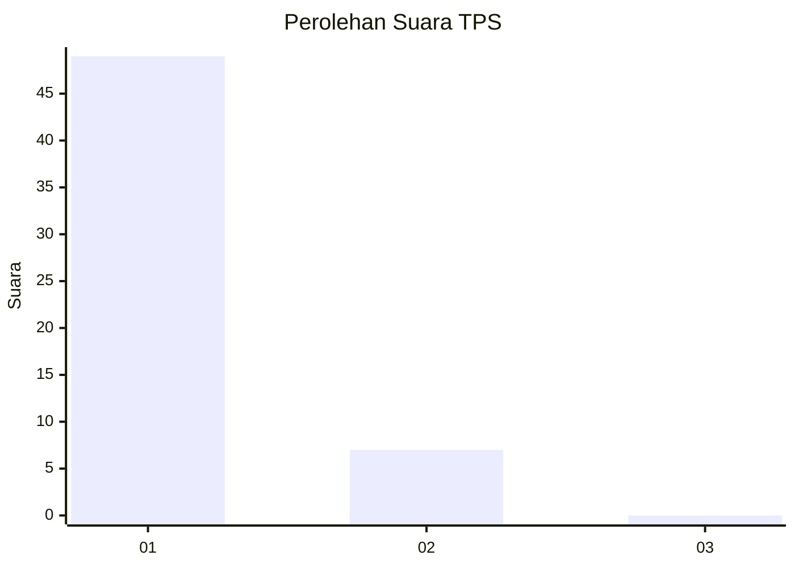
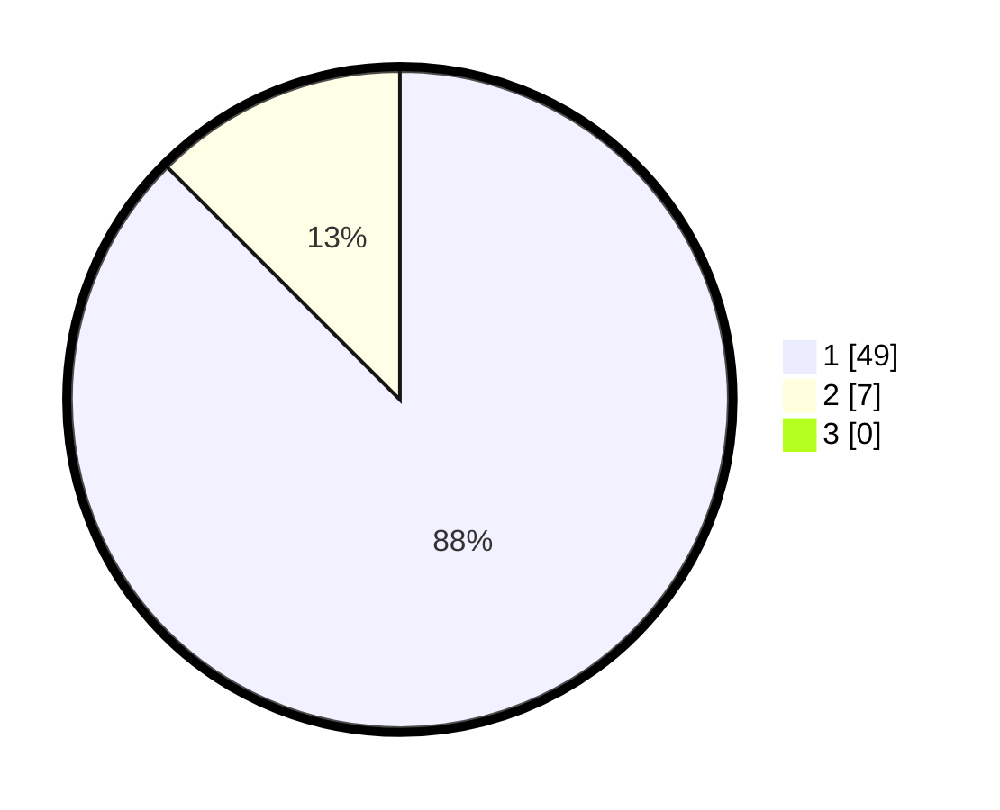

# Hasil

## Grafik

## Tabel

| No. | Nama Paslon    | Suara | Suara (raw) | Persentase |
|:--- |:-------------- | -----:| -----------:| ----------:|
| 1   | ANIES MUHAIMIN | 49    | [49][p-1]   | 87,50      |
| 2   | PRABOWO GIBRAN | 7     | [7][p-2]    | 12,50      |
| 3   | GANJAR MAHFUD  | 0     | [0][p-3]    | 0,00       |

[p-1]: https://github.com/gigit-pemilu/pemilu-2024-11-aceh/blob/main/pilpres/hitung-suara/sub/11-aceh/sub/03-aceh-timur/sub/10-ranto-peureulak/sub/2005-blang-barom/sub/002-tps/sub/paslon-1.txt
[p-2]: https://github.com/gigit-pemilu/pemilu-2024-11-aceh/blob/main/pilpres/hitung-suara/sub/11-aceh/sub/03-aceh-timur/sub/10-ranto-peureulak/sub/2005-blang-barom/sub/002-tps/sub/paslon-2.txt
[p-3]: https://github.com/gigit-pemilu/pemilu-2024-11-aceh/blob/main/pilpres/hitung-suara/sub/11-aceh/sub/03-aceh-timur/sub/10-ranto-peureulak/sub/2005-blang-barom/sub/002-tps/sub/paslon-3.txt

## Foto C Plano

https://sirekap-obj-formc.kpu.go.id/8775/pemilu/ppwp/11/03/10/20/05/1103102005002-20240215-031223--9c150e7b-a899-4d48-8445-3031f0e62fdb.jpg

https://sirekap-obj-formc.kpu.go.id/8775/pemilu/ppwp/11/03/10/20/05/1103102005002-20240215-031401--6f4d7c94-7c3b-40d3-952e-39c172b9217b.jpg

https://sirekap-obj-formc.kpu.go.id/8775/pemilu/ppwp/11/03/10/20/05/1103102005002-20240215-170120--8c8037f3-143e-439c-ab81-4f722b04b21b.jpg

## Metadata

| Key        | Value               |
| ---------- | ------------------- |
| Time Stamp | 2024-02-19 08:00:00 |

## DATA PEMILIH TETAP

Jumlah pemilih dalam DPT: **57**.
 * L: **29**.
 * P: **28**.

## DATA PENGGUNA HAK PILIH

Jumlah pengguna hak pilih dalam DPT: **51**.
 * L: **23**.
 * P: **28**.

Jumlah pengguna hak pilih dalam DPTb: **4**.
 * L: **2**.
 * P: **2**.

Jumlah pengguna hak pilih dalam DPK: **1**.
 * L: **1**.
 * P: **0**.

Jumlah pengguna hak pilih: **56**.
 * L: **26**.
 * P: **30**.

## JUMLAH SUARA SAH DAN TIDAK SAH

JUMLAH SELURUH SUARA SAH: **56**.

JUMLAH SUARA TIDAK SAH: **0**.

JUMLAH SELURUH SUARA SAH DAN SUARA TIDAK SAH: **56**.

