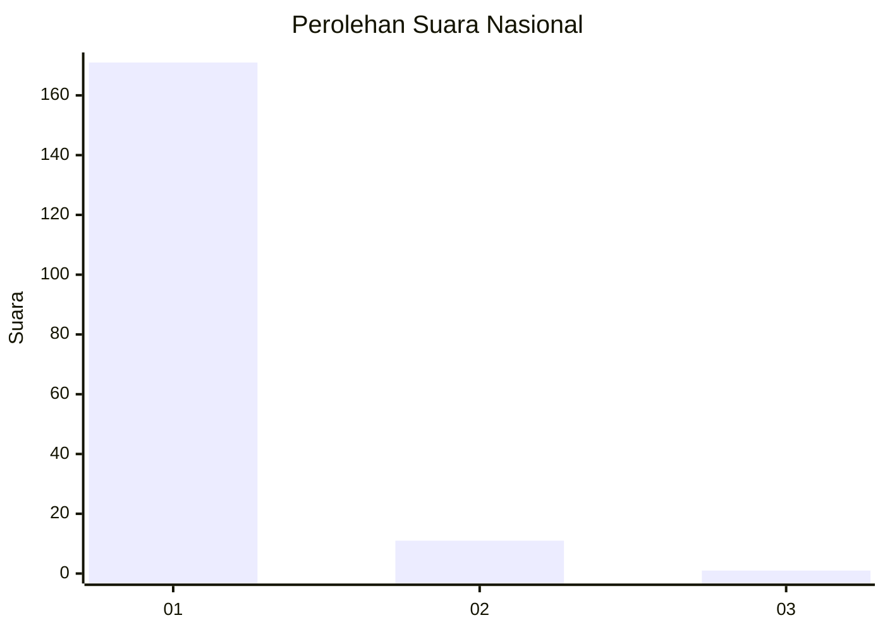
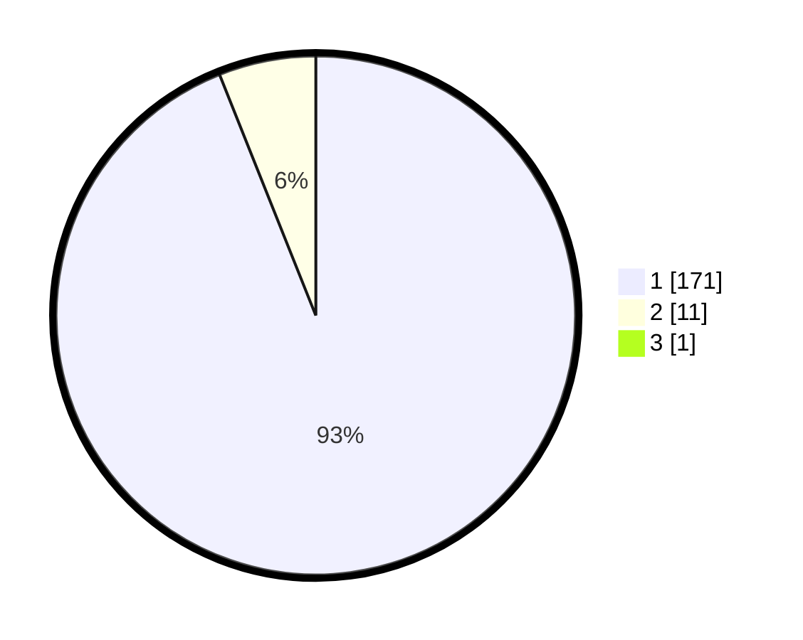

# Hasil

## Grafik

## Tabel

| No. | Nama Paslon    | Suara | Suara (raw) | Persentase |
|:--- |:-------------- | -----:| -----------:| ----------:|
| 1   | ANIES MUHAIMIN | 171   | [171][p-1]  | 93,44      |
| 2   | PRABOWO GIBRAN | 11    | [11][p-2]   | 6,01       |
| 3   | GANJAR MAHFUD  | 1     | [1][p-3]    | 0,55       |

[p-1]: https://github.com/gigit-pemilu/pemilu-2024/blob/main/pilpres/hitung-suara/sub/11-aceh/sub/03-aceh-timur/sub/10-ranto-peureulak/sub/2006-seuneubok-dalam/sub/001-tps/sub/paslon-1.txt
[p-2]: https://github.com/gigit-pemilu/pemilu-2024/blob/main/pilpres/hitung-suara/sub/11-aceh/sub/03-aceh-timur/sub/10-ranto-peureulak/sub/2006-seuneubok-dalam/sub/001-tps/sub/paslon-2.txt
[p-3]: https://github.com/gigit-pemilu/pemilu-2024/blob/main/pilpres/hitung-suara/sub/11-aceh/sub/03-aceh-timur/sub/10-ranto-peureulak/sub/2006-seuneubok-dalam/sub/001-tps/sub/paslon-3.txt

## Foto C Plano

https://sirekap-obj-formc.kpu.go.id/5578/pemilu/ppwp/11/03/10/20/06/1103102006001-20240215-050433--622dbfde-7bbe-401e-9517-43dc5330f45c.jpg

https://sirekap-obj-formc.kpu.go.id/5578/pemilu/ppwp/11/03/10/20/06/1103102006001-20240215-050514--2082d1a4-f0f0-4e20-94cf-a46506fef3cd.jpg

https://sirekap-obj-formc.kpu.go.id/5578/pemilu/ppwp/11/03/10/20/06/1103102006001-20240215-050537--68ae06fe-a6ad-47c7-9c9b-b965e9875869.jpg

## Metadata

| Key        | Value               |
| ---------- | ------------------- |
| Time Stamp | 2024-02-24 22:31:28 |

