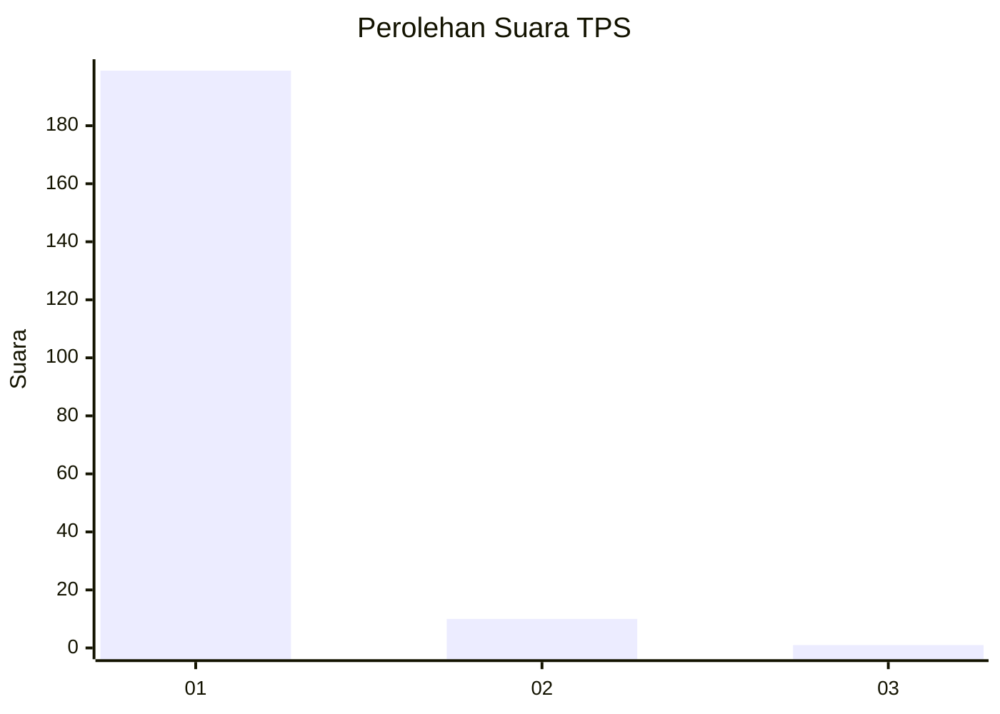
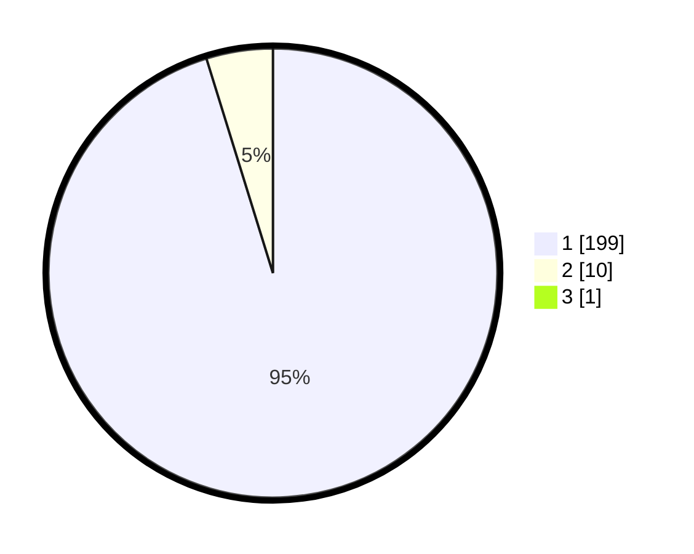

# Hasil

## Grafik

## Tabel

| No. | Nama Paslon    | Suara | Suara (raw) | Persentase |
|:--- |:-------------- | -----:| -----------:| ----------:|
| 1   | ANIES MUHAIMIN | 199   | [199][p-1]  | 94,76      |
| 2   | PRABOWO GIBRAN | 10    | [10][p-2]   | 4,76       |
| 3   | GANJAR MAHFUD  | 1     | [1][p-3]    | 0,48       |

[p-1]: https://github.com/gigit-pemilu/pemilu-2024-11-aceh/blob/main/pilpres/hitung-suara/sub/11-aceh/sub/03-aceh-timur/sub/10-ranto-peureulak/sub/2008-bhom-lama/sub/001-tps/sub/paslon-1.txt
[p-2]: https://github.com/gigit-pemilu/pemilu-2024-11-aceh/blob/main/pilpres/hitung-suara/sub/11-aceh/sub/03-aceh-timur/sub/10-ranto-peureulak/sub/2008-bhom-lama/sub/001-tps/sub/paslon-2.txt
[p-3]: https://github.com/gigit-pemilu/pemilu-2024-11-aceh/blob/main/pilpres/hitung-suara/sub/11-aceh/sub/03-aceh-timur/sub/10-ranto-peureulak/sub/2008-bhom-lama/sub/001-tps/sub/paslon-3.txt

## Foto C Plano

https://sirekap-obj-formc.kpu.go.id/58d3/pemilu/ppwp/11/03/10/20/08/1103102008001-20240215-112117--363c4bb5-7c18-49bd-9906-17a69d401af9.jpg

https://sirekap-obj-formc.kpu.go.id/58d3/pemilu/ppwp/11/03/10/20/08/1103102008001-20240215-112340--470f0503-65cd-4022-b22a-1de054ff9f2f.jpg

https://sirekap-obj-formc.kpu.go.id/58d3/pemilu/ppwp/11/03/10/20/08/1103102008001-20240215-113016--2f9f3eea-f252-42c3-9158-9c9c6f3882a0.jpg

## Metadata

| Key        | Value               |
| ---------- | ------------------- |
| Time Stamp | 2024-02-24 22:31:28 |

