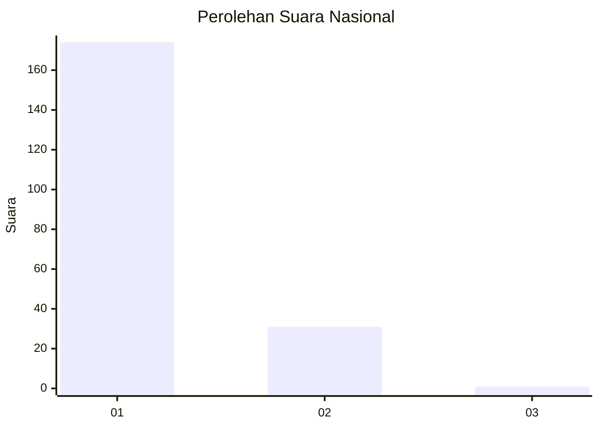
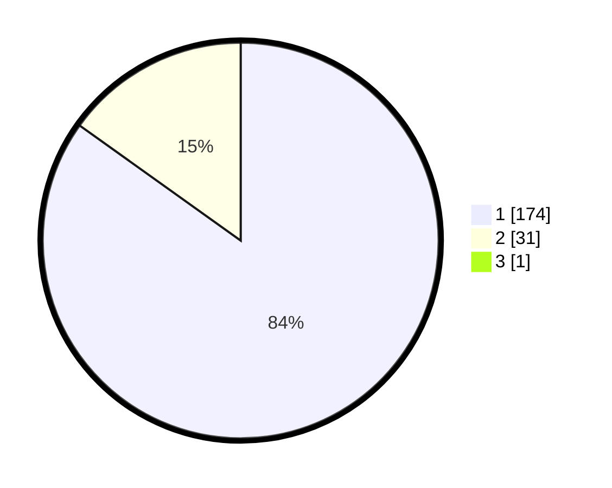

# Hasil

## Grafik

## Tabel

| No. | Nama Paslon    | Suara | Suara (raw) | Persentase |
|:--- |:-------------- | -----:| -----------:| ----------:|
| 1   | ANIES MUHAIMIN | 174   | [174][p-1]  | 84,47      |
| 2   | PRABOWO GIBRAN | 31    | [31][p-2]   | 15,05      |
| 3   | GANJAR MAHFUD  | 1     | [1][p-3]    | 0,49       |

[p-1]: https://github.com/gigit-pemilu/pemilu-2024/blob/main/pilpres/hitung-suara/sub/11-aceh/sub/03-aceh-timur/sub/10-ranto-peureulak/sub/2008-bhom-lama/sub/002-tps/sub/paslon-1.txt
[p-2]: https://github.com/gigit-pemilu/pemilu-2024/blob/main/pilpres/hitung-suara/sub/11-aceh/sub/03-aceh-timur/sub/10-ranto-peureulak/sub/2008-bhom-lama/sub/002-tps/sub/paslon-2.txt
[p-3]: https://github.com/gigit-pemilu/pemilu-2024/blob/main/pilpres/hitung-suara/sub/11-aceh/sub/03-aceh-timur/sub/10-ranto-peureulak/sub/2008-bhom-lama/sub/002-tps/sub/paslon-3.txt

## Foto C Plano

https://sirekap-obj-formc.kpu.go.id/4f5d/pemilu/ppwp/11/03/10/20/08/1103102008002-20240215-124449--7f07dbac-4e55-43bf-aa54-be595ace1cb5.jpg

https://sirekap-obj-formc.kpu.go.id/4f5d/pemilu/ppwp/11/03/10/20/08/1103102008002-20240215-094821--6d4db0c7-03ec-4e20-ba29-c629e9dc79d5.jpg

https://sirekap-obj-formc.kpu.go.id/4f5d/pemilu/ppwp/11/03/10/20/08/1103102008002-20240215-094958--c8ea5b08-26cb-44b4-915a-afadd4706d98.jpg

## Metadata

| Key        | Value               |
| ---------- | ------------------- |
| Time Stamp | 2024-02-25 22:00:00 |

