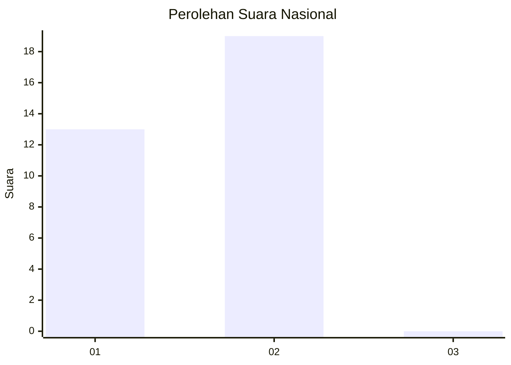
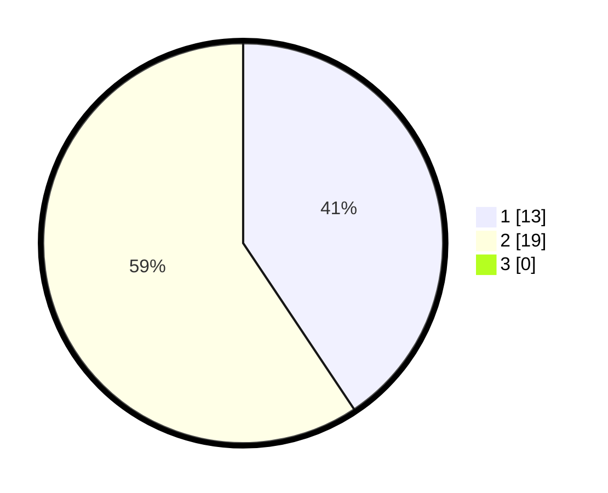

# Hasil

## Grafik

## Tabel

| No. | Nama Paslon    | Suara | Suara (raw) | Persentase |
|:--- |:-------------- | -----:| -----------:| ----------:|
| 1   | ANIES MUHAIMIN | 13    | [13][p-1]   | 40,63      |
| 2   | PRABOWO GIBRAN | 19    | [19][p-2]   | 59,38      |
| 3   | GANJAR MAHFUD  | 0     | [0][p-3]    | 0,00       |

[p-1]: https://github.com/gigit-pemilu/pemilu-2024/blob/main/pilpres/hitung-suara/sub/11-aceh/sub/03-aceh-timur/sub/10-ranto-peureulak/sub/2009-pasi-puteh/sub/003-tps/sub/paslon-1.txt
[p-2]: https://github.com/gigit-pemilu/pemilu-2024/blob/main/pilpres/hitung-suara/sub/11-aceh/sub/03-aceh-timur/sub/10-ranto-peureulak/sub/2009-pasi-puteh/sub/003-tps/sub/paslon-2.txt
[p-3]: https://github.com/gigit-pemilu/pemilu-2024/blob/main/pilpres/hitung-suara/sub/11-aceh/sub/03-aceh-timur/sub/10-ranto-peureulak/sub/2009-pasi-puteh/sub/003-tps/sub/paslon-3.txt

## Foto C Plano

https://sirekap-obj-formc.kpu.go.id/9aef/pemilu/ppwp/11/03/10/20/09/1103102009003-20240215-091159--689ae836-77ee-486c-a589-044bcfc94c1f.jpg

https://sirekap-obj-formc.kpu.go.id/9aef/pemilu/ppwp/11/03/10/20/09/1103102009003-20240215-043755--54574764-804e-41e0-bd31-05a734c2716d.jpg

https://sirekap-obj-formc.kpu.go.id/9aef/pemilu/ppwp/11/03/10/20/09/1103102009003-20240215-044323--89ce6f6c-f447-4234-bca4-529a81618525.jpg

## Metadata

| Key        | Value               |
| ---------- | ------------------- |
| Time Stamp | 2024-02-24 22:31:28 |

