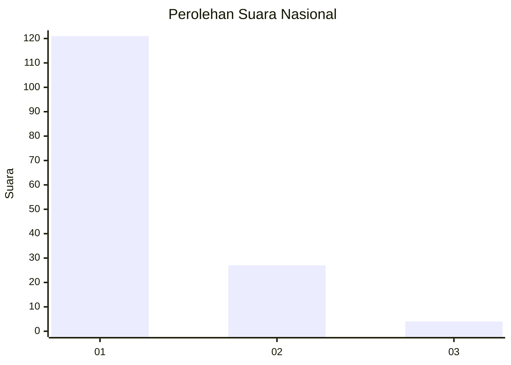
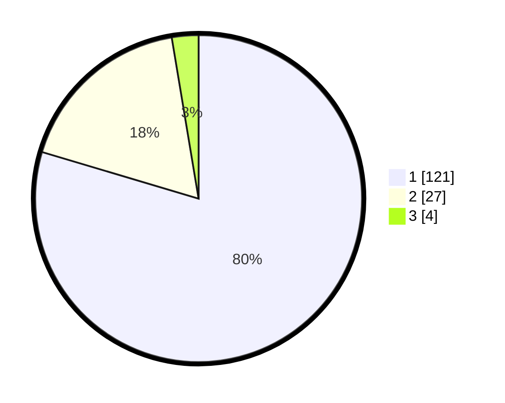

# Hasil

## Grafik

## Tabel

| No. | Nama Paslon    | Suara | Suara (raw) | Persentase |
|:--- |:-------------- | -----:| -----------:| ----------:|
| 1   | ANIES MUHAIMIN | 121   | [121][p-1]  | 79,61      |
| 2   | PRABOWO GIBRAN | 27    | [27][p-2]   | 17,76      |
| 3   | GANJAR MAHFUD  | 4     | [4][p-3]    | 2,63       |

[p-1]: https://github.com/gigit-pemilu/pemilu-2024/blob/main/pilpres/hitung-suara/sub/11-aceh/sub/03-aceh-timur/sub/10-ranto-peureulak/sub/2010-alue-dua/sub/002-tps/sub/paslon-1.txt
[p-2]: https://github.com/gigit-pemilu/pemilu-2024/blob/main/pilpres/hitung-suara/sub/11-aceh/sub/03-aceh-timur/sub/10-ranto-peureulak/sub/2010-alue-dua/sub/002-tps/sub/paslon-2.txt
[p-3]: https://github.com/gigit-pemilu/pemilu-2024/blob/main/pilpres/hitung-suara/sub/11-aceh/sub/03-aceh-timur/sub/10-ranto-peureulak/sub/2010-alue-dua/sub/002-tps/sub/paslon-3.txt

## Foto C Plano

https://sirekap-obj-formc.kpu.go.id/0188/pemilu/ppwp/11/03/10/20/10/1103102010002-20240215-044537--726c1cfc-513a-4b2a-b308-ce4c1e538dd8.jpg

https://sirekap-obj-formc.kpu.go.id/0188/pemilu/ppwp/11/03/10/20/10/1103102010002-20240215-045142--c191c205-c2c9-4f61-953a-95fdce9759bc.jpg

https://sirekap-obj-formc.kpu.go.id/0188/pemilu/ppwp/11/03/10/20/10/1103102010002-20240215-045341--4d3dc165-c2aa-4a6d-b19b-85194b6f0dc1.jpg

## Metadata

| Key        | Value               |
| ---------- | ------------------- |
| Time Stamp | 2024-02-24 22:31:28 |

