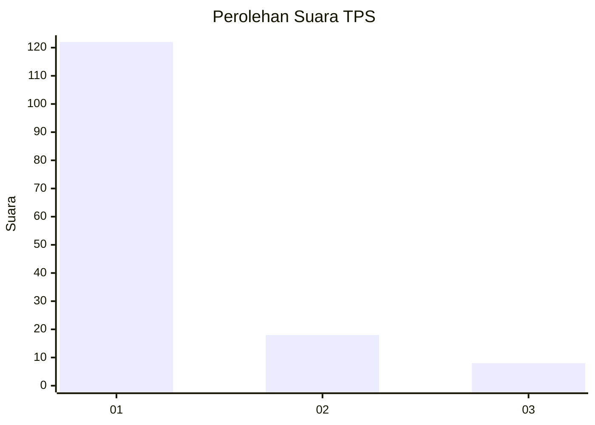
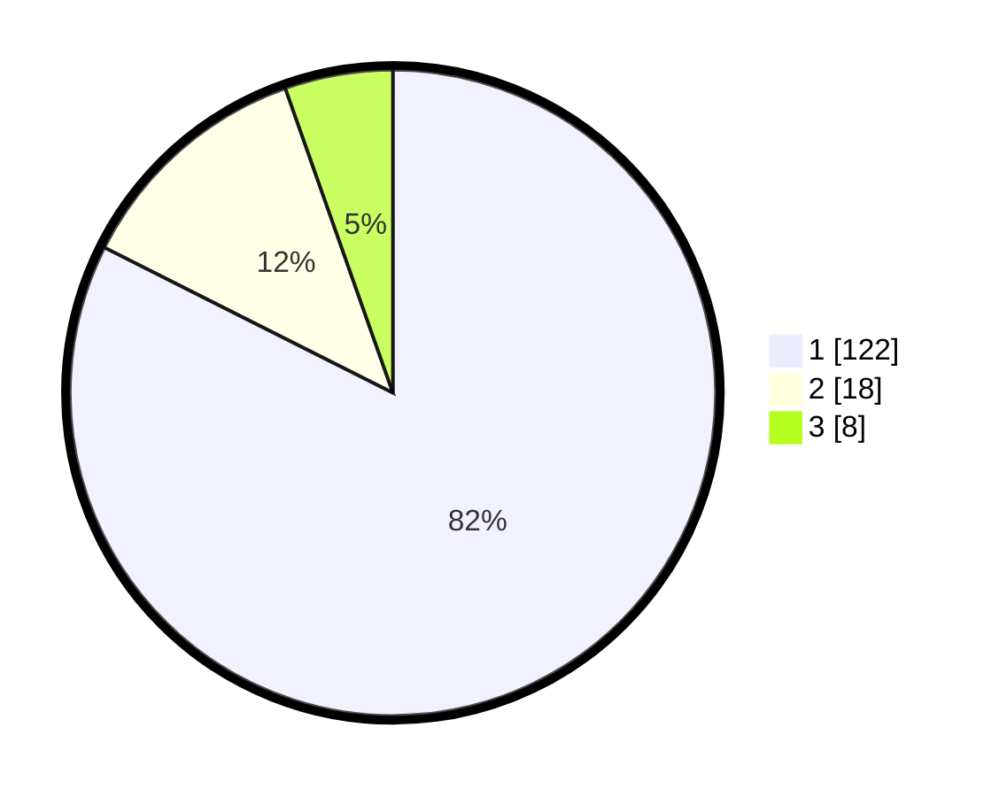

# Hasil

## Grafik

## Tabel

| No. | Nama Paslon    | Suara | Suara (raw) | Persentase |
|:--- |:-------------- | -----:| -----------:| ----------:|
| 1   | ANIES MUHAIMIN | 122   | [122][p-1]  | 82,43      |
| 2   | PRABOWO GIBRAN | 18    | [18][p-2]   | 12,16      |
| 3   | GANJAR MAHFUD  | 8     | [8][p-3]    | 5,41       |

[p-1]: https://github.com/gigit-pemilu/pemilu-2024-11-aceh/blob/main/pilpres/hitung-suara/sub/11-aceh/sub/03-aceh-timur/sub/10-ranto-peureulak/sub/2010-alue-dua/sub/003-tps/sub/paslon-1.txt
[p-2]: https://github.com/gigit-pemilu/pemilu-2024-11-aceh/blob/main/pilpres/hitung-suara/sub/11-aceh/sub/03-aceh-timur/sub/10-ranto-peureulak/sub/2010-alue-dua/sub/003-tps/sub/paslon-2.txt
[p-3]: https://github.com/gigit-pemilu/pemilu-2024-11-aceh/blob/main/pilpres/hitung-suara/sub/11-aceh/sub/03-aceh-timur/sub/10-ranto-peureulak/sub/2010-alue-dua/sub/003-tps/sub/paslon-3.txt

## Foto C Plano

https://sirekap-obj-formc.kpu.go.id/b00a/pemilu/ppwp/11/03/10/20/10/1103102010003-20240215-054021--8922d3c0-b0f9-40e5-86aa-cb970e219957.jpg

https://sirekap-obj-formc.kpu.go.id/b00a/pemilu/ppwp/11/03/10/20/10/1103102010003-20240215-054039--1f2453d2-42fe-45ed-84da-3462c456e2a6.jpg

https://sirekap-obj-formc.kpu.go.id/b00a/pemilu/ppwp/11/03/10/20/10/1103102010003-20240215-054129--2d94f92f-7857-412a-9c48-0804db34ff0d.jpg

## Metadata

| Key        | Value               |
| ---------- | ------------------- |
| Time Stamp | 2024-02-24 22:31:28 |

