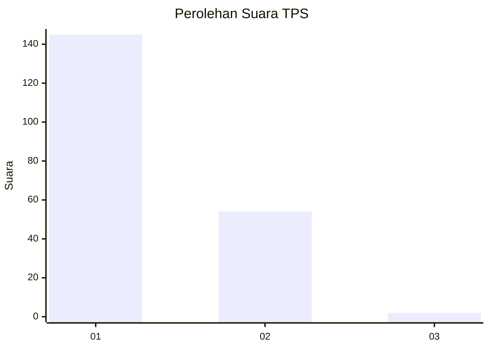
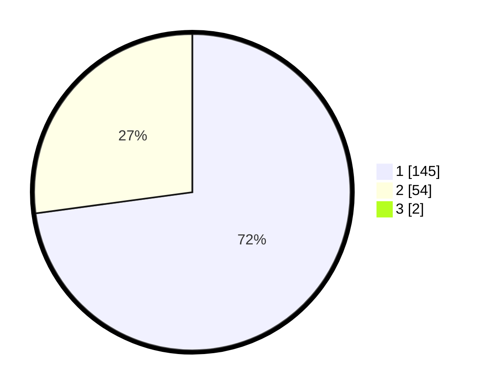

# Hasil

## Grafik

## Tabel

| No. | Nama Paslon    | Suara | Suara (raw) | Persentase |
|:--- |:-------------- | -----:| -----------:| ----------:|
| 1   | ANIES MUHAIMIN | 145   | [145][p-1]  | 72,14      |
| 2   | PRABOWO GIBRAN | 54    | [54][p-2]   | 26,87      |
| 3   | GANJAR MAHFUD  | 2     | [2][p-3]    | 1,00       |

[p-1]: https://github.com/gigit-pemilu/pemilu-2024-11-aceh/blob/main/pilpres/hitung-suara/sub/11-aceh/sub/03-aceh-timur/sub/10-ranto-peureulak/sub/2011-buket-pala/sub/001-tps/sub/paslon-1.txt
[p-2]: https://github.com/gigit-pemilu/pemilu-2024-11-aceh/blob/main/pilpres/hitung-suara/sub/11-aceh/sub/03-aceh-timur/sub/10-ranto-peureulak/sub/2011-buket-pala/sub/001-tps/sub/paslon-2.txt
[p-3]: https://github.com/gigit-pemilu/pemilu-2024-11-aceh/blob/main/pilpres/hitung-suara/sub/11-aceh/sub/03-aceh-timur/sub/10-ranto-peureulak/sub/2011-buket-pala/sub/001-tps/sub/paslon-3.txt

## Foto C Plano

https://sirekap-obj-formc.kpu.go.id/4f7d/pemilu/ppwp/11/03/10/20/11/1103102011001-20240216-151127--a5369d4b-3298-47b5-9587-48d85d1757cd.jpg

https://sirekap-obj-formc.kpu.go.id/4f7d/pemilu/ppwp/11/03/10/20/11/1103102011001-20240215-054321--d8da164a-05b9-40ab-8cde-43919ff3e7c9.jpg

https://sirekap-obj-formc.kpu.go.id/4f7d/pemilu/ppwp/11/03/10/20/11/1103102011001-20240215-054330--1430d75c-3dc3-4a80-861d-9609f6056b30.jpg

## Metadata

| Key        | Value               |
| ---------- | ------------------- |
| Time Stamp | 2024-02-24 22:31:28 |

