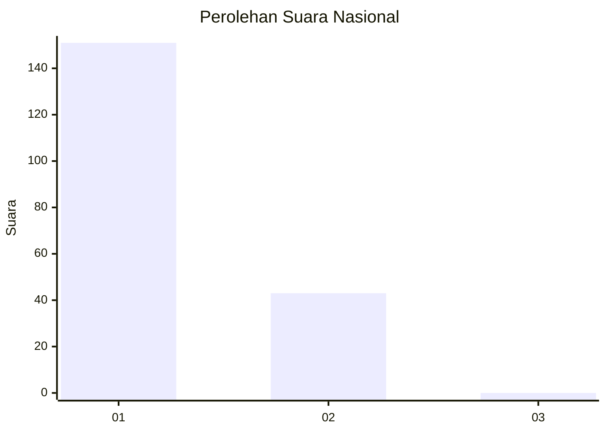
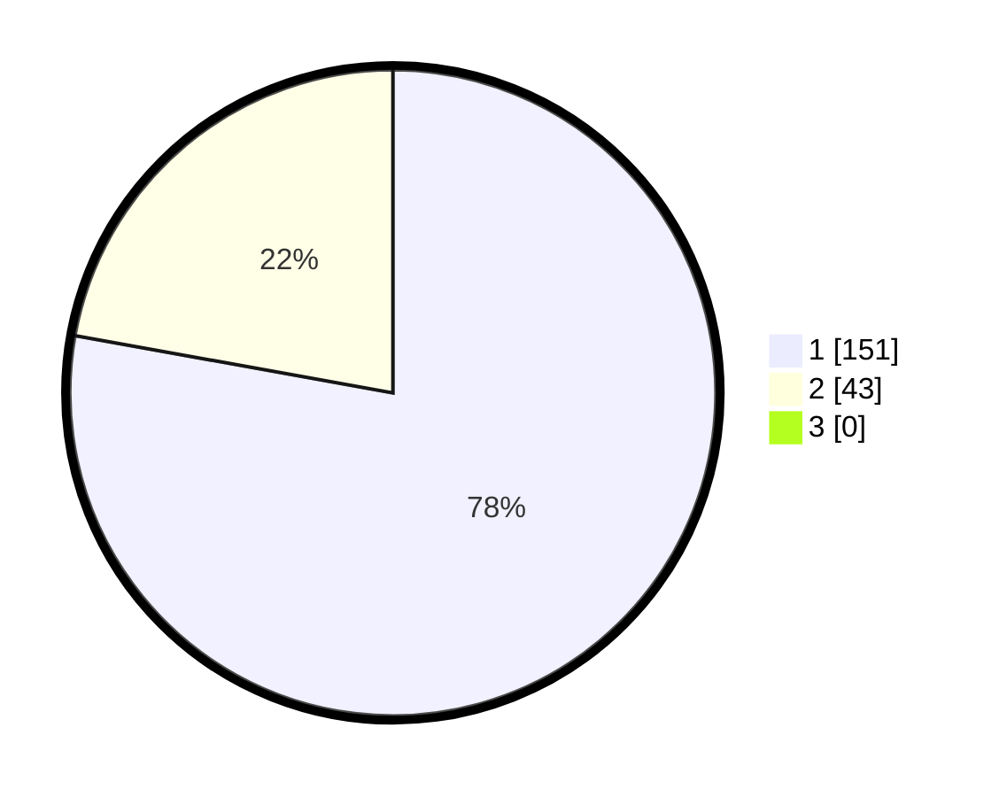

# Hasil

## Grafik

## Tabel

| No. | Nama Paslon    | Suara | Suara (raw) | Persentase |
|:--- |:-------------- | -----:| -----------:| ----------:|
| 1   | ANIES MUHAIMIN | 151   | [151][p-1]  | 77,84      |
| 2   | PRABOWO GIBRAN | 43    | [43][p-2]   | 22,16      |
| 3   | GANJAR MAHFUD  | 0     | [0][p-3]    | 0,00       |

[p-1]: https://github.com/gigit-pemilu/pemilu-2024/blob/main/pilpres/hitung-suara/sub/11-aceh/sub/03-aceh-timur/sub/10-ranto-peureulak/sub/2011-buket-pala/sub/003-tps/sub/paslon-1.txt
[p-2]: https://github.com/gigit-pemilu/pemilu-2024/blob/main/pilpres/hitung-suara/sub/11-aceh/sub/03-aceh-timur/sub/10-ranto-peureulak/sub/2011-buket-pala/sub/003-tps/sub/paslon-2.txt
[p-3]: https://github.com/gigit-pemilu/pemilu-2024/blob/main/pilpres/hitung-suara/sub/11-aceh/sub/03-aceh-timur/sub/10-ranto-peureulak/sub/2011-buket-pala/sub/003-tps/sub/paslon-3.txt

## Foto C Plano

https://sirekap-obj-formc.kpu.go.id/db22/pemilu/ppwp/11/03/10/20/11/1103102011003-20240215-110416--56bcb4a5-c246-41fc-8b88-c39b4926b29a.jpg

https://sirekap-obj-formc.kpu.go.id/db22/pemilu/ppwp/11/03/10/20/11/1103102011003-20240215-110431--0fd1756a-895e-4bc9-aeb6-52690d5e6938.jpg

https://sirekap-obj-formc.kpu.go.id/db22/pemilu/ppwp/11/03/10/20/11/1103102011003-20240215-065029--0c7d4a82-7dd5-4f31-828d-85bf8462dd2e.jpg

## Metadata

| Key        | Value               |
| ---------- | ------------------- |
| Time Stamp | 2024-02-25 13:00:00 |

