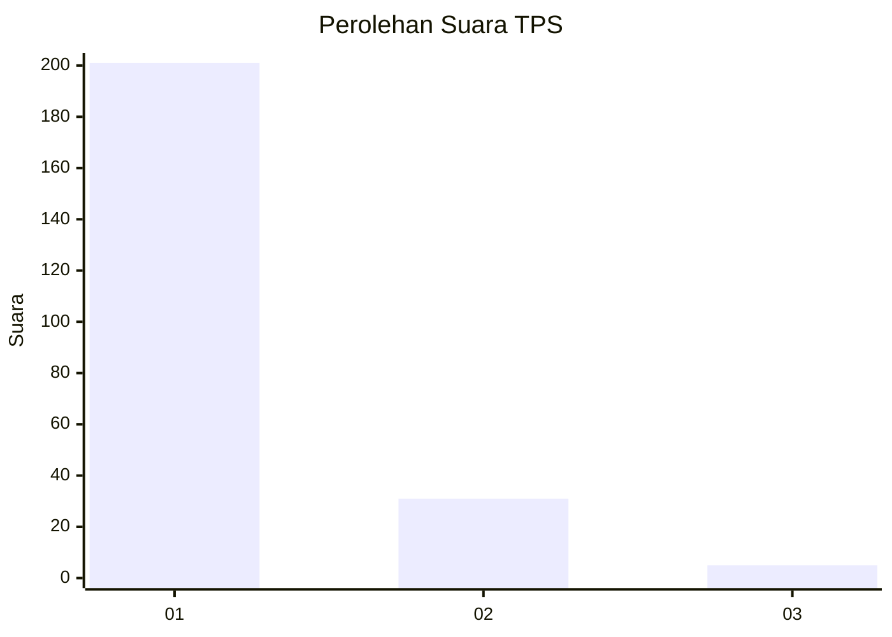
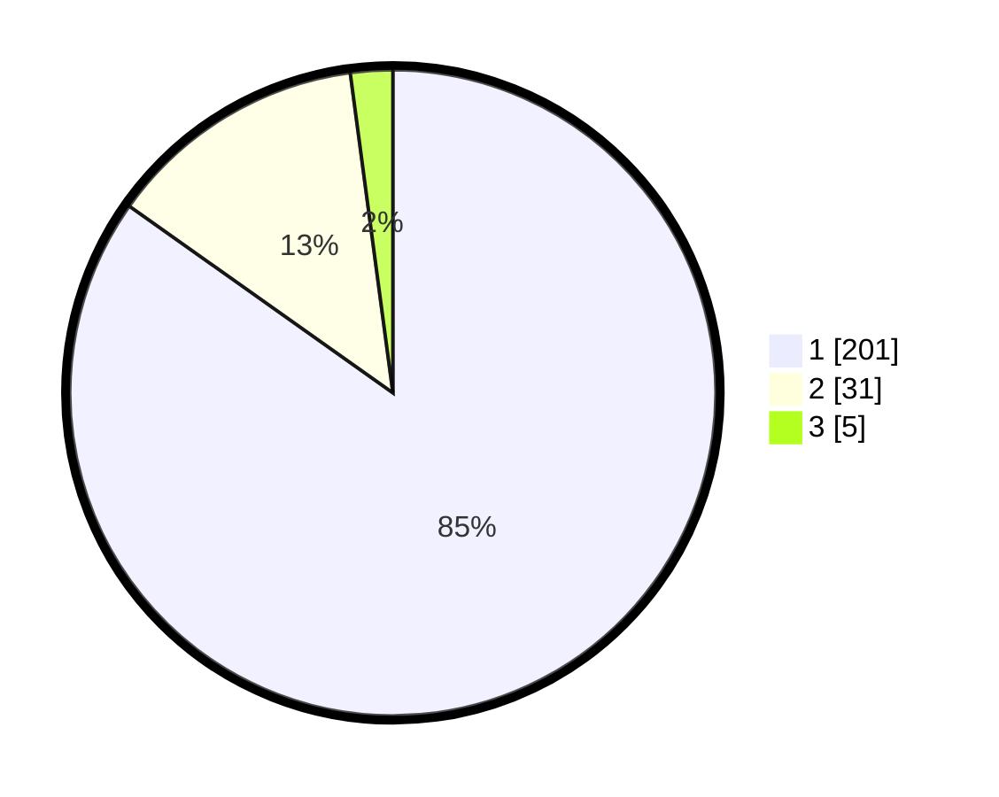

# Hasil

## Grafik

## Tabel

| No. | Nama Paslon    | Suara | Suara (raw) | Persentase |
|:--- |:-------------- | -----:| -----------:| ----------:|
| 1   | ANIES MUHAIMIN | 201   | [201][p-1]  | 84,81      |
| 2   | PRABOWO GIBRAN | 31    | [31][p-2]   | 13,08      |
| 3   | GANJAR MAHFUD  | 5     | [5][p-3]    | 2,11       |

[p-1]: https://github.com/gigit-pemilu/pemilu-2024-11-aceh/blob/main/pilpres/hitung-suara/sub/11-aceh/sub/03-aceh-timur/sub/10-ranto-peureulak/sub/2013-alue-udep/sub/001-tps/sub/paslon-1.txt
[p-2]: https://github.com/gigit-pemilu/pemilu-2024-11-aceh/blob/main/pilpres/hitung-suara/sub/11-aceh/sub/03-aceh-timur/sub/10-ranto-peureulak/sub/2013-alue-udep/sub/001-tps/sub/paslon-2.txt
[p-3]: https://github.com/gigit-pemilu/pemilu-2024-11-aceh/blob/main/pilpres/hitung-suara/sub/11-aceh/sub/03-aceh-timur/sub/10-ranto-peureulak/sub/2013-alue-udep/sub/001-tps/sub/paslon-3.txt

## Foto C Plano

https://sirekap-obj-formc.kpu.go.id/8ecb/pemilu/ppwp/11/03/10/20/13/1103102013001-20240215-140424--9d880764-23b0-42fe-8d46-86423290fc6d.jpg

https://sirekap-obj-formc.kpu.go.id/8ecb/pemilu/ppwp/11/03/10/20/13/1103102013001-20240215-155926--a6e16390-11c9-4a28-a93e-b88d2b9597a2.jpg

https://sirekap-obj-formc.kpu.go.id/8ecb/pemilu/ppwp/11/03/10/20/13/1103102013001-20240215-160016--fa6412a2-f376-439f-a2bd-475e0d9abbfe.jpg

## Metadata

| Key        | Value               |
| ---------- | ------------------- |
| Time Stamp | 2024-02-24 22:31:28 |

