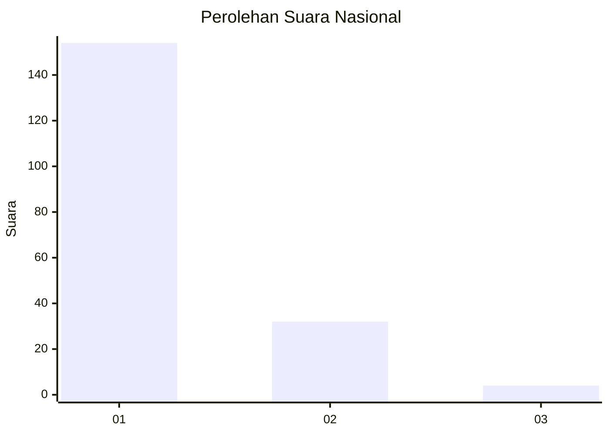
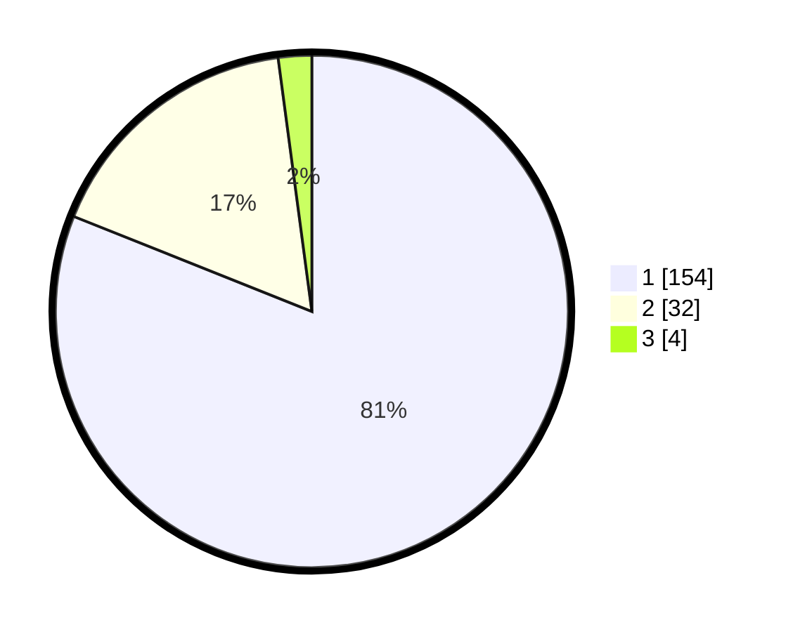

# Hasil

## Grafik

## Tabel

| No. | Nama Paslon    | Suara | Suara (raw) | Persentase |
|:--- |:-------------- | -----:| -----------:| ----------:|
| 1   | ANIES MUHAIMIN | 154   | [154][p-1]  | 81,05      |
| 2   | PRABOWO GIBRAN | 32    | [32][p-2]   | 16,84      |
| 3   | GANJAR MAHFUD  | 4     | [4][p-3]    | 2,11       |

[p-1]: https://github.com/gigit-pemilu/pemilu-2024/blob/main/pilpres/hitung-suara/sub/11-aceh/sub/03-aceh-timur/sub/10-ranto-peureulak/sub/2014-seumali/sub/001-tps/sub/paslon-1.txt
[p-2]: https://github.com/gigit-pemilu/pemilu-2024/blob/main/pilpres/hitung-suara/sub/11-aceh/sub/03-aceh-timur/sub/10-ranto-peureulak/sub/2014-seumali/sub/001-tps/sub/paslon-2.txt
[p-3]: https://github.com/gigit-pemilu/pemilu-2024/blob/main/pilpres/hitung-suara/sub/11-aceh/sub/03-aceh-timur/sub/10-ranto-peureulak/sub/2014-seumali/sub/001-tps/sub/paslon-3.txt

## Foto C Plano

https://sirekap-obj-formc.kpu.go.id/38f6/pemilu/ppwp/11/03/10/20/14/1103102014001-20240215-064712--4f467329-b11c-4506-94b2-b9662cb0a870.jpg

https://sirekap-obj-formc.kpu.go.id/38f6/pemilu/ppwp/11/03/10/20/14/1103102014001-20240215-065055--cac963bf-66b8-49b6-b074-fe4c1573b5dc.jpg

https://sirekap-obj-formc.kpu.go.id/38f6/pemilu/ppwp/11/03/10/20/14/1103102014001-20240215-065210--429db9fe-1348-4abb-a3b6-8f4cbe2c0be1.jpg

## Metadata

| Key        | Value               |
| ---------- | ------------------- |
| Time Stamp | 2024-02-25 11:00:00 |

