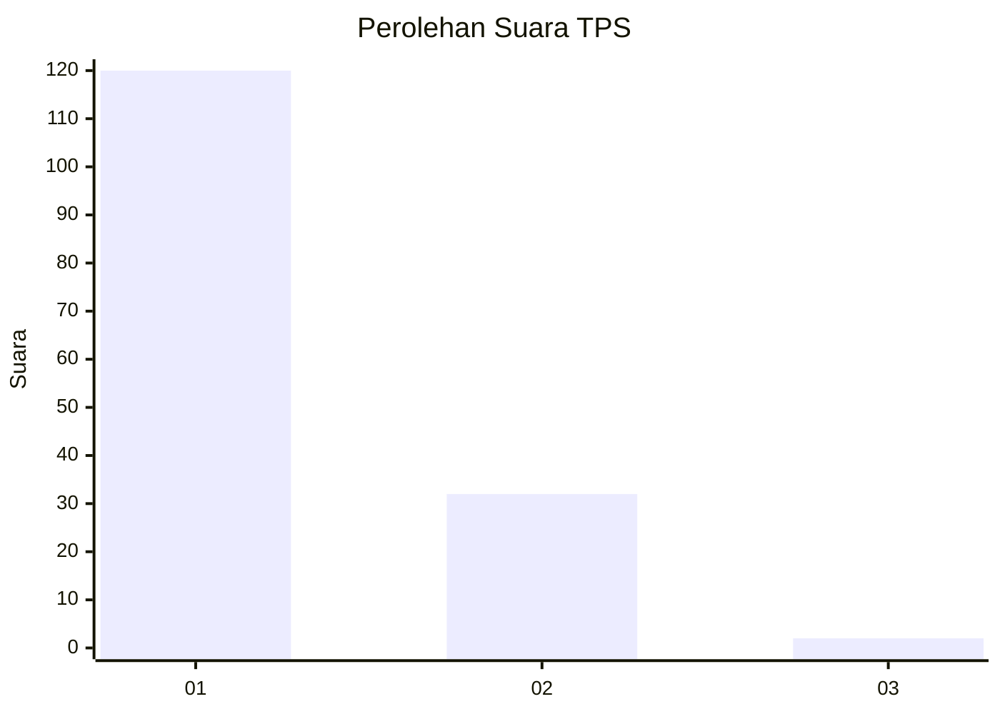
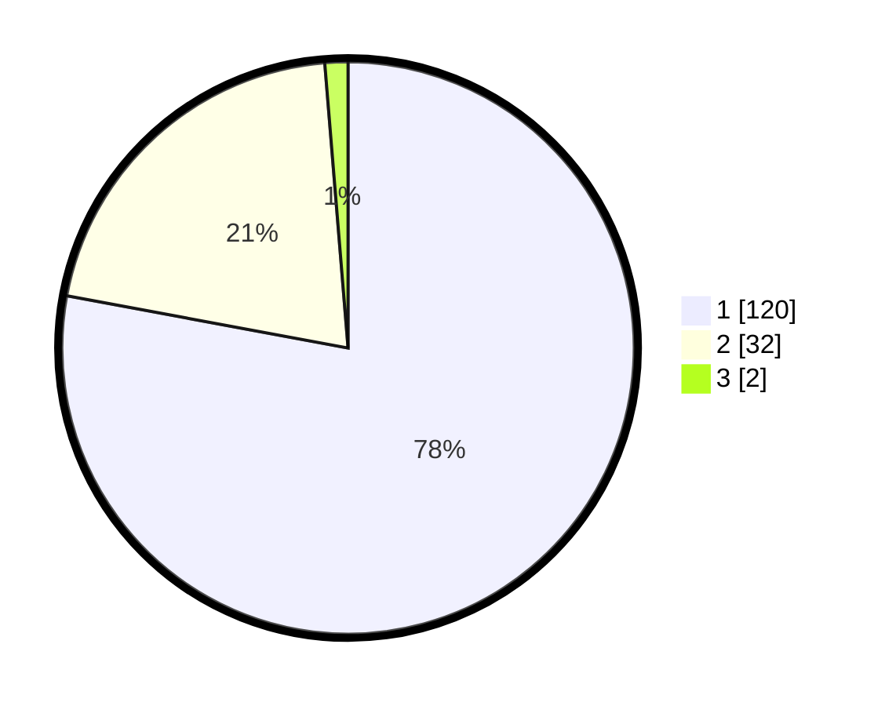

# Hasil

## Grafik

## Tabel

| No. | Nama Paslon    | Suara | Suara (raw) | Persentase |
|:--- |:-------------- | -----:| -----------:| ----------:|
| 1   | ANIES MUHAIMIN | 120   | [120][p-1]  | 77,92      |
| 2   | PRABOWO GIBRAN | 32    | [32][p-2]   | 20,78      |
| 3   | GANJAR MAHFUD  | 2     | [2][p-3]    | 1,30       |

[p-1]: https://github.com/gigit-pemilu/pemilu-2024-11-aceh/blob/main/pilpres/hitung-suara/sub/11-aceh/sub/03-aceh-timur/sub/10-ranto-peureulak/sub/2014-seumali/sub/002-tps/sub/paslon-1.txt
[p-2]: https://github.com/gigit-pemilu/pemilu-2024-11-aceh/blob/main/pilpres/hitung-suara/sub/11-aceh/sub/03-aceh-timur/sub/10-ranto-peureulak/sub/2014-seumali/sub/002-tps/sub/paslon-2.txt
[p-3]: https://github.com/gigit-pemilu/pemilu-2024-11-aceh/blob/main/pilpres/hitung-suara/sub/11-aceh/sub/03-aceh-timur/sub/10-ranto-peureulak/sub/2014-seumali/sub/002-tps/sub/paslon-3.txt

## Foto C Plano

https://sirekap-obj-formc.kpu.go.id/45fc/pemilu/ppwp/11/03/10/20/14/1103102014002-20240215-071906--08457774-0dbd-4f14-b101-acdae1017aee.jpg

https://sirekap-obj-formc.kpu.go.id/45fc/pemilu/ppwp/11/03/10/20/14/1103102014002-20240215-071703--406829b5-5e46-4ae6-b997-8e37e3f82035.jpg

https://sirekap-obj-formc.kpu.go.id/45fc/pemilu/ppwp/11/03/10/20/14/1103102014002-20240215-072105--804525f1-b7b3-49ca-a391-cb46461c9a6b.jpg

## Metadata

| Key        | Value               |
| ---------- | ------------------- |
| Time Stamp | 2024-02-24 22:31:28 |

