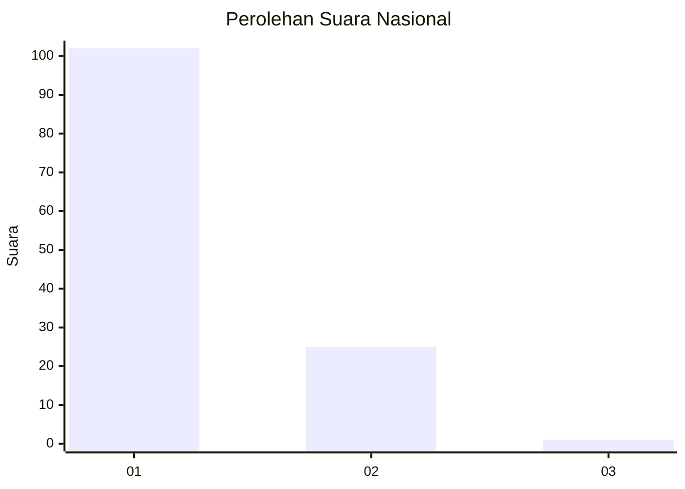
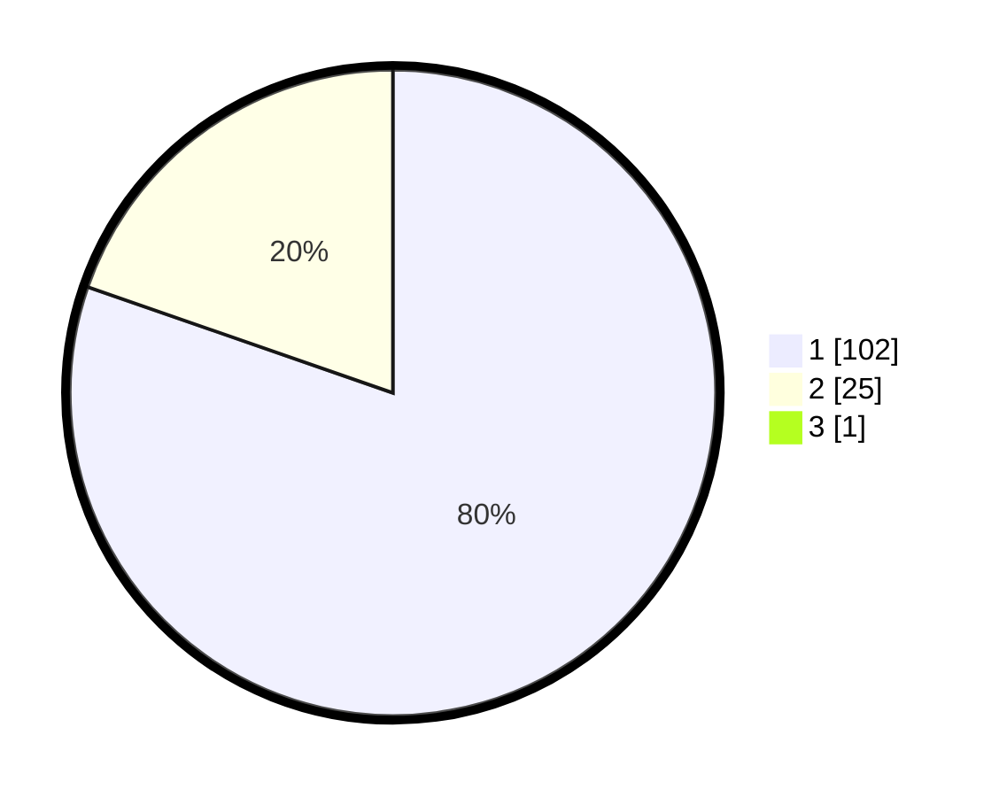

# Hasil

## Grafik

## Tabel

| No. | Nama Paslon    | Suara | Suara (raw) | Persentase |
|:--- |:-------------- | -----:| -----------:| ----------:|
| 1   | ANIES MUHAIMIN | 102   | [102][p-1]  | 79,69      |
| 2   | PRABOWO GIBRAN | 25    | [25][p-2]   | 19,53      |
| 3   | GANJAR MAHFUD  | 1     | [1][p-3]    | 0,78       |

[p-1]: https://github.com/gigit-pemilu/pemilu-2024/blob/main/pilpres/hitung-suara/sub/11-aceh/sub/03-aceh-timur/sub/10-ranto-peureulak/sub/2014-seumali/sub/003-tps/sub/paslon-1.txt
[p-2]: https://github.com/gigit-pemilu/pemilu-2024/blob/main/pilpres/hitung-suara/sub/11-aceh/sub/03-aceh-timur/sub/10-ranto-peureulak/sub/2014-seumali/sub/003-tps/sub/paslon-2.txt
[p-3]: https://github.com/gigit-pemilu/pemilu-2024/blob/main/pilpres/hitung-suara/sub/11-aceh/sub/03-aceh-timur/sub/10-ranto-peureulak/sub/2014-seumali/sub/003-tps/sub/paslon-3.txt

## Foto C Plano

https://sirekap-obj-formc.kpu.go.id/06a8/pemilu/ppwp/11/03/10/20/14/1103102014003-20240215-051612--4a101ea5-9902-43a6-8444-4c7b5a17cc95.jpg

https://sirekap-obj-formc.kpu.go.id/06a8/pemilu/ppwp/11/03/10/20/14/1103102014003-20240215-052035--bad76b8a-3368-4e9d-a3a7-f83d3e8b5019.jpg

https://sirekap-obj-formc.kpu.go.id/06a8/pemilu/ppwp/11/03/10/20/14/1103102014003-20240215-052257--6494f6c1-abbe-4628-8f49-6458d5afa999.jpg

## Metadata

| Key        | Value               |
| ---------- | ------------------- |
| Time Stamp | 2024-02-24 22:31:28 |

