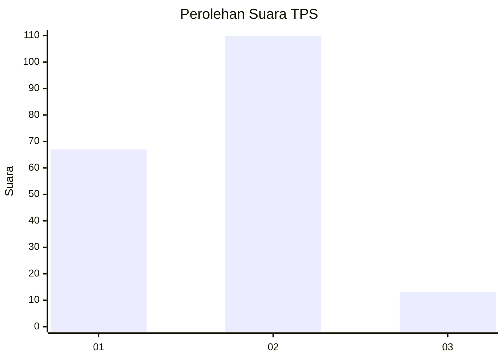
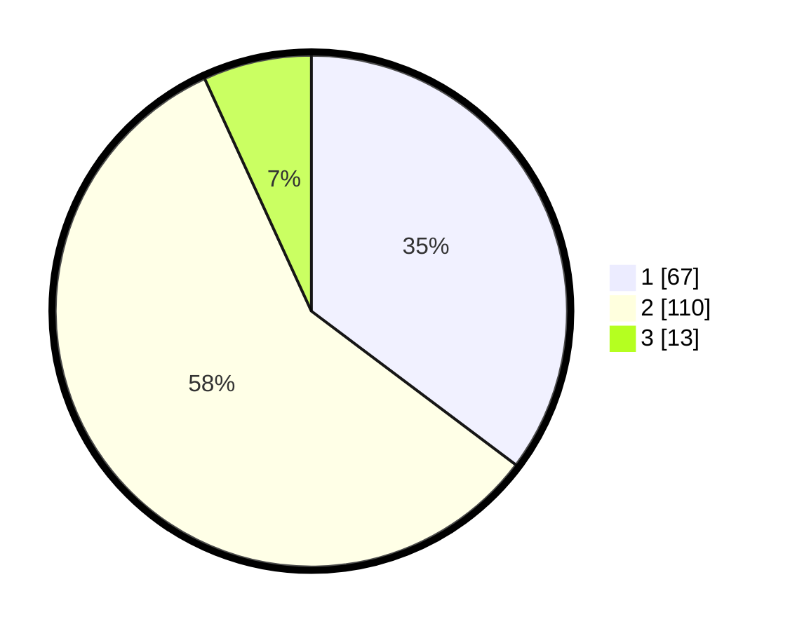

# Hasil

## Grafik

## Tabel

| No. | Nama Paslon    | Suara | Suara (raw) | Persentase |
|:--- |:-------------- | -----:| -----------:| ----------:|
| 1   | ANIES MUHAIMIN | 67    | [67][p-1]   | 35,26      |
| 2   | PRABOWO GIBRAN | 110   | [110][p-2]  | 57,89      |
| 3   | GANJAR MAHFUD  | 13    | [13][p-3]   | 6,84       |

[p-1]: https://github.com/gigit-pemilu/pemilu-2024-11-aceh/blob/main/pilpres/hitung-suara/sub/11-aceh/sub/03-aceh-timur/sub/10-ranto-peureulak/sub/2015-punti-payong/sub/001-tps/sub/paslon-1.txt
[p-2]: https://github.com/gigit-pemilu/pemilu-2024-11-aceh/blob/main/pilpres/hitung-suara/sub/11-aceh/sub/03-aceh-timur/sub/10-ranto-peureulak/sub/2015-punti-payong/sub/001-tps/sub/paslon-2.txt
[p-3]: https://github.com/gigit-pemilu/pemilu-2024-11-aceh/blob/main/pilpres/hitung-suara/sub/11-aceh/sub/03-aceh-timur/sub/10-ranto-peureulak/sub/2015-punti-payong/sub/001-tps/sub/paslon-3.txt

## Foto C Plano

https://sirekap-obj-formc.kpu.go.id/efd5/pemilu/ppwp/11/03/10/20/15/1103102015001-20240215-085331--01e3c8e1-bdc0-495c-b237-3211b8cf34a2.jpg

https://sirekap-obj-formc.kpu.go.id/efd5/pemilu/ppwp/11/03/10/20/15/1103102015001-20240215-085500--5096b810-dc80-4754-82a6-5c9e328bebb6.jpg

https://sirekap-obj-formc.kpu.go.id/efd5/pemilu/ppwp/11/03/10/20/15/1103102015001-20240215-085551--a843e15f-01d3-49e6-9000-ce1dff1fccb0.jpg

## Metadata

| Key        | Value               |
| ---------- | ------------------- |
| Time Stamp | 2024-02-25 13:00:00 |

