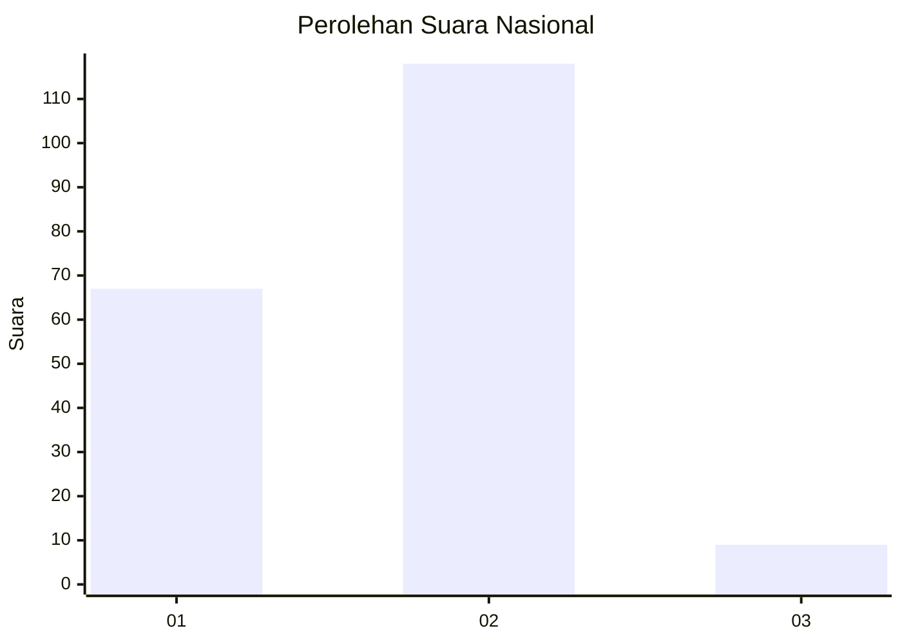
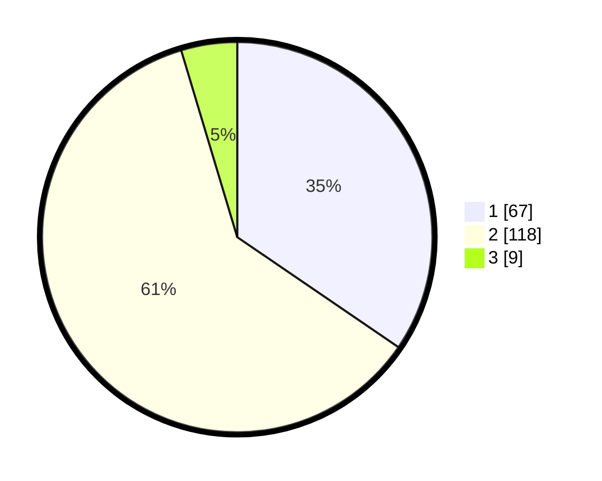

# Hasil

## Grafik

## Tabel

| No. | Nama Paslon    | Suara | Suara (raw) | Persentase |
|:--- |:-------------- | -----:| -----------:| ----------:|
| 1   | ANIES MUHAIMIN | 67    | [67][p-1]   | 34,54      |
| 2   | PRABOWO GIBRAN | 118   | [118][p-2]  | 60,82      |
| 3   | GANJAR MAHFUD  | 9     | [9][p-3]    | 4,64       |

[p-1]: https://github.com/gigit-pemilu/pemilu-2024/blob/main/pilpres/hitung-suara/sub/11-aceh/sub/03-aceh-timur/sub/10-ranto-peureulak/sub/2015-punti-payong/sub/002-tps/sub/paslon-1.txt
[p-2]: https://github.com/gigit-pemilu/pemilu-2024/blob/main/pilpres/hitung-suara/sub/11-aceh/sub/03-aceh-timur/sub/10-ranto-peureulak/sub/2015-punti-payong/sub/002-tps/sub/paslon-2.txt
[p-3]: https://github.com/gigit-pemilu/pemilu-2024/blob/main/pilpres/hitung-suara/sub/11-aceh/sub/03-aceh-timur/sub/10-ranto-peureulak/sub/2015-punti-payong/sub/002-tps/sub/paslon-3.txt

## Foto C Plano

https://sirekap-obj-formc.kpu.go.id/a4ac/pemilu/ppwp/11/03/10/20/15/1103102015002-20240215-082632--ec93633a-2275-456e-b4a9-ce2277af0030.jpg

https://sirekap-obj-formc.kpu.go.id/a4ac/pemilu/ppwp/11/03/10/20/15/1103102015002-20240215-143817--b31e125a-bc6a-43aa-b6b1-2efe0713e14a.jpg

https://sirekap-obj-formc.kpu.go.id/a4ac/pemilu/ppwp/11/03/10/20/15/1103102015002-20240215-120822--1f2a84ea-436e-4be1-af6f-bd24350e60c8.jpg

## Metadata

| Key        | Value               |
| ---------- | ------------------- |
| Time Stamp | 2024-02-25 14:00:00 |

