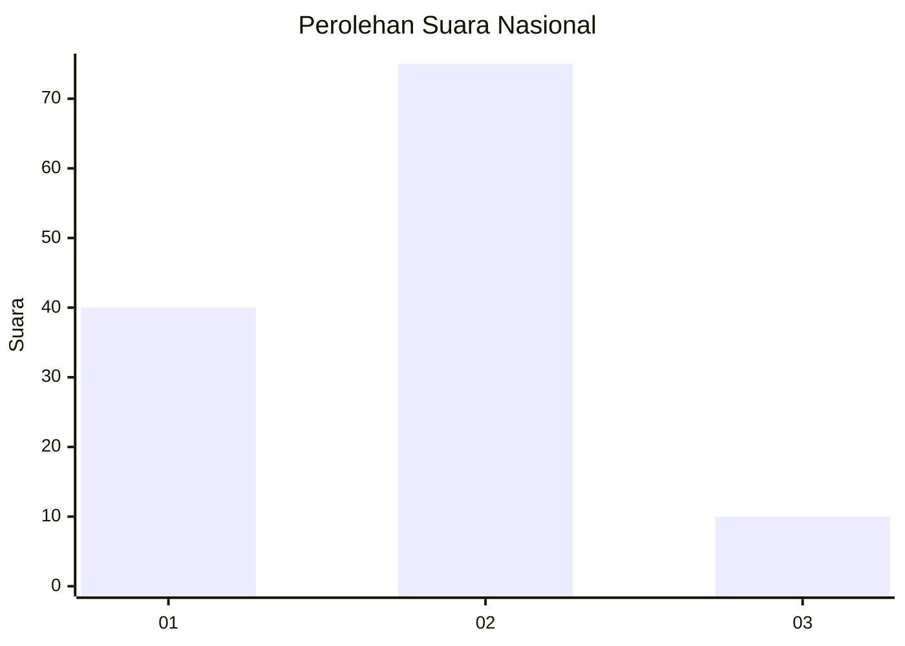
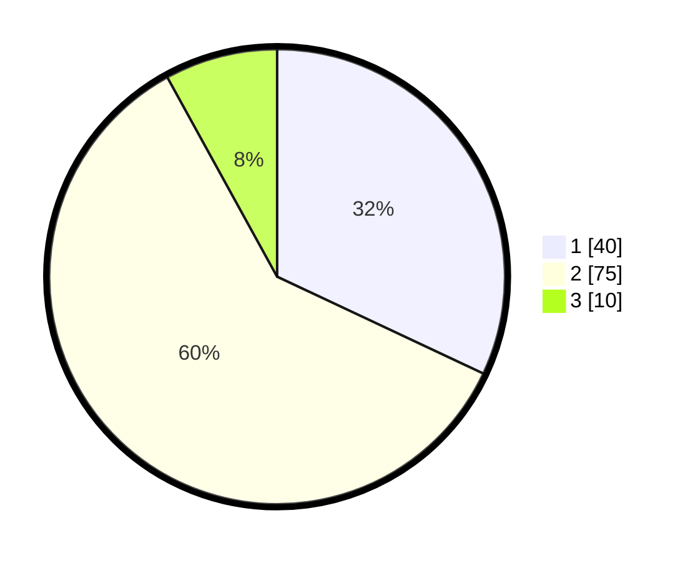

# Hasil

## Grafik

## Tabel

| No. | Nama Paslon    | Suara | Suara (raw) | Persentase |
|:--- |:-------------- | -----:| -----------:| ----------:|
| 1   | ANIES MUHAIMIN | 40    | [40][p-1]   | 32,00      |
| 2   | PRABOWO GIBRAN | 75    | [75][p-2]   | 60,00      |
| 3   | GANJAR MAHFUD  | 10    | [10][p-3]   | 8,00       |

[p-1]: https://github.com/gigit-pemilu/pemilu-2024/blob/main/pilpres/hitung-suara/sub/11-aceh/sub/03-aceh-timur/sub/10-ranto-peureulak/sub/2015-punti-payong/sub/004-tps/sub/paslon-1.txt
[p-2]: https://github.com/gigit-pemilu/pemilu-2024/blob/main/pilpres/hitung-suara/sub/11-aceh/sub/03-aceh-timur/sub/10-ranto-peureulak/sub/2015-punti-payong/sub/004-tps/sub/paslon-2.txt
[p-3]: https://github.com/gigit-pemilu/pemilu-2024/blob/main/pilpres/hitung-suara/sub/11-aceh/sub/03-aceh-timur/sub/10-ranto-peureulak/sub/2015-punti-payong/sub/004-tps/sub/paslon-3.txt

## Foto C Plano

https://sirekap-obj-formc.kpu.go.id/0770/pemilu/ppwp/11/03/10/20/15/1103102015004-20240215-170258--6e88c7d6-84e0-47ce-83f6-59b795bc0d52.jpg

https://sirekap-obj-formc.kpu.go.id/0770/pemilu/ppwp/11/03/10/20/15/1103102015004-20240215-133532--8686aebd-a41e-4293-86c0-e92287cd31f5.jpg

https://sirekap-obj-formc.kpu.go.id/0770/pemilu/ppwp/11/03/10/20/15/1103102015004-20240215-174115--5479ef89-42b9-4ad8-8d6c-d53e8b5ced2a.jpg

## Metadata

| Key        | Value               |
| ---------- | ------------------- |
| Time Stamp | 2024-02-24 22:31:28 |

## DATA PEMILIH TETAP

Jumlah pemilih dalam DPT: **138**.
 * L: **87**.
 * P: **51**.

## DATA PENGGUNA HAK PILIH

Jumlah pengguna hak pilih dalam DPT: **119**.
 * L: **75**.
 * P: **44**.

Jumlah pengguna hak pilih dalam DPTb: **0**.
 * L: **0**.
 * P: **0**.

Jumlah pengguna hak pilih dalam DPK: **11**.
 * L: **3**.
 * P: **8**.

Jumlah pengguna hak pilih: **130**.
 * L: **78**.
 * P: **52**.

## JUMLAH SUARA SAH DAN TIDAK SAH

JUMLAH SELURUH SUARA SAH: **125**.

JUMLAH SUARA TIDAK SAH: **5**.

JUMLAH SELURUH SUARA SAH DAN SUARA TIDAK SAH: **130**.

