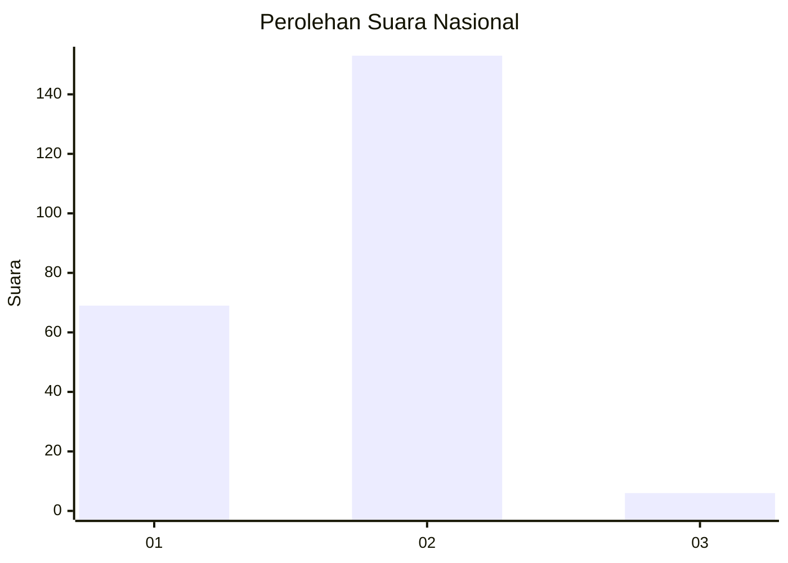
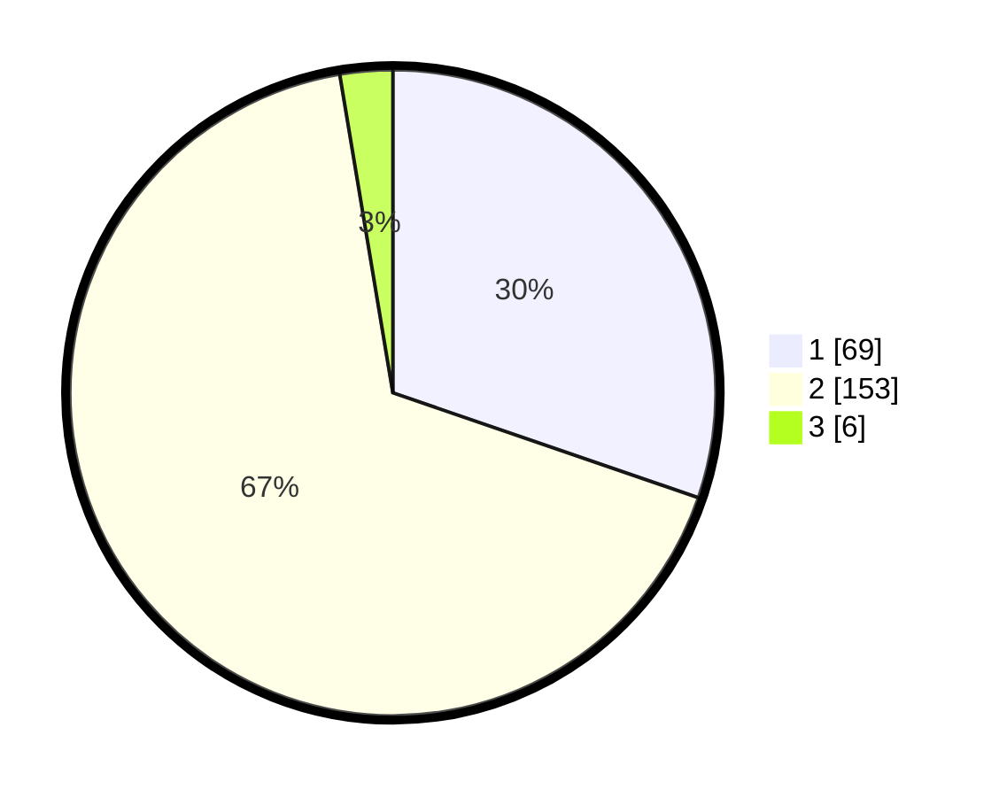

# Hasil

## Grafik

## Tabel

| No. | Nama Paslon    | Suara | Suara (raw) | Persentase |
|:--- |:-------------- | -----:| -----------:| ----------:|
| 1   | ANIES MUHAIMIN | 69    | [69][p-1]   | 30,26      |
| 2   | PRABOWO GIBRAN | 153   | [153][p-2]  | 67,11      |
| 3   | GANJAR MAHFUD  | 6     | [6][p-3]    | 2,63       |

[p-1]: https://github.com/gigit-pemilu/pemilu-2024/blob/main/pilpres/hitung-suara/sub/11-aceh/sub/03-aceh-timur/sub/10-ranto-peureulak/sub/2016-paya-palas/sub/002-tps/sub/paslon-1.txt
[p-2]: https://github.com/gigit-pemilu/pemilu-2024/blob/main/pilpres/hitung-suara/sub/11-aceh/sub/03-aceh-timur/sub/10-ranto-peureulak/sub/2016-paya-palas/sub/002-tps/sub/paslon-2.txt
[p-3]: https://github.com/gigit-pemilu/pemilu-2024/blob/main/pilpres/hitung-suara/sub/11-aceh/sub/03-aceh-timur/sub/10-ranto-peureulak/sub/2016-paya-palas/sub/002-tps/sub/paslon-3.txt

## Foto C Plano

https://sirekap-obj-formc.kpu.go.id/83af/pemilu/ppwp/11/03/10/20/16/1103102016002-20240215-151324--e87864e8-eaa4-43bb-ab46-b9a64cd6149b.jpg

https://sirekap-obj-formc.kpu.go.id/83af/pemilu/ppwp/11/03/10/20/16/1103102016002-20240215-151457--fc8eb0e5-a15a-4721-9842-75ad0e8e4974.jpg

https://sirekap-obj-formc.kpu.go.id/83af/pemilu/ppwp/11/03/10/20/16/1103102016002-20240215-080957--ed2afd19-2610-454f-80c6-4782429285b6.jpg

## Metadata

| Key        | Value               |
| ---------- | ------------------- |
| Time Stamp | 2024-02-24 22:31:28 |

