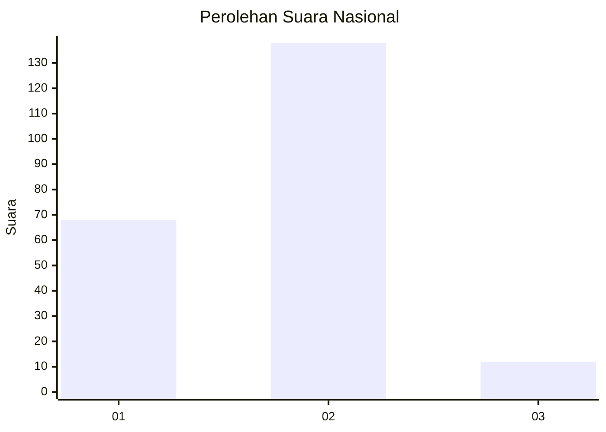
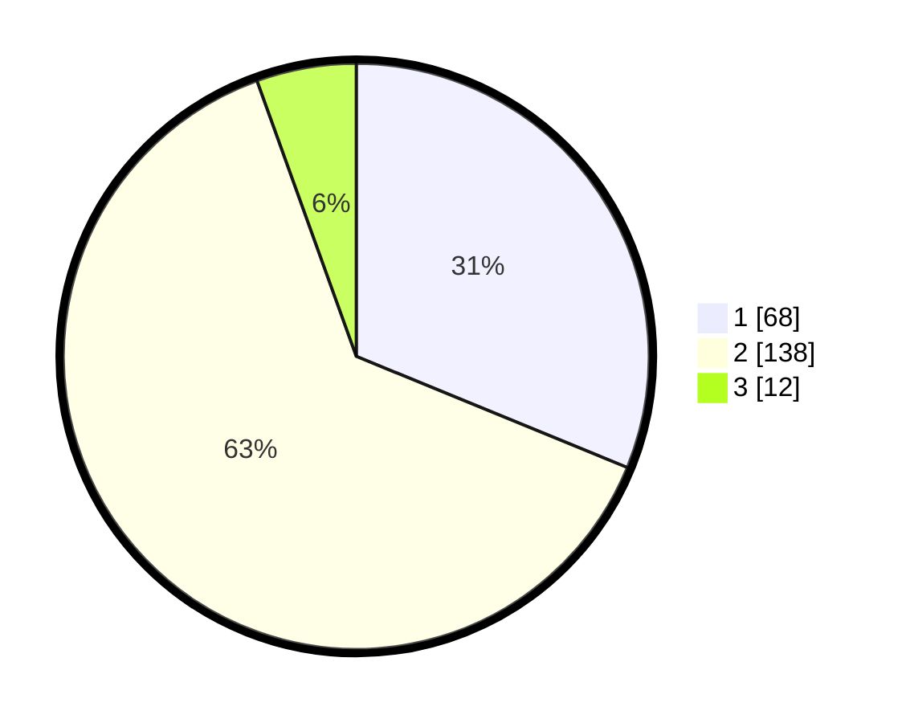

# Hasil

## Grafik

## Tabel

| No. | Nama Paslon    | Suara | Suara (raw) | Persentase |
|:--- |:-------------- | -----:| -----------:| ----------:|
| 1   | ANIES MUHAIMIN | 68    | [68][p-1]   | 31,19      |
| 2   | PRABOWO GIBRAN | 138   | [138][p-2]  | 63,30      |
| 3   | GANJAR MAHFUD  | 12    | [12][p-3]   | 5,50       |

[p-1]: https://github.com/gigit-pemilu/pemilu-2024/blob/main/pilpres/hitung-suara/sub/11-aceh/sub/03-aceh-timur/sub/10-ranto-peureulak/sub/2016-paya-palas/sub/003-tps/sub/paslon-1.txt
[p-2]: https://github.com/gigit-pemilu/pemilu-2024/blob/main/pilpres/hitung-suara/sub/11-aceh/sub/03-aceh-timur/sub/10-ranto-peureulak/sub/2016-paya-palas/sub/003-tps/sub/paslon-2.txt
[p-3]: https://github.com/gigit-pemilu/pemilu-2024/blob/main/pilpres/hitung-suara/sub/11-aceh/sub/03-aceh-timur/sub/10-ranto-peureulak/sub/2016-paya-palas/sub/003-tps/sub/paslon-3.txt

## Foto C Plano

https://sirekap-obj-formc.kpu.go.id/3952/pemilu/ppwp/11/03/10/20/16/1103102016003-20240215-063802--1fb0c28e-e47a-41b9-991e-deb5131585ac.jpg

https://sirekap-obj-formc.kpu.go.id/3952/pemilu/ppwp/11/03/10/20/16/1103102016003-20240215-144038--d488bfea-2948-4cb5-81a1-320f8cc96093.jpg

https://sirekap-obj-formc.kpu.go.id/3952/pemilu/ppwp/11/03/10/20/16/1103102016003-20240215-064042--86bd56fd-d884-49e0-954d-6092cebcc840.jpg

## Metadata

| Key        | Value               |
| ---------- | ------------------- |
| Time Stamp | 2024-02-25 17:00:00 |

