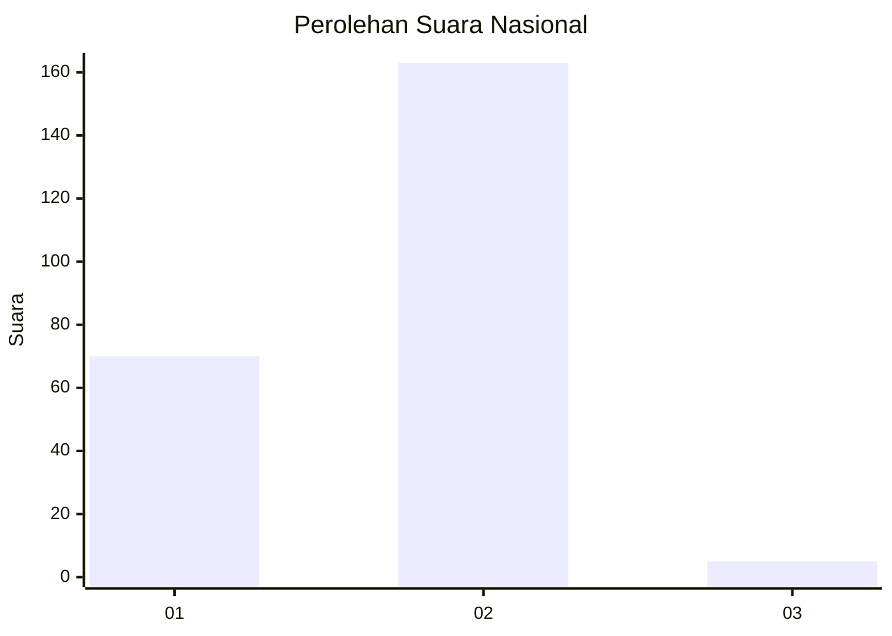
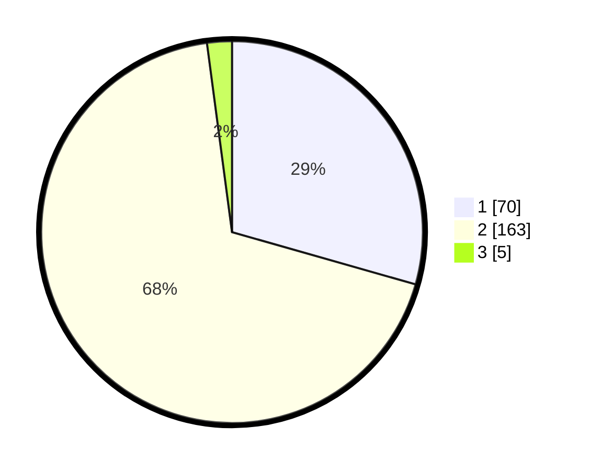

# Hasil

## Grafik

## Tabel

| No. | Nama Paslon    | Suara | Suara (raw) | Persentase |
|:--- |:-------------- | -----:| -----------:| ----------:|
| 1   | ANIES MUHAIMIN | 70    | [70][p-1]   | 29,41      |
| 2   | PRABOWO GIBRAN | 163   | [163][p-2]  | 68,49      |
| 3   | GANJAR MAHFUD  | 5     | [5][p-3]    | 2,10       |

[p-1]: https://github.com/gigit-pemilu/pemilu-2024/blob/main/pilpres/hitung-suara/sub/11-aceh/sub/03-aceh-timur/sub/10-ranto-peureulak/sub/2016-paya-palas/sub/006-tps/sub/paslon-1.txt
[p-2]: https://github.com/gigit-pemilu/pemilu-2024/blob/main/pilpres/hitung-suara/sub/11-aceh/sub/03-aceh-timur/sub/10-ranto-peureulak/sub/2016-paya-palas/sub/006-tps/sub/paslon-2.txt
[p-3]: https://github.com/gigit-pemilu/pemilu-2024/blob/main/pilpres/hitung-suara/sub/11-aceh/sub/03-aceh-timur/sub/10-ranto-peureulak/sub/2016-paya-palas/sub/006-tps/sub/paslon-3.txt

## Foto C Plano

https://sirekap-obj-formc.kpu.go.id/a527/pemilu/ppwp/11/03/10/20/16/1103102016006-20240215-121746--d94ab206-711b-4e9a-9020-8bd9034b1b81.jpg

https://sirekap-obj-formc.kpu.go.id/a527/pemilu/ppwp/11/03/10/20/16/1103102016006-20240215-122522--5ef56698-09f5-4944-aaff-b03714633fab.jpg

https://sirekap-obj-formc.kpu.go.id/a527/pemilu/ppwp/11/03/10/20/16/1103102016006-20240215-122714--559839b5-377f-4f4c-a7b2-da2f9117a31d.jpg

## Metadata

| Key        | Value               |
| ---------- | ------------------- |
| Time Stamp | 2024-02-24 22:31:28 |

