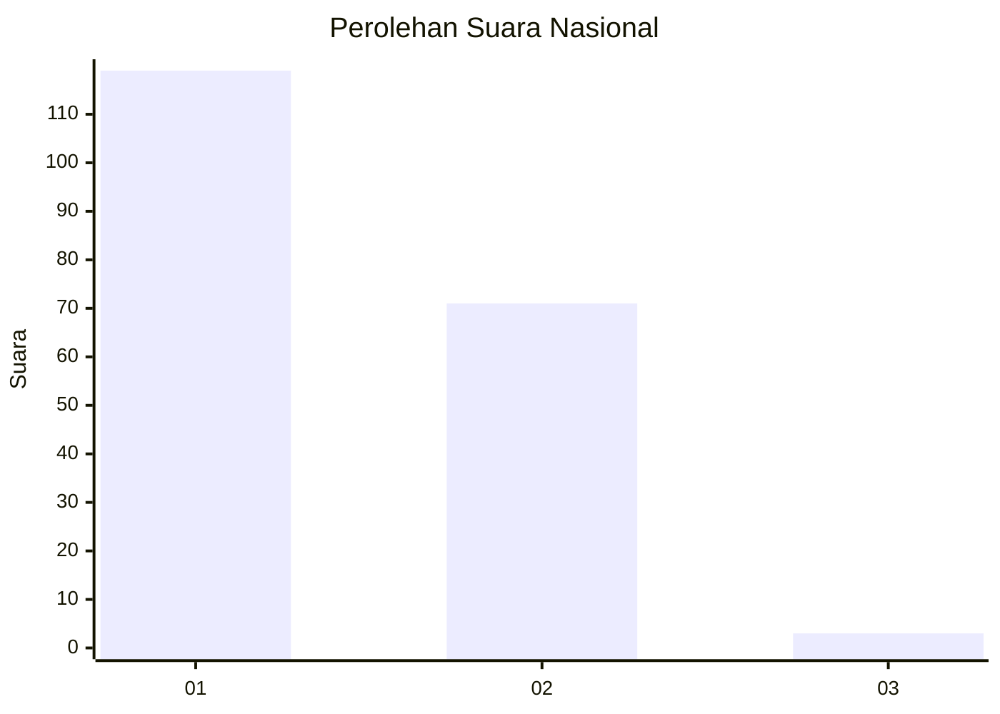
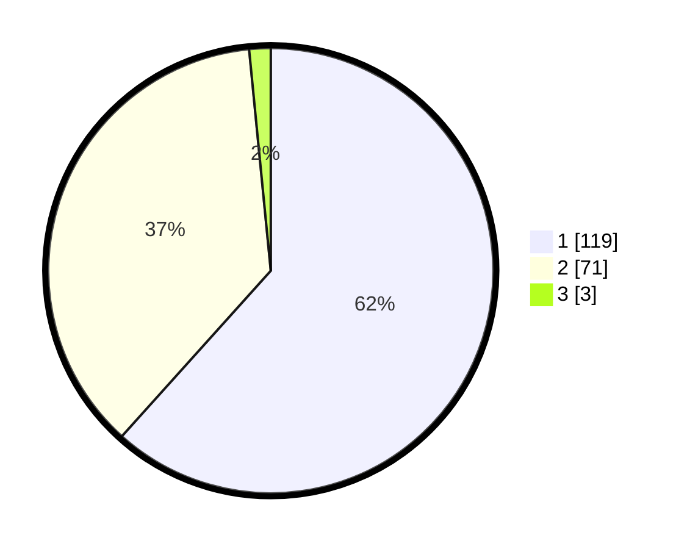

# Hasil

## Grafik

## Tabel

| No. | Nama Paslon    | Suara | Suara (raw) | Persentase |
|:--- |:-------------- | -----:| -----------:| ----------:|
| 1   | ANIES MUHAIMIN | 119   | [119][p-1]  | 61,66      |
| 2   | PRABOWO GIBRAN | 71    | [71][p-2]   | 36,79      |
| 3   | GANJAR MAHFUD  | 3     | [3][p-3]    | 1,55       |

[p-1]: https://github.com/gigit-pemilu/pemilu-2024/blob/main/pilpres/hitung-suara/sub/11-aceh/sub/03-aceh-timur/sub/10-ranto-peureulak/sub/2017-tampak/sub/001-tps/sub/paslon-1.txt
[p-2]: https://github.com/gigit-pemilu/pemilu-2024/blob/main/pilpres/hitung-suara/sub/11-aceh/sub/03-aceh-timur/sub/10-ranto-peureulak/sub/2017-tampak/sub/001-tps/sub/paslon-2.txt
[p-3]: https://github.com/gigit-pemilu/pemilu-2024/blob/main/pilpres/hitung-suara/sub/11-aceh/sub/03-aceh-timur/sub/10-ranto-peureulak/sub/2017-tampak/sub/001-tps/sub/paslon-3.txt

## Foto C Plano

https://sirekap-obj-formc.kpu.go.id/f09e/pemilu/ppwp/11/03/10/20/17/1103102017001-20240215-014108--adc13a64-02ba-4422-a358-d59f272febdc.jpg

https://sirekap-obj-formc.kpu.go.id/f09e/pemilu/ppwp/11/03/10/20/17/1103102017001-20240215-014125--5715ecd3-d261-4630-bbd7-ad8f4a7a1de7.jpg

https://sirekap-obj-formc.kpu.go.id/f09e/pemilu/ppwp/11/03/10/20/17/1103102017001-20240215-014143--ecbe3833-3be8-4089-91b4-9161386b37d0.jpg

## Metadata

| Key        | Value               |
| ---------- | ------------------- |
| Time Stamp | 2024-02-24 22:31:28 |

