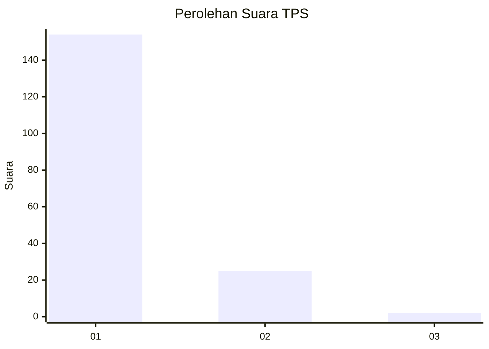
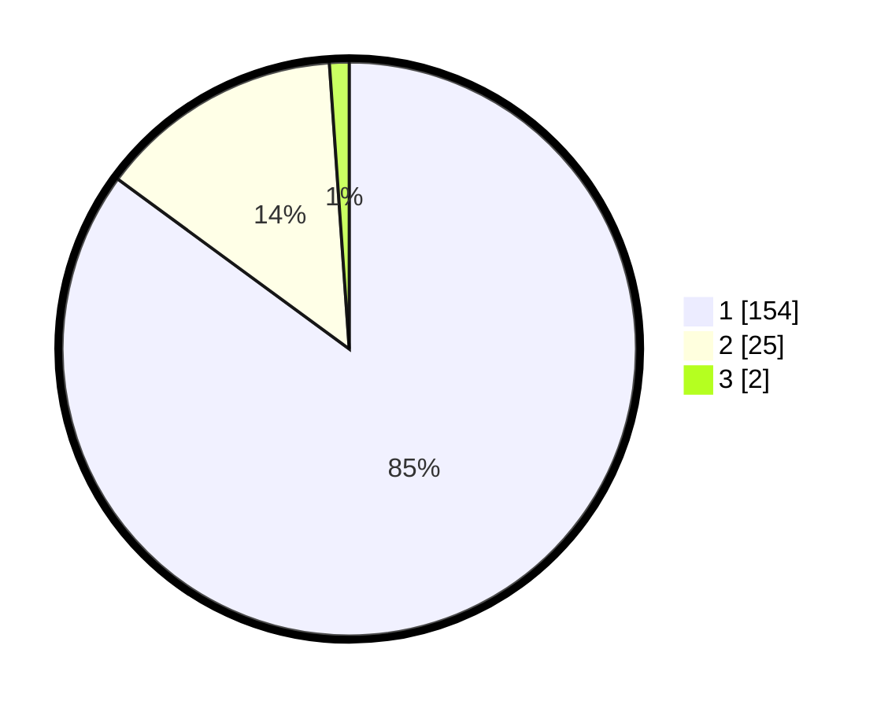

# Hasil

## Grafik

## Tabel

| No. | Nama Paslon    | Suara | Suara (raw) | Persentase |
|:--- |:-------------- | -----:| -----------:| ----------:|
| 1   | ANIES MUHAIMIN | 154   | [154][p-1]  | 85,08      |
| 2   | PRABOWO GIBRAN | 25    | [25][p-2]   | 13,81      |
| 3   | GANJAR MAHFUD  | 2     | [2][p-3]    | 1,10       |

[p-1]: https://github.com/gigit-pemilu/pemilu-2024-11-aceh/blob/main/pilpres/hitung-suara/sub/11-aceh/sub/03-aceh-timur/sub/10-ranto-peureulak/sub/2018-kliet/sub/001-tps/sub/paslon-1.txt
[p-2]: https://github.com/gigit-pemilu/pemilu-2024-11-aceh/blob/main/pilpres/hitung-suara/sub/11-aceh/sub/03-aceh-timur/sub/10-ranto-peureulak/sub/2018-kliet/sub/001-tps/sub/paslon-2.txt
[p-3]: https://github.com/gigit-pemilu/pemilu-2024-11-aceh/blob/main/pilpres/hitung-suara/sub/11-aceh/sub/03-aceh-timur/sub/10-ranto-peureulak/sub/2018-kliet/sub/001-tps/sub/paslon-3.txt

## Foto C Plano

https://sirekap-obj-formc.kpu.go.id/b0d3/pemilu/ppwp/11/03/10/20/18/1103102018001-20240215-050737--a50f9c51-c47c-43c5-a79a-ee3b5e4af1bb.jpg

https://sirekap-obj-formc.kpu.go.id/b0d3/pemilu/ppwp/11/03/10/20/18/1103102018001-20240215-043602--b9d3ec8f-1fb2-4862-83bb-b4e3938c6e5b.jpg

https://sirekap-obj-formc.kpu.go.id/b0d3/pemilu/ppwp/11/03/10/20/18/1103102018001-20240215-043713--565671c1-e39f-4443-8a12-32b3ae31655b.jpg

## Metadata

| Key        | Value               |
| ---------- | ------------------- |
| Time Stamp | 2024-02-24 22:31:28 |

