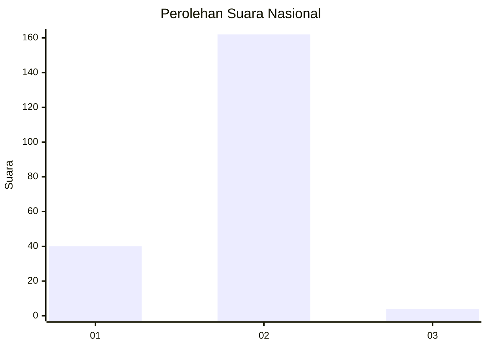
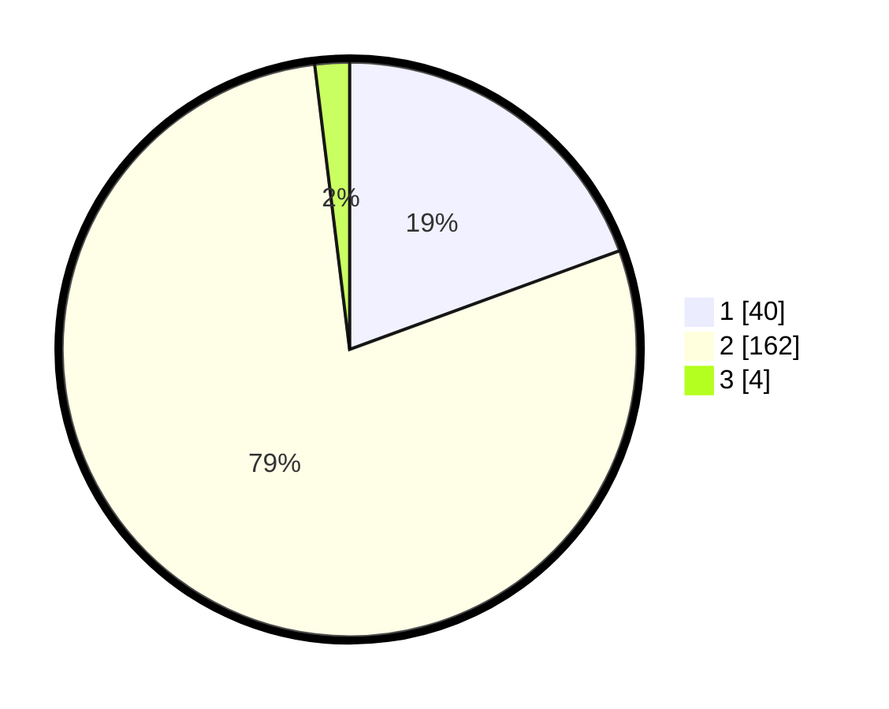

# Hasil

## Grafik

## Tabel

| No. | Nama Paslon    | Suara | Suara (raw) | Persentase |
|:--- |:-------------- | -----:| -----------:| ----------:|
| 1   | ANIES MUHAIMIN | 40    | [40][p-1]   | 19,42      |
| 2   | PRABOWO GIBRAN | 162   | [162][p-2]  | 78,64      |
| 3   | GANJAR MAHFUD  | 4     | [4][p-3]    | 1,94       |

[p-1]: https://github.com/gigit-pemilu/pemilu-2024/blob/main/pilpres/hitung-suara/sub/11-aceh/sub/03-aceh-timur/sub/10-ranto-peureulak/sub/2019-alue-geunteng/sub/001-tps/sub/paslon-1.txt
[p-2]: https://github.com/gigit-pemilu/pemilu-2024/blob/main/pilpres/hitung-suara/sub/11-aceh/sub/03-aceh-timur/sub/10-ranto-peureulak/sub/2019-alue-geunteng/sub/001-tps/sub/paslon-2.txt
[p-3]: https://github.com/gigit-pemilu/pemilu-2024/blob/main/pilpres/hitung-suara/sub/11-aceh/sub/03-aceh-timur/sub/10-ranto-peureulak/sub/2019-alue-geunteng/sub/001-tps/sub/paslon-3.txt

## Foto C Plano

https://sirekap-obj-formc.kpu.go.id/f859/pemilu/ppwp/11/03/10/20/19/1103102019001-20240215-111220--e4db2c51-bccb-4330-81ee-1cf381f2f6ab.jpg

https://sirekap-obj-formc.kpu.go.id/f859/pemilu/ppwp/11/03/10/20/19/1103102019001-20240215-111332--df2e5b49-a8a6-4716-9f6b-5104f8c6eabd.jpg

https://sirekap-obj-formc.kpu.go.id/f859/pemilu/ppwp/11/03/10/20/19/1103102019001-20240215-111449--faa52fa2-a30e-4616-a9a1-61c7f3deb558.jpg

## Metadata

| Key        | Value               |
| ---------- | ------------------- |
| Time Stamp | 2024-02-24 22:31:28 |

