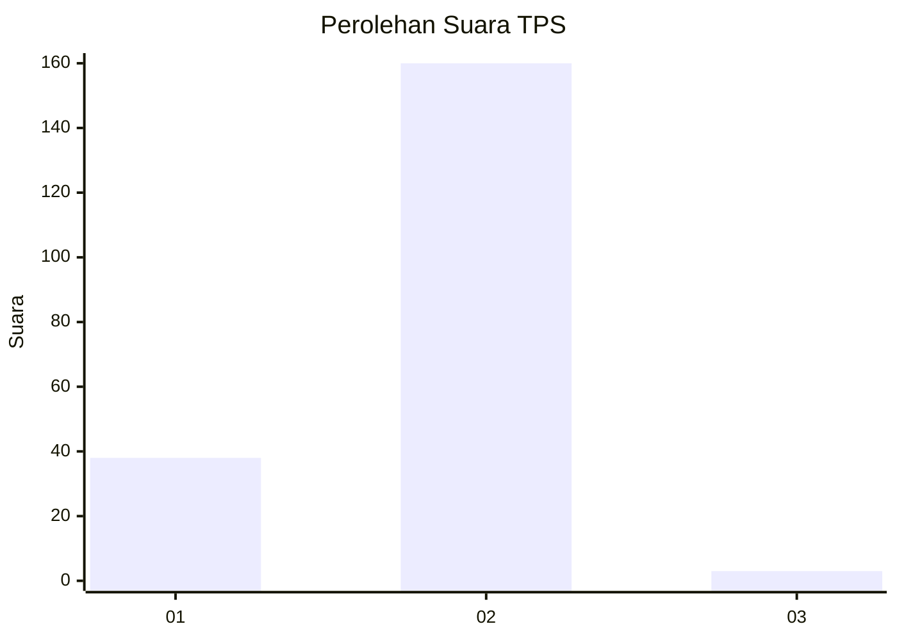
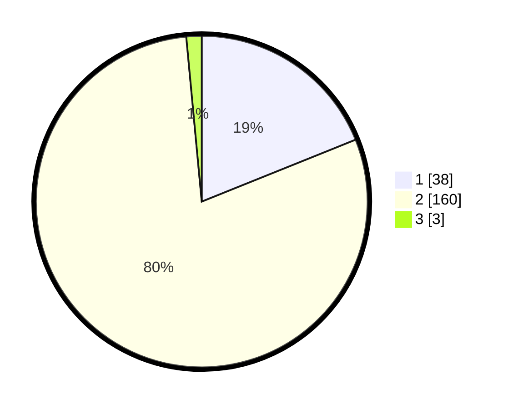

# Hasil

## Grafik

## Tabel

| No. | Nama Paslon    | Suara | Suara (raw) | Persentase |
|:--- |:-------------- | -----:| -----------:| ----------:|
| 1   | ANIES MUHAIMIN | 38    | [38][p-1]   | 18,91      |
| 2   | PRABOWO GIBRAN | 160   | [160][p-2]  | 79,60      |
| 3   | GANJAR MAHFUD  | 3     | [3][p-3]    | 1,49       |

[p-1]: https://github.com/gigit-pemilu/pemilu-2024-11-aceh/blob/main/pilpres/hitung-suara/sub/11-aceh/sub/03-aceh-timur/sub/10-ranto-peureulak/sub/2019-alue-geunteng/sub/004-tps/sub/paslon-1.txt
[p-2]: https://github.com/gigit-pemilu/pemilu-2024-11-aceh/blob/main/pilpres/hitung-suara/sub/11-aceh/sub/03-aceh-timur/sub/10-ranto-peureulak/sub/2019-alue-geunteng/sub/004-tps/sub/paslon-2.txt
[p-3]: https://github.com/gigit-pemilu/pemilu-2024-11-aceh/blob/main/pilpres/hitung-suara/sub/11-aceh/sub/03-aceh-timur/sub/10-ranto-peureulak/sub/2019-alue-geunteng/sub/004-tps/sub/paslon-3.txt

## Foto C Plano

https://sirekap-obj-formc.kpu.go.id/e2ec/pemilu/ppwp/11/03/10/20/19/1103102019004-20240215-145742--4505df08-647f-4349-9c98-4ce4bd94d452.jpg

https://sirekap-obj-formc.kpu.go.id/e2ec/pemilu/ppwp/11/03/10/20/19/1103102019004-20240215-113814--a5041908-7cb6-4d51-b252-6315d9387691.jpg

https://sirekap-obj-formc.kpu.go.id/e2ec/pemilu/ppwp/11/03/10/20/19/1103102019004-20240215-113854--8f23cdb9-117f-4595-a35b-18b4ddaed9cd.jpg

## Metadata

| Key        | Value               |
| ---------- | ------------------- |
| Time Stamp | 2024-02-24 22:31:28 |

