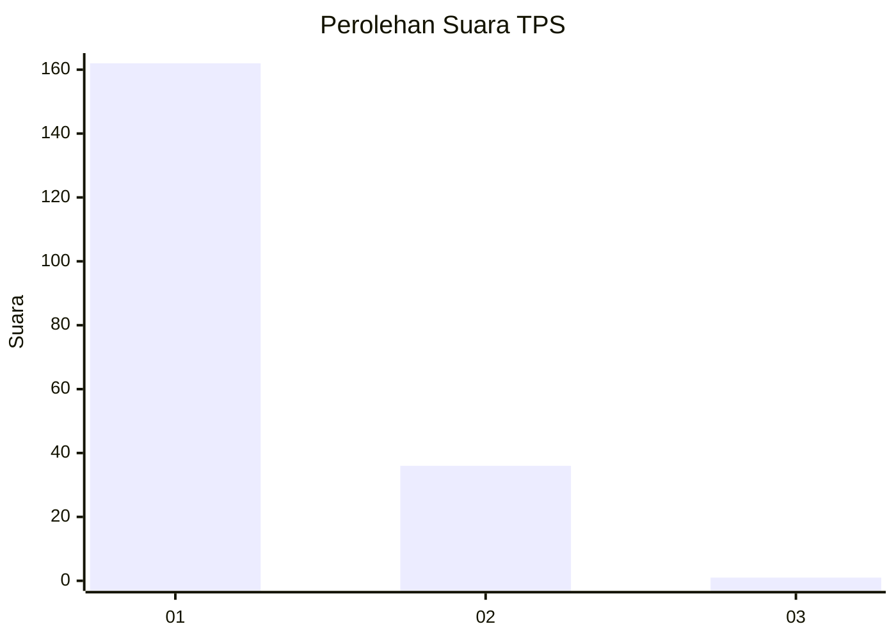
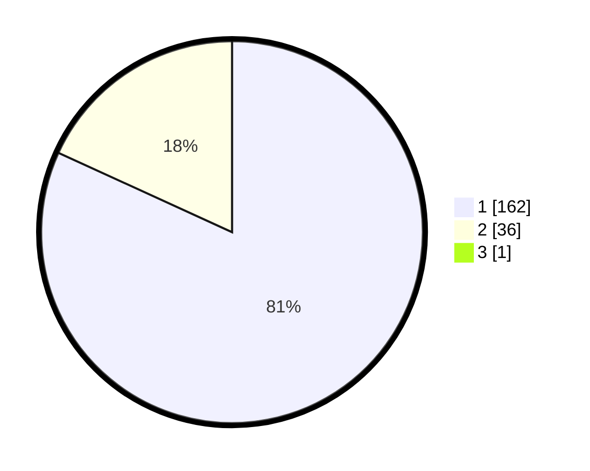

# Hasil

## Grafik

## Tabel

| No. | Nama Paslon    | Suara | Suara (raw) | Persentase |
|:--- |:-------------- | -----:| -----------:| ----------:|
| 1   | ANIES MUHAIMIN | 162   | [162][p-1]  | 81,41      |
| 2   | PRABOWO GIBRAN | 36    | [36][p-2]   | 18,09      |
| 3   | GANJAR MAHFUD  | 1     | [1][p-3]    | 0,50       |

[p-1]: https://github.com/gigit-pemilu/pemilu-2024-11-aceh/blob/main/pilpres/hitung-suara/sub/11-aceh/sub/03-aceh-timur/sub/10-ranto-peureulak/sub/2020-pertamina/sub/001-tps/sub/paslon-1.txt
[p-2]: https://github.com/gigit-pemilu/pemilu-2024-11-aceh/blob/main/pilpres/hitung-suara/sub/11-aceh/sub/03-aceh-timur/sub/10-ranto-peureulak/sub/2020-pertamina/sub/001-tps/sub/paslon-2.txt
[p-3]: https://github.com/gigit-pemilu/pemilu-2024-11-aceh/blob/main/pilpres/hitung-suara/sub/11-aceh/sub/03-aceh-timur/sub/10-ranto-peureulak/sub/2020-pertamina/sub/001-tps/sub/paslon-3.txt

## Foto C Plano

https://sirekap-obj-formc.kpu.go.id/eb22/pemilu/ppwp/11/03/10/20/20/1103102020001-20240214-224441--2cf945f0-37b1-431d-8ee3-16f41fd76f34.jpg

https://sirekap-obj-formc.kpu.go.id/eb22/pemilu/ppwp/11/03/10/20/20/1103102020001-20240214-190448--894a0ea2-4ff9-4908-8d25-db3b513cbab3.jpg

https://sirekap-obj-formc.kpu.go.id/eb22/pemilu/ppwp/11/03/10/20/20/1103102020001-20240214-225921--bd395d4d-6111-4d3b-b010-16343af13846.jpg

## Metadata

| Key        | Value               |
| ---------- | ------------------- |
| Time Stamp | 2024-02-15 19:30:26 |

