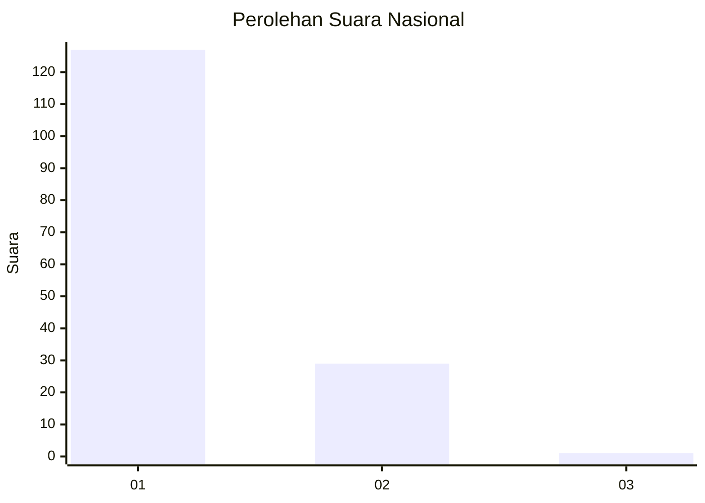
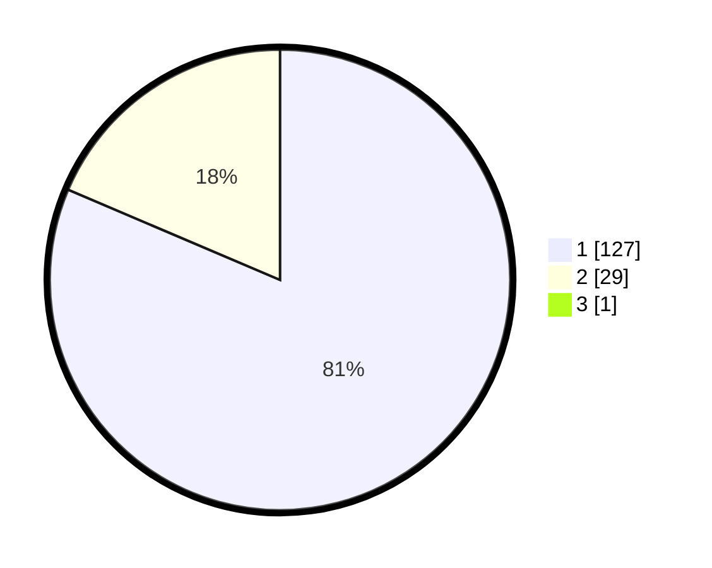

# Hasil

## Grafik

## Tabel

| No. | Nama Paslon    | Suara | Suara (raw) | Persentase |
|:--- |:-------------- | -----:| -----------:| ----------:|
| 1   | ANIES MUHAIMIN | 127   | [127][p-1]  | 80,89      |
| 2   | PRABOWO GIBRAN | 29    | [29][p-2]   | 18,47      |
| 3   | GANJAR MAHFUD  | 1     | [1][p-3]    | 0,64       |

[p-1]: https://github.com/gigit-pemilu/pemilu-2024/blob/main/pilpres/hitung-suara/sub/11-aceh/sub/03-aceh-timur/sub/10-ranto-peureulak/sub/2020-pertamina/sub/002-tps/sub/paslon-1.txt
[p-2]: https://github.com/gigit-pemilu/pemilu-2024/blob/main/pilpres/hitung-suara/sub/11-aceh/sub/03-aceh-timur/sub/10-ranto-peureulak/sub/2020-pertamina/sub/002-tps/sub/paslon-2.txt
[p-3]: https://github.com/gigit-pemilu/pemilu-2024/blob/main/pilpres/hitung-suara/sub/11-aceh/sub/03-aceh-timur/sub/10-ranto-peureulak/sub/2020-pertamina/sub/002-tps/sub/paslon-3.txt

## Foto C Plano

https://sirekap-obj-formc.kpu.go.id/75e0/pemilu/ppwp/11/03/10/20/20/1103102020002-20240214-200740--86e20563-4cdc-4212-9fb2-da676c2d8326.jpg

https://sirekap-obj-formc.kpu.go.id/75e0/pemilu/ppwp/11/03/10/20/20/1103102020002-20240214-200714--697f30f3-2d6d-49bd-8a72-f4d972c9531b.jpg

https://sirekap-obj-formc.kpu.go.id/75e0/pemilu/ppwp/11/03/10/20/20/1103102020002-20240214-201152--6c4fbaf3-6481-4680-a739-2892a244af91.jpg

## Metadata

| Key        | Value               |
| ---------- | ------------------- |
| Time Stamp | 2024-02-15 06:00:23 |

## DATA PEMILIH TETAP

Jumlah pemilih dalam DPT: **233**.
 * L: **115**.
 * P: **118**.

## DATA PENGGUNA HAK PILIH

Jumlah pengguna hak pilih dalam DPT: **151**.
 * L: **68**.
 * P: **83**.

Jumlah pengguna hak pilih dalam DPTb: **0**.
 * L: **0**.
 * P: **0**.

Jumlah pengguna hak pilih dalam DPK: **12**.
 * L: **6**.
 * P: **6**.

Jumlah pengguna hak pilih: **163**.
 * L: **74**.
 * P: **89**.

## JUMLAH SUARA SAH DAN TIDAK SAH

JUMLAH SELURUH SUARA SAH: **157**.

JUMLAH SUARA TIDAK SAH: **6**.

JUMLAH SELURUH SUARA SAH DAN SUARA TIDAK SAH: **163**.

