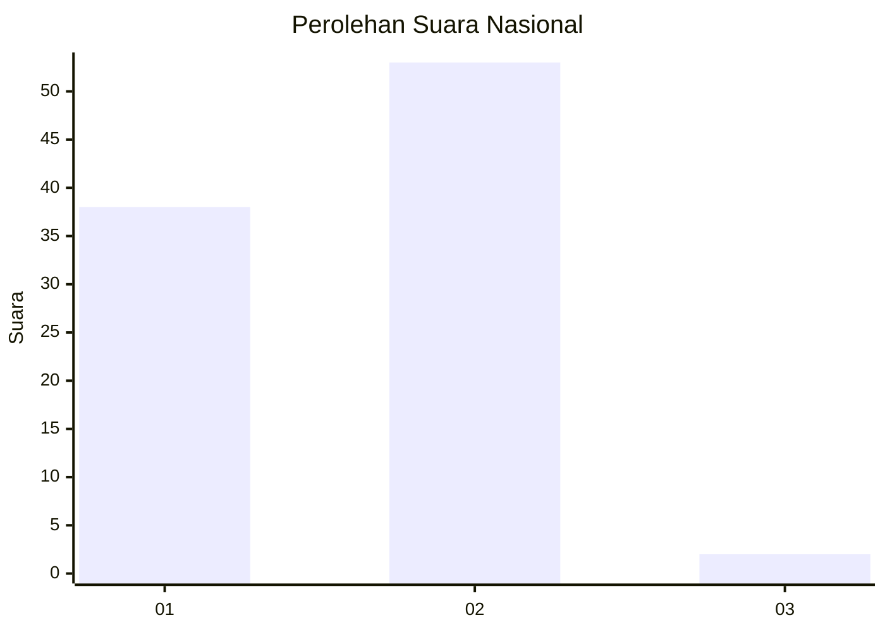
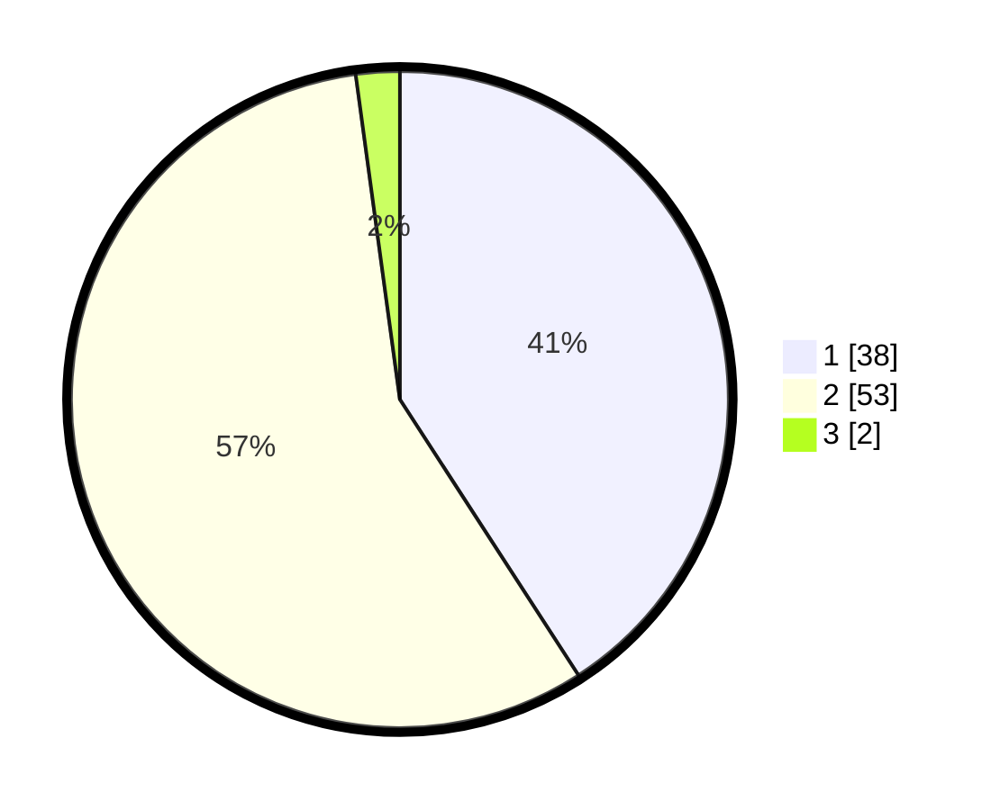

# Hasil

## Grafik

## Tabel

| No. | Nama Paslon    | Suara | Suara (raw) | Persentase |
|:--- |:-------------- | -----:| -----------:| ----------:|
| 1   | ANIES MUHAIMIN | 38    | [38][p-1]   | 40,86      |
| 2   | PRABOWO GIBRAN | 53    | [53][p-2]   | 56,99      |
| 3   | GANJAR MAHFUD  | 2     | [2][p-3]    | 2,15       |

[p-1]: https://github.com/gigit-pemilu/pemilu-2024/blob/main/pilpres/hitung-suara/sub/11-aceh/sub/03-aceh-timur/sub/10-ranto-peureulak/sub/2021-alue-batee/sub/002-tps/sub/paslon-1.txt
[p-2]: https://github.com/gigit-pemilu/pemilu-2024/blob/main/pilpres/hitung-suara/sub/11-aceh/sub/03-aceh-timur/sub/10-ranto-peureulak/sub/2021-alue-batee/sub/002-tps/sub/paslon-2.txt
[p-3]: https://github.com/gigit-pemilu/pemilu-2024/blob/main/pilpres/hitung-suara/sub/11-aceh/sub/03-aceh-timur/sub/10-ranto-peureulak/sub/2021-alue-batee/sub/002-tps/sub/paslon-3.txt

## Foto C Plano

https://sirekap-obj-formc.kpu.go.id/5f1b/pemilu/ppwp/11/03/10/20/21/1103102021002-20240214-203541--8e7ed79d-367b-4bad-b8bc-8189c571ddf1.jpg

https://sirekap-obj-formc.kpu.go.id/5f1b/pemilu/ppwp/11/03/10/20/21/1103102021002-20240214-202752--a0e1a936-96f9-45bc-be4d-8906145fb2c0.jpg

https://sirekap-obj-formc.kpu.go.id/5f1b/pemilu/ppwp/11/03/10/20/21/1103102021002-20240214-202814--5cbd1232-9fd0-4b5f-be9c-e892dc878f39.jpg

## Metadata

| Key        | Value               |
| ---------- | ------------------- |
| Time Stamp | 2024-02-15 00:41:44 |

## DATA PEMILIH TETAP

Jumlah pemilih dalam DPT: **116**.
 * L: **56**.
 * P: **60**.

## DATA PENGGUNA HAK PILIH

Jumlah pengguna hak pilih dalam DPT: **89**.
 * L: **42**.
 * P: **47**.

Jumlah pengguna hak pilih dalam DPTb: **0**.
 * L: **0**.
 * P: **0**.

Jumlah pengguna hak pilih dalam DPK: **5**.
 * L: **1**.
 * P: **4**.

Jumlah pengguna hak pilih: **94**.
 * L: **43**.
 * P: **51**.

## JUMLAH SUARA SAH DAN TIDAK SAH

JUMLAH SELURUH SUARA SAH: **93**.

JUMLAH SUARA TIDAK SAH: **1**.

JUMLAH SELURUH SUARA SAH DAN SUARA TIDAK SAH: **94**.

