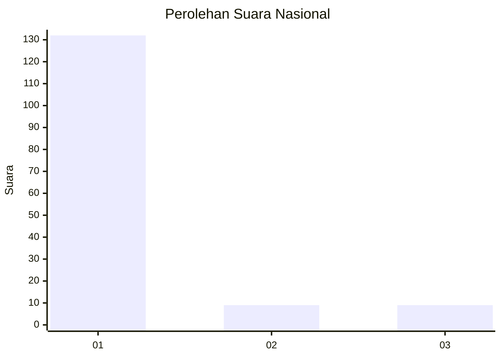
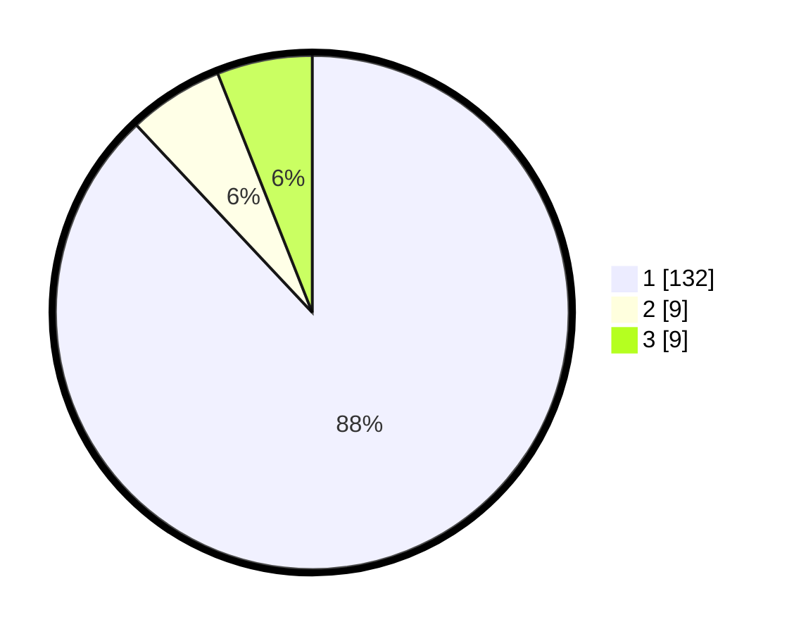

# Hasil

## Grafik

## Tabel

| No. | Nama Paslon    | Suara | Suara (raw) | Persentase |
|:--- |:-------------- | -----:| -----------:| ----------:|
| 1   | ANIES MUHAIMIN | 132   | [132][p-1]  | 88,00      |
| 2   | PRABOWO GIBRAN | 9     | [9][p-2]    | 6,00       |
| 3   | GANJAR MAHFUD  | 9     | [9][p-3]    | 6,00       |

[p-1]: https://github.com/gigit-pemilu/pemilu-2024/blob/main/pilpres/hitung-suara/sub/11-aceh/sub/03-aceh-timur/sub/10-ranto-peureulak/sub/2024-seumanah-jaya/sub/001-tps/sub/paslon-1.txt
[p-2]: https://github.com/gigit-pemilu/pemilu-2024/blob/main/pilpres/hitung-suara/sub/11-aceh/sub/03-aceh-timur/sub/10-ranto-peureulak/sub/2024-seumanah-jaya/sub/001-tps/sub/paslon-2.txt
[p-3]: https://github.com/gigit-pemilu/pemilu-2024/blob/main/pilpres/hitung-suara/sub/11-aceh/sub/03-aceh-timur/sub/10-ranto-peureulak/sub/2024-seumanah-jaya/sub/001-tps/sub/paslon-3.txt

## Foto C Plano

https://sirekap-obj-formc.kpu.go.id/30f0/pemilu/ppwp/11/03/10/20/24/1103102024001-20240216-163506--a581945e-1969-4158-920b-b263dfc5a8da.jpg

https://sirekap-obj-formc.kpu.go.id/30f0/pemilu/ppwp/11/03/10/20/24/1103102024001-20240215-085526--74e7f52e-1781-47db-89c7-fa7bc7885ffc.jpg

https://sirekap-obj-formc.kpu.go.id/30f0/pemilu/ppwp/11/03/10/20/24/1103102024001-20240215-085640--9ec3b893-c509-4941-9036-d0b29741d42d.jpg

## Metadata

| Key        | Value               |
| ---------- | ------------------- |
| Time Stamp | 2024-02-24 22:31:28 |

