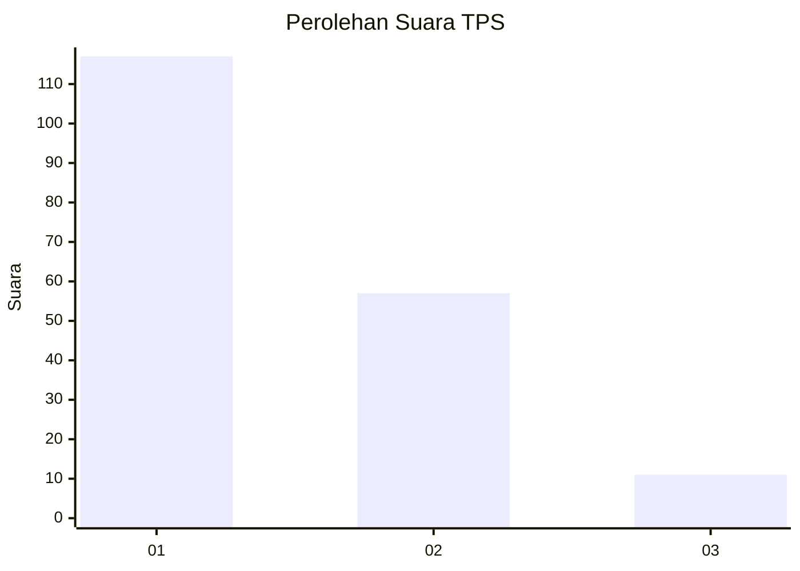
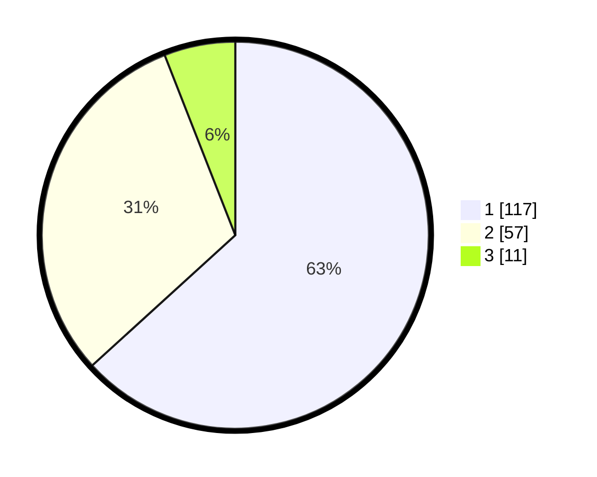

# Hasil

## Grafik

## Tabel

| No. | Nama Paslon    | Suara | Suara (raw) | Persentase |
|:--- |:-------------- | -----:| -----------:| ----------:|
| 1   | ANIES MUHAIMIN | 117   | [117][p-1]  | 63,24      |
| 2   | PRABOWO GIBRAN | 57    | [57][p-2]   | 30,81      |
| 3   | GANJAR MAHFUD  | 11    | [11][p-3]   | 5,95       |

[p-1]: https://github.com/gigit-pemilu/pemilu-2024-11-aceh/blob/main/pilpres/hitung-suara/sub/11-aceh/sub/03-aceh-timur/sub/10-ranto-peureulak/sub/2024-seumanah-jaya/sub/003-tps/sub/paslon-1.txt
[p-2]: https://github.com/gigit-pemilu/pemilu-2024-11-aceh/blob/main/pilpres/hitung-suara/sub/11-aceh/sub/03-aceh-timur/sub/10-ranto-peureulak/sub/2024-seumanah-jaya/sub/003-tps/sub/paslon-2.txt
[p-3]: https://github.com/gigit-pemilu/pemilu-2024-11-aceh/blob/main/pilpres/hitung-suara/sub/11-aceh/sub/03-aceh-timur/sub/10-ranto-peureulak/sub/2024-seumanah-jaya/sub/003-tps/sub/paslon-3.txt

## Foto C Plano

https://sirekap-obj-formc.kpu.go.id/5c44/pemilu/ppwp/11/03/10/20/24/1103102024003-20240215-093634--0a27c73f-9581-4cba-a7f5-4d1fed1ee0e1.jpg

https://sirekap-obj-formc.kpu.go.id/5c44/pemilu/ppwp/11/03/10/20/24/1103102024003-20240215-110236--7c4e31ff-b012-4ad8-a092-8c19a4d05af2.jpg

https://sirekap-obj-formc.kpu.go.id/5c44/pemilu/ppwp/11/03/10/20/24/1103102024003-20240215-110534--93ba4676-76e2-49d5-801a-bf244bcb1a5a.jpg

## Metadata

| Key        | Value               |
| ---------- | ------------------- |
| Time Stamp | 2024-02-25 15:00:00 |

