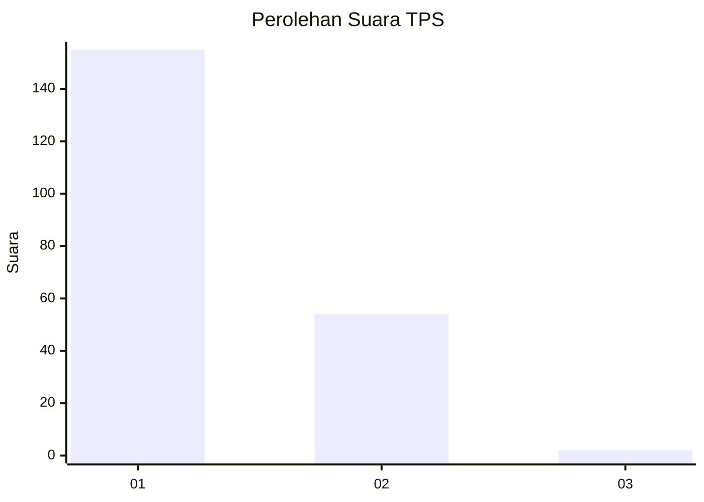
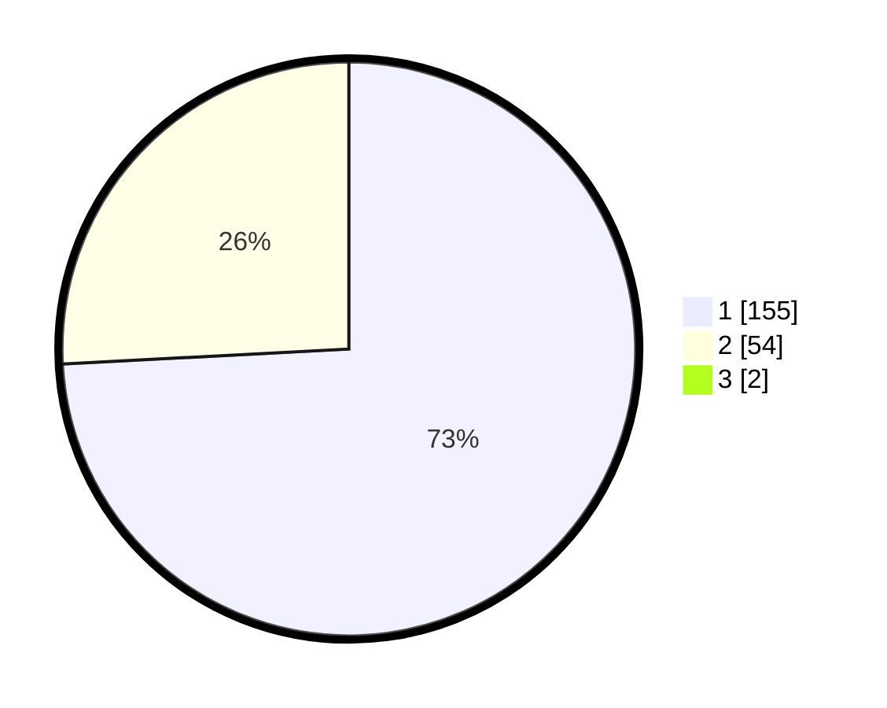

# Hasil

## Grafik

## Tabel

| No. | Nama Paslon    | Suara | Suara (raw) | Persentase |
|:--- |:-------------- | -----:| -----------:| ----------:|
| 1   | ANIES MUHAIMIN | 155   | [155][p-1]  | 73,46      |
| 2   | PRABOWO GIBRAN | 54    | [54][p-2]   | 25,59      |
| 3   | GANJAR MAHFUD  | 2     | [2][p-3]    | 0,95       |

[p-1]: https://github.com/gigit-pemilu/pemilu-2024-11-aceh/blob/main/pilpres/hitung-suara/sub/11-aceh/sub/03-aceh-timur/sub/10-ranto-peureulak/sub/2024-seumanah-jaya/sub/004-tps/sub/paslon-1.txt
[p-2]: https://github.com/gigit-pemilu/pemilu-2024-11-aceh/blob/main/pilpres/hitung-suara/sub/11-aceh/sub/03-aceh-timur/sub/10-ranto-peureulak/sub/2024-seumanah-jaya/sub/004-tps/sub/paslon-2.txt
[p-3]: https://github.com/gigit-pemilu/pemilu-2024-11-aceh/blob/main/pilpres/hitung-suara/sub/11-aceh/sub/03-aceh-timur/sub/10-ranto-peureulak/sub/2024-seumanah-jaya/sub/004-tps/sub/paslon-3.txt

## Foto C Plano

https://sirekap-obj-formc.kpu.go.id/74db/pemilu/ppwp/11/03/10/20/24/1103102024004-20240215-045107--2fbdedf1-0d98-46fa-8c19-b29ad52f3d64.jpg

https://sirekap-obj-formc.kpu.go.id/74db/pemilu/ppwp/11/03/10/20/24/1103102024004-20240215-075103--08b1e16e-5c45-48a3-836a-89bac02cd048.jpg

https://sirekap-obj-formc.kpu.go.id/74db/pemilu/ppwp/11/03/10/20/24/1103102024004-20240215-075250--faae423a-a4fb-4b76-82eb-bc56df85183b.jpg

## Metadata

| Key        | Value               |
| ---------- | ------------------- |
| Time Stamp | 2024-02-15 17:00:25 |

