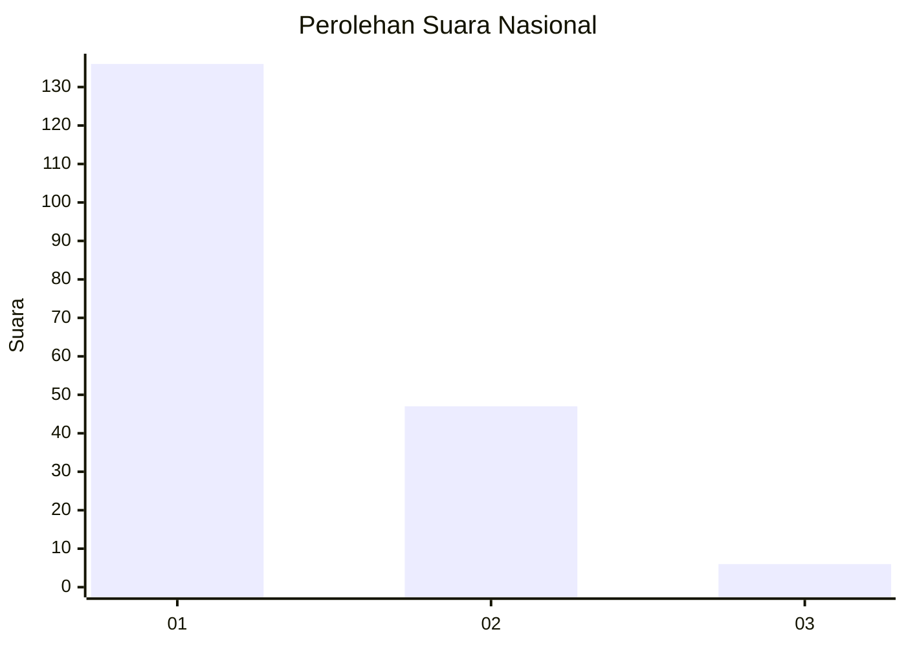
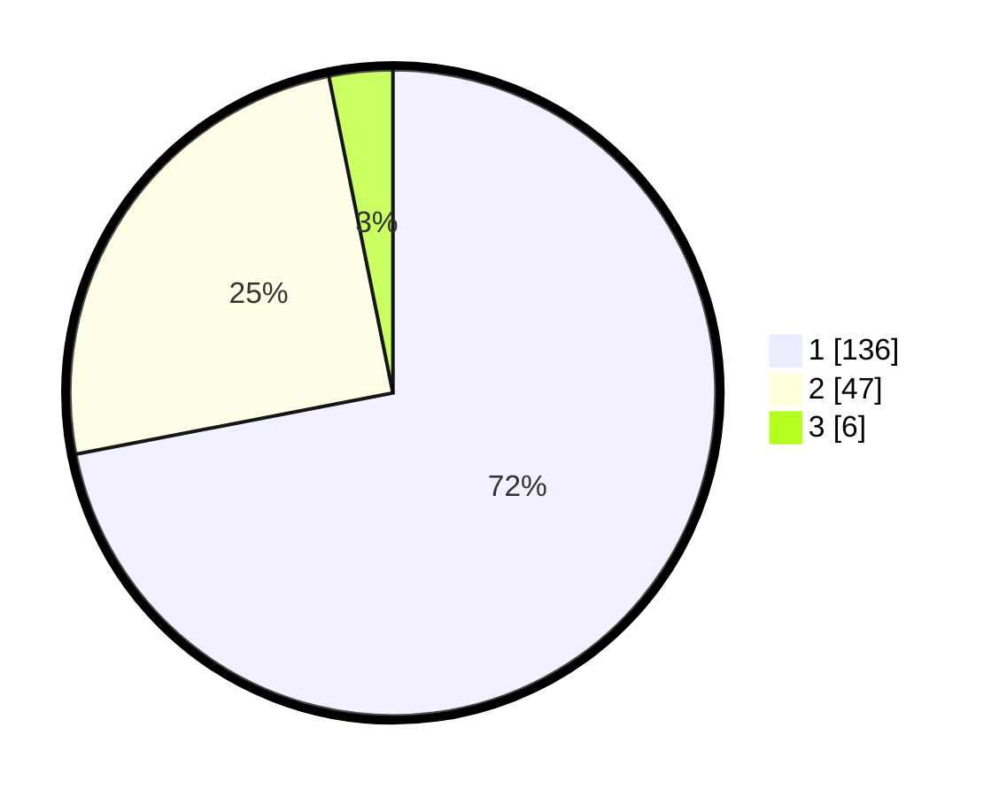

# Hasil

## Grafik

## Tabel

| No. | Nama Paslon    | Suara | Suara (raw) | Persentase |
|:--- |:-------------- | -----:| -----------:| ----------:|
| 1   | ANIES MUHAIMIN | 136   | [136][p-1]  | 71,96      |
| 2   | PRABOWO GIBRAN | 47    | [47][p-2]   | 24,87      |
| 3   | GANJAR MAHFUD  | 6     | [6][p-3]    | 3,17       |

[p-1]: https://github.com/gigit-pemilu/pemilu-2024/blob/main/pilpres/hitung-suara/sub/11-aceh/sub/03-aceh-timur/sub/10-ranto-peureulak/sub/2024-seumanah-jaya/sub/005-tps/sub/paslon-1.txt
[p-2]: https://github.com/gigit-pemilu/pemilu-2024/blob/main/pilpres/hitung-suara/sub/11-aceh/sub/03-aceh-timur/sub/10-ranto-peureulak/sub/2024-seumanah-jaya/sub/005-tps/sub/paslon-2.txt
[p-3]: https://github.com/gigit-pemilu/pemilu-2024/blob/main/pilpres/hitung-suara/sub/11-aceh/sub/03-aceh-timur/sub/10-ranto-peureulak/sub/2024-seumanah-jaya/sub/005-tps/sub/paslon-3.txt

## Foto C Plano

https://sirekap-obj-formc.kpu.go.id/4eba/pemilu/ppwp/11/03/10/20/24/1103102024005-20240215-133105--2aaa40c3-1e3b-4727-8982-2dc4f58bef59.jpg

https://sirekap-obj-formc.kpu.go.id/4eba/pemilu/ppwp/11/03/10/20/24/1103102024005-20240215-065320--862e7117-2ae8-4944-9493-945b1b1dc791.jpg

https://sirekap-obj-formc.kpu.go.id/4eba/pemilu/ppwp/11/03/10/20/24/1103102024005-20240215-065518--2ad5d7c3-bdac-43a8-840d-3403fc57ec7b.jpg

## Metadata

| Key        | Value               |
| ---------- | ------------------- |
| Time Stamp | 2024-02-24 22:31:28 |

