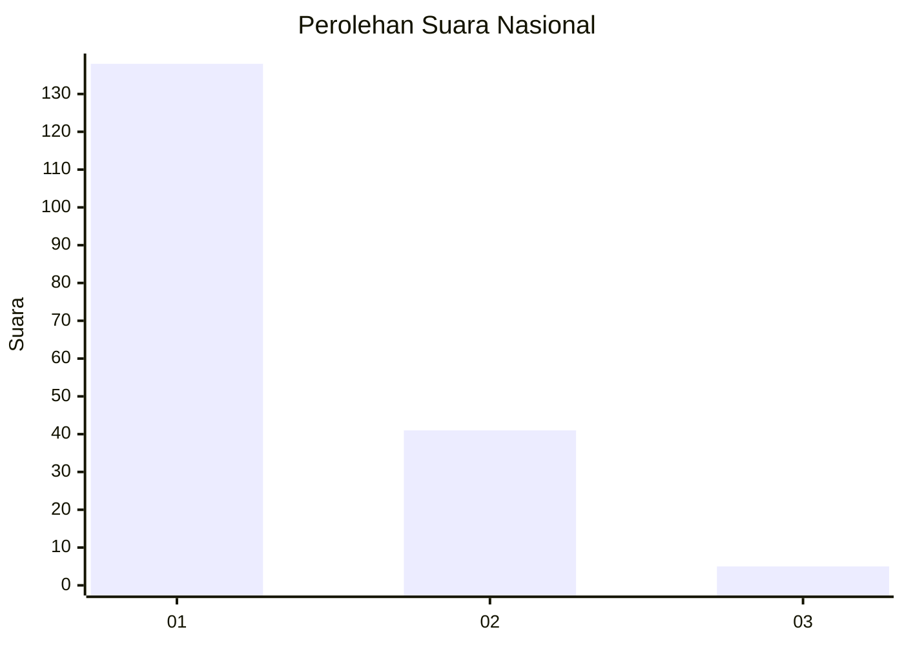
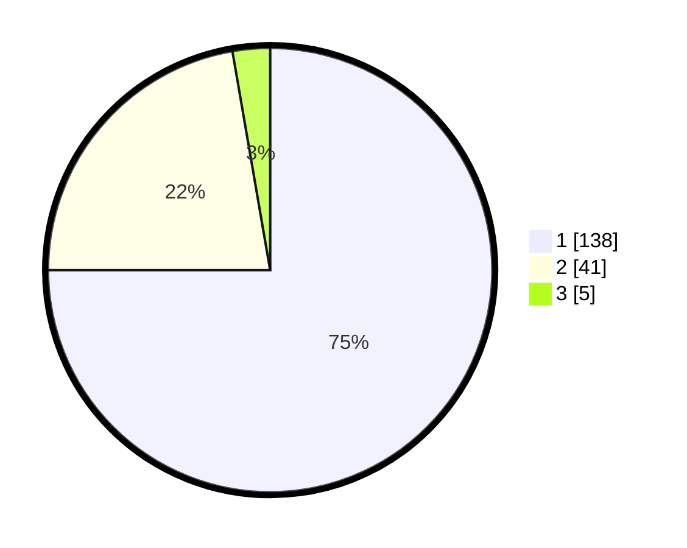

# Hasil

## Grafik

## Tabel

| No. | Nama Paslon    | Suara | Suara (raw) | Persentase |
|:--- |:-------------- | -----:| -----------:| ----------:|
| 1   | ANIES MUHAIMIN | 138   | [138][p-1]  | 75,00      |
| 2   | PRABOWO GIBRAN | 41    | [41][p-2]   | 22,28      |
| 3   | GANJAR MAHFUD  | 5     | [5][p-3]    | 2,72       |

[p-1]: https://github.com/gigit-pemilu/pemilu-2024/blob/main/pilpres/hitung-suara/sub/11-aceh/sub/03-aceh-timur/sub/10-ranto-peureulak/sub/2024-seumanah-jaya/sub/006-tps/sub/paslon-1.txt
[p-2]: https://github.com/gigit-pemilu/pemilu-2024/blob/main/pilpres/hitung-suara/sub/11-aceh/sub/03-aceh-timur/sub/10-ranto-peureulak/sub/2024-seumanah-jaya/sub/006-tps/sub/paslon-2.txt
[p-3]: https://github.com/gigit-pemilu/pemilu-2024/blob/main/pilpres/hitung-suara/sub/11-aceh/sub/03-aceh-timur/sub/10-ranto-peureulak/sub/2024-seumanah-jaya/sub/006-tps/sub/paslon-3.txt

## Foto C Plano

https://sirekap-obj-formc.kpu.go.id/8d03/pemilu/ppwp/11/03/10/20/24/1103102024006-20240215-063108--dd1adc72-1ace-4f6f-bd81-8af5564464d6.jpg

https://sirekap-obj-formc.kpu.go.id/8d03/pemilu/ppwp/11/03/10/20/24/1103102024006-20240215-063448--9e6e2840-2127-416b-9400-f203b985274f.jpg

https://sirekap-obj-formc.kpu.go.id/8d03/pemilu/ppwp/11/03/10/20/24/1103102024006-20240215-063612--f347a0f3-2281-4ed2-b99c-210aabf95685.jpg

## Metadata

| Key        | Value               |
| ---------- | ------------------- |
| Time Stamp | 2024-02-19 06:16:00 |

## DATA PEMILIH TETAP

Jumlah pemilih dalam DPT: **294**.
 * L: **130**.
 * P: **169**.

## DATA PENGGUNA HAK PILIH

Jumlah pengguna hak pilih dalam DPT: **785**.
 * L: **79**.
 * P: **111**.

Jumlah pengguna hak pilih dalam DPTb: **0**.
 * L: **0**.
 * P: **0**.

Jumlah pengguna hak pilih dalam DPK: **3**.
 * L: **2**.
 * P: **1**.

Jumlah pengguna hak pilih: **188**.
 * L: **76**.
 * P: **112**.

## JUMLAH SUARA SAH DAN TIDAK SAH

JUMLAH SELURUH SUARA SAH: **184**.

JUMLAH SUARA TIDAK SAH: **4**.

JUMLAH SELURUH SUARA SAH DAN SUARA TIDAK SAH: **188**.

