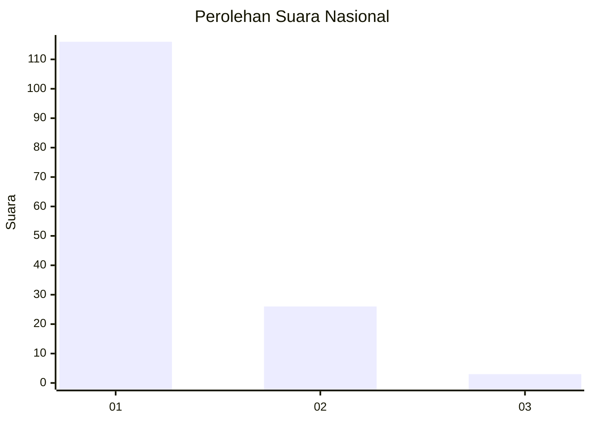
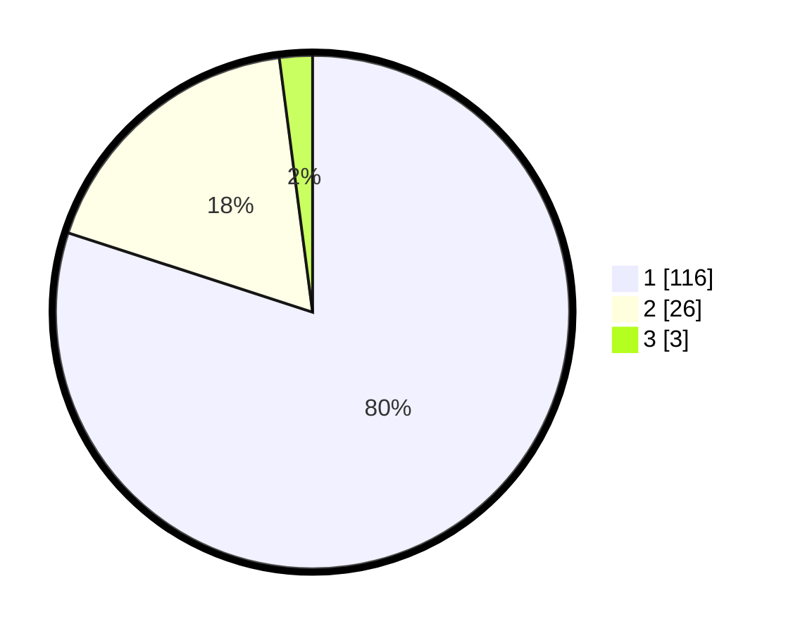

# Hasil

## Grafik

## Tabel

| No. | Nama Paslon    | Suara | Suara (raw) | Persentase |
|:--- |:-------------- | -----:| -----------:| ----------:|
| 1   | ANIES MUHAIMIN | 116   | [116][p-1]  | 80,00      |
| 2   | PRABOWO GIBRAN | 26    | [26][p-2]   | 17,93      |
| 3   | GANJAR MAHFUD  | 3     | [3][p-3]    | 2,07       |

[p-1]: https://github.com/gigit-pemilu/pemilu-2024/blob/main/pilpres/hitung-suara/sub/11-aceh/sub/03-aceh-timur/sub/10-ranto-peureulak/sub/2024-seumanah-jaya/sub/009-tps/sub/paslon-1.txt
[p-2]: https://github.com/gigit-pemilu/pemilu-2024/blob/main/pilpres/hitung-suara/sub/11-aceh/sub/03-aceh-timur/sub/10-ranto-peureulak/sub/2024-seumanah-jaya/sub/009-tps/sub/paslon-2.txt
[p-3]: https://github.com/gigit-pemilu/pemilu-2024/blob/main/pilpres/hitung-suara/sub/11-aceh/sub/03-aceh-timur/sub/10-ranto-peureulak/sub/2024-seumanah-jaya/sub/009-tps/sub/paslon-3.txt

## Foto C Plano

https://sirekap-obj-formc.kpu.go.id/3ec4/pemilu/ppwp/11/03/10/20/24/1103102024009-20240214-194231--0706da83-4710-4519-a618-24a46dd13f6c.jpg

https://sirekap-obj-formc.kpu.go.id/3ec4/pemilu/ppwp/11/03/10/20/24/1103102024009-20240215-080812--395d61a4-428c-4cb0-9173-3958a1b8bbc8.jpg

https://sirekap-obj-formc.kpu.go.id/3ec4/pemilu/ppwp/11/03/10/20/24/1103102024009-20240215-081011--6d87c764-01b0-4f0b-8853-7847c2a8e048.jpg

## Metadata

| Key        | Value               |
| ---------- | ------------------- |
| Time Stamp | 2024-02-24 22:31:28 |

